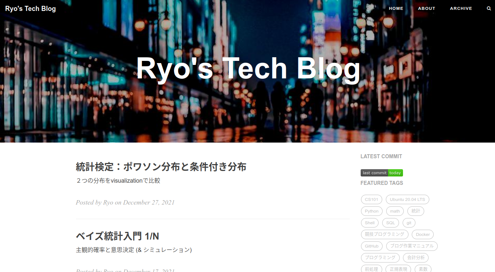

[Ryo Blog](https://ryonakagami.github.io)
================================

> がんばる




[User Manual 👉](_doc/Manual.md)
--------------------------------------------------

### Getting Started

1. [Jekyll](https://jekyllrb.com/)ベースで構築しているため[Ruby](https://www.ruby-lang.org/en/) と [Bundler](https://bundler.io/)をinstallする必要があります. [Using Jekyll with Bundler](https://jekyllrb.com/tutorials/using-jekyll-with-bundler/)に従って環境構築推奨.

2. `Gemfile`の記述に従ってDependencyをinstall:

```sh
$ bundle install 
```

3. ローカルでウェブサイトをServeします (`localhost:4000` by default):

```sh
$ bundle exec jekyll serve  # alternatively, npm start
```

### How to git push

```
git push --set-upstream origin master
```

### Development (Build From Source)

To modify the theme, you will need [Grunt](https://gruntjs.com/). There are numbers of tasks you can find in the `Gruntfile.js`, includes minifing JavaScript, compiling `.less` to `.css`, adding banners to keep the Apache 2.0 license intact, watching for changes, etc. 

Yes, they were inherited and are extremely old-fashioned. There is no modularization and transpilation, etc.

Critical Jekyll-related code are located in `_include/` and `_layouts/`. Most of them are [Liquid](https://github.com/Shopify/liquid/wiki) templates.

This theme uses the default code syntax highlighter of jekyll, [Rouge](http://rouge.jneen.net/), which is compatible with Pygments theme so just pick any pygments theme css (e.g. from [here](http://jwarby.github.io/jekyll-pygments-themes/languages/javascript.html) and replace the content of `highlight.less`.


### Interesting to know more? Checkout the [full user manual](_doc/Manual.md)!


Other Resources
---------------

Ports
- [**Hexo**](https://github.com/Kaijun/hexo-theme-huxblog) by @kaijun
- [**React-SSR**](https://github.com/LucasIcarus/huxpro.github.io/tree/ssr) by @LucasIcarus
