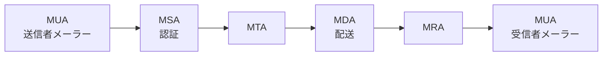
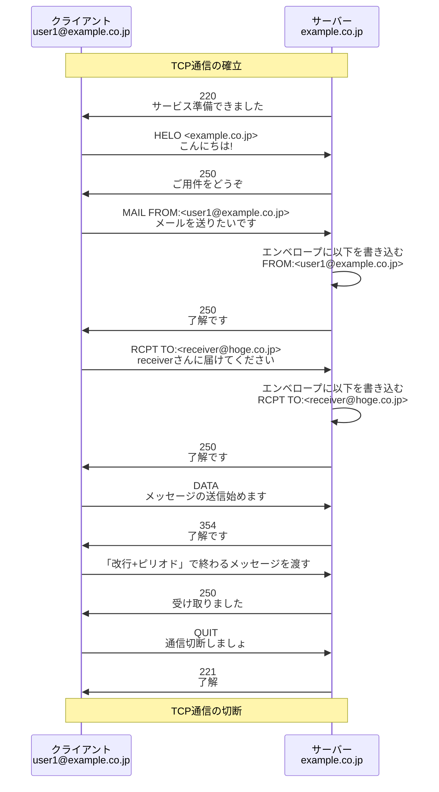
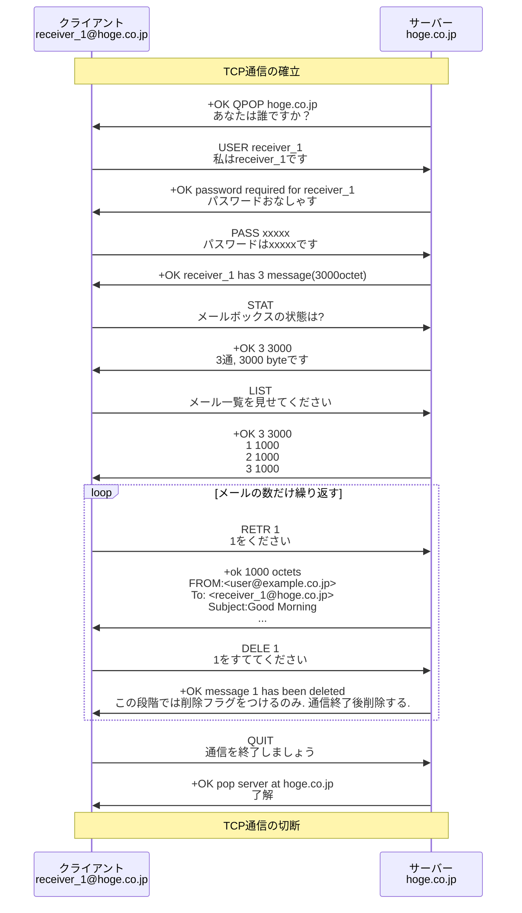

<div style='border-radius: 1em; border-style:solid; border-color:#D3D3D3; background-color:#F8F8F8'>
<p class="h4">&nbsp;&nbsp;Table of Contents</p>
<!-- START doctoc generated TOC please keep comment here to allow auto update -->
<!-- DON'T EDIT THIS SECTION, INSTEAD RE-RUN doctoc TO UPDATE -->

- [電子メールサービス](#%E9%9B%BB%E5%AD%90%E3%83%A1%E3%83%BC%E3%83%AB%E3%82%B5%E3%83%BC%E3%83%93%E3%82%B9)
  - [電子メールやり取りの概要](#%E9%9B%BB%E5%AD%90%E3%83%A1%E3%83%BC%E3%83%AB%E3%82%84%E3%82%8A%E5%8F%96%E3%82%8A%E3%81%AE%E6%A6%82%E8%A6%81)
  - [エージェント](#%E3%82%A8%E3%83%BC%E3%82%B8%E3%82%A7%E3%83%B3%E3%83%88)
- [電子メールでやり取りされる情報](#%E9%9B%BB%E5%AD%90%E3%83%A1%E3%83%BC%E3%83%AB%E3%81%A7%E3%82%84%E3%82%8A%E5%8F%96%E3%82%8A%E3%81%95%E3%82%8C%E3%82%8B%E6%83%85%E5%A0%B1)
  - [データとしての電子メール](#%E3%83%87%E3%83%BC%E3%82%BF%E3%81%A8%E3%81%97%E3%81%A6%E3%81%AE%E9%9B%BB%E5%AD%90%E3%83%A1%E3%83%BC%E3%83%AB)
  - [エンベロープとヘッダが分かれているメリット/デメリット](#%E3%82%A8%E3%83%B3%E3%83%99%E3%83%AD%E3%83%BC%E3%83%97%E3%81%A8%E3%83%98%E3%83%83%E3%83%80%E3%81%8C%E5%88%86%E3%81%8B%E3%82%8C%E3%81%A6%E3%81%84%E3%82%8B%E3%83%A1%E3%83%AA%E3%83%83%E3%83%88%E3%83%87%E3%83%A1%E3%83%AA%E3%83%83%E3%83%88)
  - [メールヘッダ情報](#%E3%83%A1%E3%83%BC%E3%83%AB%E3%83%98%E3%83%83%E3%83%80%E6%83%85%E5%A0%B1)
- [電子メールで用いられるプロトコル](#%E9%9B%BB%E5%AD%90%E3%83%A1%E3%83%BC%E3%83%AB%E3%81%A7%E7%94%A8%E3%81%84%E3%82%89%E3%82%8C%E3%82%8B%E3%83%97%E3%83%AD%E3%83%88%E3%82%B3%E3%83%AB)
  - [コマンドとレスポンス](#%E3%82%B3%E3%83%9E%E3%83%B3%E3%83%89%E3%81%A8%E3%83%AC%E3%82%B9%E3%83%9D%E3%83%B3%E3%82%B9)
  - [SMTP プロトコル](#smtp-%E3%83%97%E3%83%AD%E3%83%88%E3%82%B3%E3%83%AB)
    - [メールマガジンを実現する仕組み](#%E3%83%A1%E3%83%BC%E3%83%AB%E3%83%9E%E3%82%AC%E3%82%B8%E3%83%B3%E3%82%92%E5%AE%9F%E7%8F%BE%E3%81%99%E3%82%8B%E4%BB%95%E7%B5%84%E3%81%BF)
  - [POPプロトコル](#pop%E3%83%97%E3%83%AD%E3%83%88%E3%82%B3%E3%83%AB)
    - [APOPは危険？](#apop%E3%81%AF%E5%8D%B1%E9%99%BA)
- [インターネットメールのフォーマット: MIME](#%E3%82%A4%E3%83%B3%E3%82%BF%E3%83%BC%E3%83%8D%E3%83%83%E3%83%88%E3%83%A1%E3%83%BC%E3%83%AB%E3%81%AE%E3%83%95%E3%82%A9%E3%83%BC%E3%83%9E%E3%83%83%E3%83%88-mime)
  - [電子メールの制約](#%E9%9B%BB%E5%AD%90%E3%83%A1%E3%83%BC%E3%83%AB%E3%81%AE%E5%88%B6%E7%B4%84)
  - [MIME](#mime)
- [Appendix: 特定電子メール法における規制の対象](#appendix-%E7%89%B9%E5%AE%9A%E9%9B%BB%E5%AD%90%E3%83%A1%E3%83%BC%E3%83%AB%E6%B3%95%E3%81%AB%E3%81%8A%E3%81%91%E3%82%8B%E8%A6%8F%E5%88%B6%E3%81%AE%E5%AF%BE%E8%B1%A1)
  - [企業が広告宣伝メールを送信する場面におけるオプトイン方式](#%E4%BC%81%E6%A5%AD%E3%81%8C%E5%BA%83%E5%91%8A%E5%AE%A3%E4%BC%9D%E3%83%A1%E3%83%BC%E3%83%AB%E3%82%92%E9%80%81%E4%BF%A1%E3%81%99%E3%82%8B%E5%A0%B4%E9%9D%A2%E3%81%AB%E3%81%8A%E3%81%91%E3%82%8B%E3%82%AA%E3%83%97%E3%83%88%E3%82%A4%E3%83%B3%E6%96%B9%E5%BC%8F)
  - [特定電子メール法の注意点](#%E7%89%B9%E5%AE%9A%E9%9B%BB%E5%AD%90%E3%83%A1%E3%83%BC%E3%83%AB%E6%B3%95%E3%81%AE%E6%B3%A8%E6%84%8F%E7%82%B9)
- [References](#references)

<!-- END doctoc generated TOC please keep comment here to allow auto update -->

</div>

## 電子メールサービス

ユーザー同士が文字やファイルをやり取りできるサービスの一種として電子メールサービスがあります.
電子メールのやり取りは「**メールボックス**」を介して行われます. 電子メールを送る際には, 
送り先のメールボックスを指定するためにメールアドレスを使います. 電子メールのアドレスは, 一般的に以下のように表記されます. 

```
<user mail account>@<domain>
```

- `user mail account`: ユーザー固有の文字列
- `domain`: メールボックスのあるサーバーの住所

メールアドレスはIPアドレスやMACアドレスなどと同じ識別子なので, 重複してはいけません.

> 特別なメールアドレス: MAILER-DAEMON

IPアドレスやMACアドレスにブロードキャストアドレスのような特殊用途のアドレスがあるように, メールアドレスにも特別な用途で使われるものがあります.
その一例が `MAILER-DAEMON` です. 形式は`MAILER-DAEMON@ドメイン`, Gmail利用している場合は `mailer-daemon@googlemail.com`
となります. 

- 宛先のメールボックスが見つからない（User unknown）
- ドメインに該当するメールサーバが見当たらない（Host unknown）
- 相手のメールボックスがいっぱい（over quota）

上述のように, メールを中継している間に何らかのエラーが見つかった場合に利用されるメールアドレスです.


### 電子メールやり取りの概要


電子メールサービスは, メーラーとメールサーバーとのやり取りで成り立っています. 
メールサーバーとは, 送信されたメールアドレスの情報に基づいてメールデータの転送処理などをするサーバーのことです. やり取りに用いられるプロトコルは送信用と受信用に分けられています(=**現在のメールシステムにおいて, 送信と受信の機能が独立している**).  

送信用プロトコルはSMTP(Simple Mail Transfer Protocol), 受信用はPOP(Post Office Protocol)またはIMAP(Internet Message Access Protocol)です.

なお, TCP/IPでの通信では,「ポート番号」というものを用いており, ポート番号はプロトコルごとに決まった番号になっています.
ノード同士はポート番号を目印にして, どのプロトコルで通信するかを判別しています.


<div style='padding-left: 2em; padding-right: 2em; border-radius: 1em; border-style:solid; border-color:gray; background-color:gray; color:white'>
<p class="h4"><ins>Column: 電子メールで用いるプロトコル</ins></p>

|Protocol|役割|説明|
|:---:|:---|:---|
|STMP|メール送信プロトコル|メーラーで作ったメールを自社のメールサーバーに送信する時や自社のメールサーバーが相手先のメールサーバーへメールを配送する時に用いられる|
|POP|メール受信プロトコル|メーラーが存在するパソコン側にデータがダウンロードされる<br><br>過去に受信したメールはインターネット上に接続していないオフライン状態でも閲覧が可能<br><br>メールサーバーからはデータが消える|
|IMAP|メール受信プロトコル|メールサーバー上にメールを保管・保存しておき, メーラーがインターネットを通じてメールデータを読み込んでメールを閲覧|
|APOP|メール受信プロトコル|AUthenticated Post Office Protocol<br><br>POPのユーザー認証の際にパスワードを暗号化するプロトコル|
|IMAP4|メール受信プロトコル|SMTPとPOPの機能を併せ持つプロトコル.<br><br>選択したメールだけを利用者端末へ転送する機能, サーバ上のメールを検索する機能, メールのヘッダだけを取り出す機能を持っている(=POPと異なりメールサーバ内のメールを選択して受信できる)|

</div>

### エージェント

電子メールサービスでは, **Agent（エージェント）**という概念がでてきます. これはメールシステムにおいて必要とされる機能を役割という視点表現する際に使用する概念です. 例として, ユーザーインターフェイスを提供するMUA（Mail User Agent）, メールの転送経路を決定するMTA（Mail Transfer Agent）, メールを配送（転送）するMDA（Mail Delivery Agent）, POPやIMAPのメール受信のための部分はMRA（Mail Retrieval Agent ）がAgentとして存在します.

<div style='padding-left: 2em; padding-right: 2em; border-radius: 1em; border-style:solid; border-color:gray; background-color:gray; color:white'>
<p class="h4"><ins>Column: 電子メールで用いるプロトコル</ins></p>

|Agent|説明|
|:---:|:---|
|MUA|メールの確認や作成を行うユーザインタフェース|
|MTA|SMTP によるメールリレー（メール転送）の機能. Linux の `postfix` やWindowsの `Exchange`|
|MDA|メール転送エージェント(MTA)によって受け取った電子メールをメールサーバ―にあるメールボックス（メールスプール）への保存する機能|
|MSA|Mail Submission Agent. メールサーバ―に含まれるメールの発信受付, ユーザ認証の機能|
|MRA|Mail Retrieval Agent. ユーザ認証, メールボックス（メールスプール）からのメールの取り出しの機能|

</div>


> Agentベースでメールの送受信の流れ

<figure style="text-align: center;">


</figure>

1. まずユーザーがMUA（メールクライアント）でメールを送信し, メールサーバはMTAでメールを受け取る. 
2. MTAはメールの配送先を決定し, 配送先がローカルであればローカルMDAにメールを渡し, ローカルメールボックスにメールを入れる. 他のメールサーバへ配送する場合は出力MDAにメールを渡し, SMTPで外部のメールサーバにメールを配送する. 
3. ユーザーが受信メールを読む場合はMUAからMRAにアクセスし, メールボックスに到着したメールを読み出す.


## 電子メールでやり取りされる情報
### データとしての電子メール


注意点として, SMTP通信において郵便サービスにおける封筒の役割を果たしているのは**エンベロープ**です. STMPプロトコルでは, この**エンベロープ**を対象にコマンド & レスポンスのやり取りがされ, ヘッダーとメッセージ本文はデータとしてSMTPでは扱われます.


### エンベロープとヘッダが分かれているメリット/デメリット

> メリット

- Bcc機能が使える:Bccの仕組みは, BCCで送信する宛先をエンベロープToのみに設定し, メールメッセージのBccヘッダフィールドはSMTPサーバでエンベロープを展開するとヘッダ情報から削除されます
- 転送や代理送信など, 柔軟なメール配信が可能になる

> デメリット

- なりすましメール: ヘッダFromを偽装し送信することで, 送信元を偽るメール配信が可能となってしまう


### メールヘッダ情報

|項目|	内容|
|:---|:---|
|`Date:`|	メールの発信日時|
|`From:`|	メールの発信元アドレス|
|`Sender:`|	メールの送信者のアドレス. <br><br>From:はメール原稿の作成者を表し, 共著した場合には, From:に複数のアドレスを指定することができます. |
|`To:`|	メールの送信先アドレス|
|`Cc:`|	メールの共同送信先アドレス|
|`Bcc:`|	同上, SMTPでメッセージが転送される過程で削除される（=受信者のメール上では削除される）|
|`Subject:`|	メールの表題|
|`Message-Id:`|	電子メールの識別ID. ネットワークで唯一の値が割り与えられる. |
|`Received:`|	電子メールの配信経路での受信したサーバ名. 各MTAごとに追加され, 経路追跡に利用される. |
|`Reply-to:`|	送信元と違う電子メールアドレスへの返信を要求する場合に付け加えられる. エンベロープのMAIL FROM:の内容. |
|`In-Reply-To:`|	返信時にどのメールへの返信かを示すヘッダ. 通常はMessage-IDが引用される. |
|`References:`|	返信時に使用されるヘッダ. References:とMessage-Id:が引用される. 多くのメーラーは, この値を用いてスレッド表示を行う. |
|`Return-path:`|	メールが宛先に届かない場合のエラー通知を行うためのアドレス. |
|`Mime-Version:`|	MIMEのバージョンを示す. |
|`Content-Transfer-Encording:`|	エンコードタイプを示す. |

## 電子メールで用いられるプロトコル
### コマンドとレスポンス

電子メールの送受信の際, クライアントとサーバーは細かい連絡を取り合います. この連絡の内, 

- コマンド: クライアントからサーバーへの呼びかけ
- レスポンス: サーバーからクライアントへの返答. レスポンスの先頭には3ケタの「**リプライコード**」が含まれ, このコードによって, 成功／不成功が判別できるようになっている


> `telnet`コマンドを用いたメールサーバーとのコマンド & レスポンス


> クライアントとサーバー

サーバー間でメールを転送する場合, メールを送る側がクライアント, 受け取る側がサーバーになります


### SMTP プロトコル

SMTPプロトコルでは, コマンド & レスポンスについて以下のような特徴があります:

- コマンド: 4文字のアルファベット
- レスポンス: ３桁の数字

<figure style="text-align: center;">



</figure>

エンベロープで通知される差出人および宛先はメールメッセージのヘッダから得ています. メールメッセージのヘッダには差出人情報がFromフィールドに, 宛先情報がToフィールドにあります. そのほか宛先を示すヘッダフィールドにはCc, Bccがあります. FromフィールドはSMTPのMAIL TOコマンドで, そのほかに宛先を示すTo, Cc, BccのフィールドはすべてSMTPのRCPT TOコマンドで通知されています.

#### メールマガジンを実現する仕組み

複数の宛先にメールを一斉に送信するメールマガジンは, メールサーバの「**エイリアス**」という仕組みを用いて実現しています.
メールサーバーにて, `parametric-club`というエイリアスを作成すると, このエイリアスと複数のメールアドレスを対応づけたリストを作ることができます.このリストが, いわゆるメーリングリストと呼ばれているものになります.

この`parametric-club`というメーリングリスト宛にメールを送信すると, 受信したメールサーバは登録されているエイリアスのリストを読み出し, リストに登録されているメールアドレスへメールを送信します. 


### POPプロトコル

POPプロトコルとは, 自分宛ての電子メールを受取るときに使うプロトコルです. 現在はPOP3が主流.

POP3プロトコルでは, コマンド & レスポンスについて以下のような特徴があります:

- コマンド: 4文字のアルファベット
- レスポンス: `+OK`, `- ERR`で表す

<figure style="text-align: center; width:100%;">



</figure>

もちろんサーバ側のメールを削除せずに残して置くこともできます. メールクライアントのオプション設定で「サーバにメッセージを残す」を選択すれば, メールクライアントは`DELE`コマンドをPOP3サーバに送りません.

> POP3とIMAP4の違い

POP3とIMAP4の最大の違いはメールの管理方法です.

---|---
POP3|POP3ではメールをクライアント側のPCにダウンロードし, クライアント側でメールを管理
IMAP4|IMAP4はサーバ上にメールを保存しておく. メールクライアントはサーバ側の様子を表示している

IMAP4ではサーバ側にメールを保存しているため, サーバと常に通信できる環境が前提となっています. メリットとして, メールの実体が離れた場所(=サーバー)にあるためPCの故障などでデータが消滅するリスクを回避できます.

#### APOPは危険？

メール受信プロトコルであるPOP3は, 本人認証時のパスワードを平分で送信するため, 暗号化したパスワードを使用するAPOPの実装が進んでいる
と紹介されることがありますが, 現在では嘘です.

<div style='padding-left: 2em; padding-right: 2em; border-radius: 1em; border-style:solid; border-color:#D3D3D3; background-color:#F8F8F8'>
<p class="h4"><ins>Def: APOP</ins></p>

APOPは, ユーザー認証に必要なユーザーIDと, パスワードをサーバー側から提供されるチャレンジ文字列と一緒にしてMD5でハッシュしたものを送り返すという一種のchallenge-responseによる認証方法のこと. ただし, メール本文は暗号化されません.

</div>

APOPの方式は, ハッシュに使われているMD5の脆弱性のためチャレンジ文字列とハッシュされた文字列のペアが沢山集まるとパスワードが復元されてしまう脆弱性が指摘されています. そもそも, 「**MD5は暗号的には使ってはいけない**」ハッシュ関数です.

APOPの問題点として, ユーザー名やメール本体は平文のまま送受信されるため, 経路途上での盗み見や改竄, すり替えなどを防ぐことはできないことも挙げられます.
そのため, SSL/TLSを併用してPOPによるやり取りを丸ごと暗号化する「**POP3S**」（POP3 over SSL/TLS）などを用いることが推奨されています.


## インターネットメールのフォーマット: MIME

MIME(Multipurpose Internet Mail Extension)は, ASCII文字しか使用できないSMTPを利用したメールで, ヘッダフィールドの拡張を行うことで日本語の2バイトコードや静止画, 動画, 音声などデータを送信できるようにした仕組みのことです. 

ASCII文字以外のデータを`Quoted-Printable`や`base64`などを用いてエンコードすることで, SMTPプロトコル上で送受信できるようにしています.

MIMEに暗号化とディジタル署名の機能を付け電子メールの機密性と完全性を高めたものをS/MIME(Secure MIME)といいます. 

### 電子メールの制約

<div style='padding-left: 2em; padding-right: 2em; border-radius: 1em; border-style:solid; border-color:#D3D3D3; background-color:#F8F8F8'>
<p class="h4"><ins>制約 1: SubjectはUS-ASCIIのみ </ins></p>

電子メールのヘッダで使える文字コードはUS-ASCIIだけ. そのため, Subjectフィールドでは, そのままでは日本語を使うことは出来ない.

</div>

ASCIIコードは8ビット中の下位7ビット(=128文字)までしか使用していないため, 「7ビットコード」とも呼ばれてます. 

> REMARKS

- 本文の日本語はMIMEの機能がなくても, ISO-2022-JPという7ビットJISコードに符号化することですべてのバイトを7ビットに収めてやり取りできます(=MIMEがなくても本文では日本語が使える)

<div style='padding-left: 2em; padding-right: 2em; border-radius: 1em; border-style:solid; border-color:#D3D3D3; background-color:#F8F8F8'>
<p class="h4"><ins>制約 2: テキストしか送れない </ins></p>

本文がテキストに限定されており, 画像や音声データを電子メールで送信することができない.

</div>

### MIME

MIMEは, 決められた原則に従ってファイルをUS_ASCIIの文字列にエンコードし, どのようにエンコードしたかという情報を添付して宛先に送ることで, 受け取った側が正しい方法でデコードできるようにする仕組みです. より詳細に説明すると

- バイナリや8ビットコード・データなどの「コンテンツ」を, 7ビットに変換する「可視コード化」の仕様（符号化）
- コンテンツをアプリケーションや言語と関連付けて格納する仕組み（構造化）

この「符号化」と「構造化」を用いることで, あらゆるデータをUS-ASCIIテキストに変換して送受信しようとしている仕組みがMIMEとなります. 


SubjectのMIME拡張によって, 日本語で書かれた件名ヘッダ情報は下記のようなASCII文字の羅列になっています. 

```
Subject: =?ISO-2022-JP?B?GyRCJV4layVBJVEhPCVIJE5OYyRHJDkbKEI=?=
```

英語以外の文字が使われている場合には, 件名の最初に文字コードの記述があります. 
日本語で書かれている場合は、`ISO-2022-JP` という文字コードの情報がSubjectの中に埋め込まれています.

> ヘッダでのエンコーディング

---|---
`=?`|エンコードの開始
`?=`|エンコードの終了
`?`|文字コードやエンコード方式やデータの区切り

`=?ISO-2022-JP?B?GyRCJV4layVBJVEhPCVIJE5OYyRHJDkbKEI=?=`をみてみると, `ISO-2022-JP?B?`があります.
これは`ISO-2022-JP`という文字コードを用いる宣言と, `B`によって`Base64`エンコード方式を用いる宣言をしています.
`Q`の場合は, `Quoted Printable`形式を用いるという宣言になります.

<div style='padding-left: 2em; padding-right: 2em; border-radius: 1em; border-style:solid; border-color:#D3D3D3; background-color:#F8F8F8'>
<p class="h4"><ins>Problem: ネットワークスペシャリスト試験平成25年秋期　問16</ins></p>

"情報太郎"はMIMEで`=?ISO-2011-JP?B?GyRCPnBKc0JATzobKEI=?=`と表される. 
情報太郎のメールアドレスを taro@example.jp とするとき, メールアドレスと表示名(情報太郎)を指定する
メールヘッダのFromフィールドを書け.

</div>

**解答**

メールヘッダーの「From」は「差出人のメールアドレス」を指定するフィールドで、次の形式になっています.

```
From: 差出人名 <差出人のメールアドレス>
```

従って, 

```
From:=?ISO-2011-JP?B?GyRCPnBKc0JATzobKEI=?=<taro@example.jp>
```

**解答終了**

---


## Appendix: 特定電子メール法における規制の対象
### 企業が広告宣伝メールを送信する場面におけるオプトイン方式

---|---
オプトイン方式|事前に同意を得た相手だけにメールを送信する
オプトアウト方式|メールの送信は原則自由で, 受け取りたくない受信者は個別に受信拒否通知を行う

平成20年（2008年）に施行された改正特定電子メール法（特定電子メールの送信の適正化等に関する法律）では, 無差別かつ大量に短時間の内に送信される迷惑メールを規制するために, 取引関係者などの一部の例外を除いて同意者以外の者への広告／迷惑メール送信を禁じています. 事業者が広告メールの配信を行う際は, **オプトイン方式**（=メール配信に先だって相手に承諾を求め, 同意を得なければならない）が定められています.

オプトイン方式を保証するための仕組みとして, 同法第3条2項において, 「**特定電子メールの送信をするように求めがあったこと又は送信をすることに同意があったことを証する記録を保存しなければならない**」と送信者に義務を課しています. 

<div style='padding-left: 2em; padding-right: 2em; border-radius: 1em; border-style:solid; border-color:#D3D3D3; background-color:#F8F8F8'>
<p class="h4"><ins>特定電子メールの送信の適正化等に関する法律第3条2項</ins></p>

前項第一号の通知を受けた者は, 総務省令で定めるところにより特定電子メールの送信をするように求めがあったこと又は送信をすることに同意があったことを証する記録を保存しなければならない. 

</div>


なお, 広告への誘導がなければ, 事業者が送信する「取引上の条件を案内する事務連絡や料金請求のお知らせなど取引関係に係る通知」は, 広告・宣伝のための手段として送信されたものとは考えられないため, 特定電子メールに当たらないとされます.


### 特定電子メール法の注意点

> (1) 海外の電気通信設備からの電子メールも規制対象

特定電子メール法では特定電子メールの範囲を, 国内にある電気通信設備からの送信, または国内にある電気通信設備への送信としています. 
よって, 海外から国内の電気通信設備に送信される電子メールも本法の規制の対象となります.

> (2) 非営利団体が送信する電子メールは, 特定電子メールにはあたらない

「特定電子メール」を, **営利目的の団体または営業を営む個人から, 自己または他人の営業について広告・宣伝目的で送信される電子メール**と規定しています. そのため, 政治団体・宗教団体・NPO法人・労働組合等の非営利団体が送信する電子メールは規制の対象外となります.


## References

> 書籍

- [TCP/IPの絵本 第2版 ネットワークを学ぶ新しい9つの扉, 株式会社アンク 著](https://www.shoeisha.co.jp/book/detail/9784798155159)

> オンラインマテリアル

- [応用情報技術者令和3年春期 午前問79](https://www.ap-siken.com/kakomon/03_haru/q79.html)
- [応用情報技術者令和3年秋期 午前問79](https://www.ap-siken.com/kakomon/03_aki/q79.html)
- [日々の忘備録とリファレンス PHPマニア > メールサーバー](https://php-mania.com/term/285)
- [ASCII.jp × TECH > 電子メールの秘密](https://ascii.jp/serialarticles/433055/)