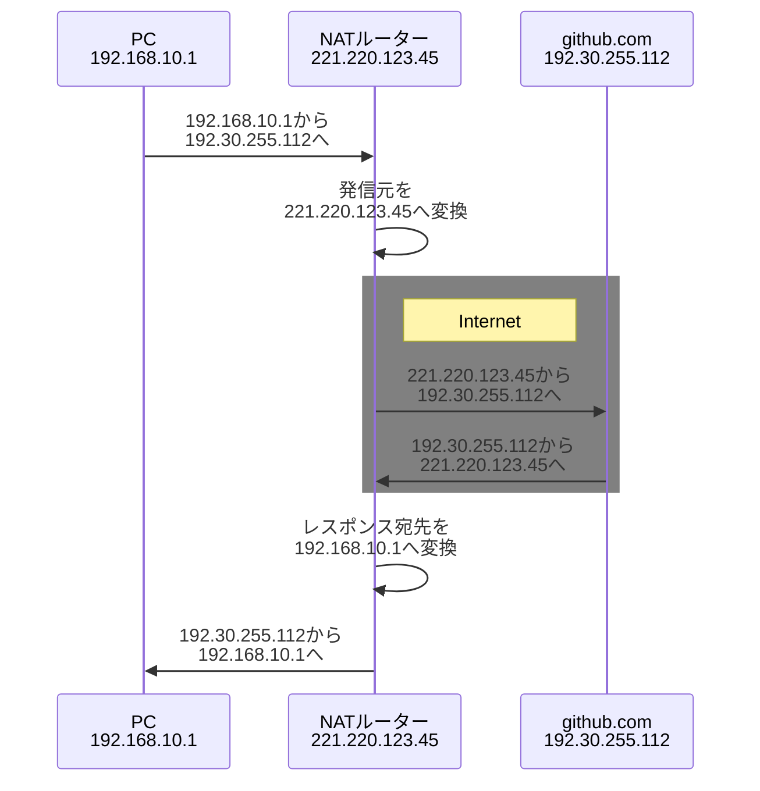
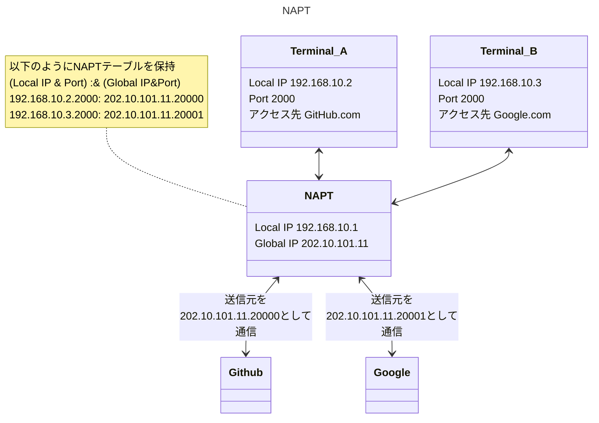

<div style='border-radius: 1em; border-style:solid; border-color:#D3D3D3; background-color:#F8F8F8'>

<p class="h4">&nbsp;&nbsp;Table of Contents</p>

<!-- START doctoc generated TOC please keep comment here to allow auto update -->
<!-- DON'T EDIT THIS SECTION, INSTEAD RE-RUN doctoc TO UPDATE -->

- [IPアドレスとは？](#ip%E3%82%A2%E3%83%89%E3%83%AC%E3%82%B9%E3%81%A8%E3%81%AF)
  - [プライベートIPアドレス](#%E3%83%97%E3%83%A9%E3%82%A4%E3%83%99%E3%83%BC%E3%83%88ip%E3%82%A2%E3%83%89%E3%83%AC%E3%82%B9)
    - [Network Address Translation](#network-address-translation)
    - [Network Address and Port Translation](#network-address-and-port-translation)
  - [IPアドレスのクラス](#ip%E3%82%A2%E3%83%89%E3%83%AC%E3%82%B9%E3%81%AE%E3%82%AF%E3%83%A9%E3%82%B9)
  - [IPv4](#ipv4)
- [サブネットマスク: ネットワーク部とホスト部の境目](#%E3%82%B5%E3%83%96%E3%83%8D%E3%83%83%E3%83%88%E3%83%9E%E3%82%B9%E3%82%AF-%E3%83%8D%E3%83%83%E3%83%88%E3%83%AF%E3%83%BC%E3%82%AF%E9%83%A8%E3%81%A8%E3%83%9B%E3%82%B9%E3%83%88%E9%83%A8%E3%81%AE%E5%A2%83%E7%9B%AE)
  - [ネットワークアドレスの集約](#%E3%83%8D%E3%83%83%E3%83%88%E3%83%AF%E3%83%BC%E3%82%AF%E3%82%A2%E3%83%89%E3%83%AC%E3%82%B9%E3%81%AE%E9%9B%86%E7%B4%84)
- [予約済みIPアドレス: ネットワークアドレス, ブロードキャストアドレス, ループバックアドレス](#%E4%BA%88%E7%B4%84%E6%B8%88%E3%81%BFip%E3%82%A2%E3%83%89%E3%83%AC%E3%82%B9-%E3%83%8D%E3%83%83%E3%83%88%E3%83%AF%E3%83%BC%E3%82%AF%E3%82%A2%E3%83%89%E3%83%AC%E3%82%B9-%E3%83%96%E3%83%AD%E3%83%BC%E3%83%89%E3%82%AD%E3%83%A3%E3%82%B9%E3%83%88%E3%82%A2%E3%83%89%E3%83%AC%E3%82%B9-%E3%83%AB%E3%83%BC%E3%83%97%E3%83%90%E3%83%83%E3%82%AF%E3%82%A2%E3%83%89%E3%83%AC%E3%82%B9)
  - [ネットワークアドレス](#%E3%83%8D%E3%83%83%E3%83%88%E3%83%AF%E3%83%BC%E3%82%AF%E3%82%A2%E3%83%89%E3%83%AC%E3%82%B9)
  - [ブロードキャストアドレス](#%E3%83%96%E3%83%AD%E3%83%BC%E3%83%89%E3%82%AD%E3%83%A3%E3%82%B9%E3%83%88%E3%82%A2%E3%83%89%E3%83%AC%E3%82%B9)
  - [ループバックアドレス](#%E3%83%AB%E3%83%BC%E3%83%97%E3%83%90%E3%83%83%E3%82%AF%E3%82%A2%E3%83%89%E3%83%AC%E3%82%B9)
- [References](#references)

<!-- END doctoc generated TOC please keep comment here to allow auto update -->


</div>

##  IPアドレスとは？

<div style='padding-left: 2em; padding-right: 2em; border-radius: 1em; border-style:solid; border-color:#D3D3D3; background-color:#F8F8F8'>
<p class="h4"><ins>Def: IPアドレス</ins></p>note for Terminal_B ""

IPアドレスとは, 通信プロトコルのIPが送信先を判断するために利用する「ネットワークに接続されているコンピューターに割り当てられた住所」のこと.
IPアドレスは「グローバルIPアドレス」と「プライベートIPアドレス」の２種類に分けられ, 以下のような違いがある:

- グローバルIPアドレス: インターネットに接続された機器に一意に割り当てられるIPアドレス
- プライベートIPアドレス: イントラネットで一意に割り当てられるIPアドレス

</div>

グローバルIPアドレスについて全く同じアドレスをもつコンピューターが複数台存在してしまうと, 「コンピューターを識別する」という目的が果たせないので, 
番号の重複を防ぐために ICANN(アイキャン)という機関が中心となってグローバルIPアドレスを管理しています.

### プライベートIPアドレス

会社や仮定などのLAN内のネットワーク（＝イントラネット）に限って利用可能なIPアドレスは自由に使うことが出来ます.

- 自由に使用できるとはいえ組織内で一意でない場合は, 宛先を混同して正常に通信できないので一意に割り当てる必要があります.
- このIPアドレスが割り当てられた機器はインターネットでは通信を行えないため, インターネット通信を行うためには, アドレス変換技術(NAT, Network Address Translation)などでグローバルIPを持つ機器に中継してもらう必要がある

<div style='padding-left: 2em; padding-right: 2em; border-radius: ０em; border-style:solid; border-color:#D3D3D3; background-color:#F8F8F8'>
<p class="h4"><ins>IPv4におけるプライベートIPアドレスの範囲</ins></p>

|クラス|	アドレス範囲|
|---|:---:|
|クラスA|	10.0.0.0 ～ 10.255.255.255|
|クラスB|	172.16.0.0 ～ 172.31.255.255|
|クラスC|	192.168.0.0 ～ 192.168.255.255|

なお, プライベートIP以外がグローバルIPアドレスの範囲となります.

</div>

#### Network Address Translation

<div style='padding-left: 2em; padding-right: 2em; border-radius: 1em; border-style:solid; border-color:#D3D3D3; background-color:#F8F8F8'>
<p class="h4"><ins>Def: Network Address Translation</ins></p>

- Network Address Translationは, 企業や家庭のLAN（Local Area Network）内で利用するプライベートIPアドレスを、インターネットで通信する際に使うグローバルIPアドレスに変換する技術を指す
- ルーターが備える機能の1つで, ルーターは変換元である内部のIPアドレスと変換先である外部のIPアドレスの対応関係を**NATテーブル**で管理
- プライベートIPアドレスとグローバルIPアドレスを1対1で変換してしまうので, ルーターが保持するグローバルIPアドレスの数しか複数端末が同時にインターネットへ接続できないという問題がある(→NAPTの登場)

</div>

まず基本として, プライベートIPアドレスのままではLAN内にある端末からインターネットにあるサーバーにアクセスできません.
インターネットを介した通信を実現するにあたって, ローカルのデバイス目線だと

1. ルーターが, 送信元のプライベートIPアドレス（内部のIPアドレス）をグローバルIPアドレス（外部のIPアドレス）に書き換えて送信
2. 宛先のサーバーからは, そのグローバルIPアドレスを持つ端末が送信元に見えるかたちで通信のやり取り
3. サーバーからの応答を受け取ったルーターは, 宛先のグローバルIPアドレスをNATテーブルに従ってプライベートIPアドレスに再変換



通信時にIPアドレスが書き換えられるので, 外部ネットワークに対して内部ネットワークを隠蔽できるという特徴があります. 
またLAN内にある端末には外部ネットワークから直接アクセスできなくなるのでセキュリティーを高められます.
そのため, プライベートIPアドレスがバレてしまっても特段問題はありません.

#### Network Address and Port Translation

<div style='padding-left: 2em; padding-right: 2em; border-radius: 1em; border-style:solid; border-color:#D3D3D3; background-color:#F8F8F8'>
<p class="h4"><ins>Def: Network Address and Port Translation</ins></p>

- NAPTはLAN内にある端末のプライベートIPアドレスと送信元ポート番号を, ルーターが持つ1つのグローバルIPアドレスと適当なポート番号に書き換える仕組みのこと
- ポート番号は他の通信と重ならないように割り当てる

</div>

例としてGlobal IP address 202.10.101.11をもつ同一LAN内に以下の２つの端末とNAPTルーター以下のような形で存在するとする

- NAPTルーター: 192.168.10.1
- 端末 A: 192.168.10.2, GitHub.comへアクセスしたい
- 端末 B: 192.168.10.3, Google.comへアクセスしたい

NATは, あくまでもプライベートアドレスとグローバルアドレスを1対1で変換するものなので, 同時にアクセスしたい場合は端末の数だけグローバルアドレスが必要になる. NAPTはプライベートアドレス端末で利用しているTCP/UDPのポート番号理利用して, ルーターが持つ1つのグローバルIPアドレスと適当なポート番号に書き換えることで同じ一つのグローバルアドレスを使いながら, 同時に複数のプライベートアドレス端末からの通信を実現します.

**ネットワークアドレスの変換例**

|端末|変換前Private IP Address|Global IP Address|Port|NAPTからの送信元|アクセス先|
|----|----|---|---|---|---|
|端末 A|192.168.10.2|202.10.101.11|20000|202.10.101.11:20000|GitHub.com|
|端末 B|192.168.10.3|202.10.101.11|20001|202.10.101.11:20001|Google.com|


NAPTではプライベートIPアドレス及びそのポート番号とグローバルIPアドレス及びそのポート番号の対応を管理することでIPマスカレード機能を実現しています.





### IPアドレスのクラス

IPアドレスは, クラスA, クラスB, クラスC, クラスD, クラスEの5つのアドレスクラスに分類されます.
これらのクラスでは以下の項目が定義されています:

- ネットワーク部とホスト部の範囲
- アドレス範囲
- 用途


<style>
    .header_gray {
        width: 70%;
        text-align: center;192.168.10.100
    }
    .header_gray th {
        background: grey;
        word-wrap: break-word;
        text-align: center;
    }
</style>

<div class="header_gray">

|クラス|	アドレス範囲|	定義	|用途|
|:---:|:---:|:---:|:---:|
|クラスA|	0.0.0.0 ～ 127.255.255.255  |	ネットワーク部 (8bit)　ホスト部 (24bit )	|大規模ネットワークでの使用|
|クラスB|	128.0.0.0 ～ 191.255.255.255|	ネットワーク部 (16bit)　ホスト部 (16bit)	|中規模ネットワークでの使用|
|クラスC|	192.0.0.0 ～ 223.255.255.255|	ネットワーク部 (24bit)　ホスト部 (8bit)	192.168.10.100|小規模ネットワークでの使用|
|クラスD|	224.0.0.0 ～ 239.255.255.255|	下位28bitがマルチキャストグループID	|マルチキャスト用のアドレス|
|クラスE|	240.0.0.0 ～ 255.255.255.255|	現在、割り当てが定義されていない	|実験用のアドレス|

</div>

- ネットワーク部が小さいほど, ホスト部が大きくなるので大きなネットワークになる
- 例: クラスCではホスト部が8bitなので, $256 - 2 = 254$ 個のIPアドレスのみネットワーク内で割り当てることができる

> 使用禁止されているアドレス

自分自身を表すループバックアドレスとして, IPv4では一般に `127.0.0.1`を用いるが実際には `127.0.0.0/8` のネットワーク番号を持つIPアドレスはクラスの関係上すべてループバックアドレスとして使用できてしまいます. そのため, `127.0.0.0/8`はネットワークアドレスとして使用禁止されているIPアドレスと事実上なっています. なお, IPv6では `::1` がループバックアドレスが定義されており, IPv4での無駄が改善されています.


### IPv4

IPアドレスには, 32 bitで表現される「IPv4」と128 bitで表現される「IPv6」の２種類があります.
従来から用いられているIPv4の構造は基本的には次のような構造になっています:


> ネットワーク部とホスト部の関係


## サブネットマスク: ネットワーク部とホスト部の境目

IPアドレスにおいてネットワークアドレスに割り当てるbit数を定義するために使われるのが, サブネットマスクという32 bitの数値です.
サブネットマスクには, 以下のような3つの表記方法があります
192.168.10.100
- CIDR表記, アドレスプレフィックス表記 : `/24`
- 10進数表記: `255.255.255.`
- 2進数表記: `11111111.11111111.11111111.00000000`

<div style='padding-left: 2em; padding-right: 2em; border-radius: 1em; border-style:solid; border-color:#D3D3D3; background-color:#F8F8F8'>
<p class="h4"><ins>Def: サブネット</ins></p>

サブネットは, クラスA, B, Cのネットワークを複数の小さなネットワークに分割したネットワークのこと.
IPアドレスを構成するネットワーク部とホスト部のうち、ホスト部のビットをサブネット部として使用することにより,
IPアドレスを無駄なく使うことを目的にサブネットは活用されます.

</div>


<div style='padding-left: 2em; padding-right: 2em; border-radius: 0em; border-style:solid; border-color:#D3D3D3; background-color:#F8F8F8'>
<p class="h4"><ins>Problem 1</ins></p>

192.168.0.0/23(サブネットマスク255.255.254.0)のIPv4ネットワークにおいて, ホストとして使用できるアドレスの個数の上限はいくつか？

</div>

<br>

<div style="display: inline-block; background: #6495ED;; border: 1px solid #6495ED; padding: 3px 10px;color:#FFFFFF"><span >解答</span>
</div>

<div style="border: 1px solid #6495ED; font-size: 100%; padding: 20px;">


IPv4アドレスは32 bitであり,`/23` は先頭から23 bit目までがネットワークアドレスであることを表しているので, 
$32 - 23 = 9$ bitがホストアドレスに割り当てられるbit数. 9 bitで表現できる数は

$$
2^9 = 256 \times 2 = 512
$$

ただし, `000000000`と`111111111`はそれぞれネットワークアドレス, ブロードキャストアドレスとして予約されているため
ホストアドレスとして割り当てることはできないので, 510個が答えとなる.

</div>

<br>

<div style='padding-left: 2em; padding-right: 2em; border-radius: 0em; border-style:solid; border-color:#D3D3D3; background-color:#F8F8F8'>
<p class="h4"><ins>Problem 2</ins></p>

クラスBのIPアドレスで, サブネットマスクが16進数の FFFFFF80 である場合，利用可能なホスト数は最大幾つか？

</div>

<br>

<div style="display: inline-block; background: #6495ED;; border: 1px solid #6495ED; padding: 3px 10px;color:#FFFFFF"><span >解答</span>
</div>

<div style="border: 1px solid #6495ED; font-size: 100%; padding: 20px;">


FFFFFF80を2進数と10進数展開すると, 

```zsh
# 10進数
255.255.255.128

# 2進数
11111111.11111111.11111111.10000000
```

従って, ホスト部は $2^7 - 2 = 126$のアドレス数が利用可能.


</div>


<br>

<div style='padding-left: 2em; padding-right: 2em; border-radius: 0em; border-style:solid; border-color:#D3D3D3; background-color:#F8F8F8'>
<p class="h4"><ins>Problem 3</ins></p>

ネットワークに接続されているホストのIPアドレスが212.62.31.90で, サブネットマスクが255.255.255.224のときのホストアドレスを10進数でこたえよ

</div>

<br>

<div style="display: inline-block; background: #6495ED;; border: 1px solid #6495ED; padding: 3px 10px;color:#FFFFFF"><span >解答</span>
</div>

<div style="border: 1px solid #6495ED; font-size: 100%; padding: 20px;">

サブネットマスクが255.255.255.224なので下位5 bitがホストアドレスとわかる.

従って, 90を２進数で表現すると `01011010` なので `11010`, つまり 26がホストアドレスとわかる.

</div>


### ネットワークアドレスの集約

<div style='padding-left: 2em; padding-right: 2em; border-radius: 1em; border-style:solid; border-color:#D3D3D3; background-color:#F8F8F8'>
<p class="h4"><ins>Def: ルート集約</ins></p>

複数のネットワークアドレスを1つにまとめることをルート集約（経路集約, スーパーネット化）という.
複数のIPアドレスを2進数表記にしたときに, 共通しているビット列の位置までサブネットマスクを左にずらすことでルート集約を行うことができる.


</div>

ネットワークの規模が大きくなって, サブネットワークの数が増えてくると, ルーティングテーブルに登録するネットワーク数も多くなり, 多くのメモリを必要とします. ルート集約を行うと複数のネットワークアドレスを1つのネットワークアドレスに集約して対向側のルータへ通知することができるため, ルーティングアップデートで伝える情報が減り, 収束時間を短縮することも可能になるというメリットがあります.

このネットワークの集約を可能にした技術のことがCIDRです.

<div style='padding-left: 2em; padding-right: 2em; border-radius: 1em; border-style:solid; border-color:#D3D3D3; background-color:#F8F8F8'>
<p class="h4"><ins>Def: CIDR</ins></p>

インターネットの黎明期に使用されていたアドレスクラスの概念を廃止し, ネットワークアドレス部を1ビット単位の任意のビット長で割り当て可能にした仕組みのこと. 別名「クラスレスアドレッシング」とも呼ばれる. 

CIDRのおかげで, アドレス空間の細分化や複数のネットワークの集約化を実現することができている.
</div>

CIDRによって, 例えば `200.0.0.0/24 ～ 200.0.7.0/24` の8つのネットワークを, 1つのネットワークに集約をして `200.0.0.0/21` として扱うことができます. 例えば401個のホストを同じネットワークで管理したいとき, クラスBのネットワークを付与するのではなく, 必要としているIPアドレスの数と同じくらいの数となるよう, 連続する複数のクラスCのネットワークを1つのネットワークとして割り当てれば(= 2つのクラスCを集約する), IPアドレス空間を有効利用できるようになります.


<div style='padding-left: 2em; padding-right: 2em; border-radius: 0em; border-style:solid; border-color:#D3D3D3; background-color:#F8F8F8'>
<p class="h4"><ins>Problem: ネットワークスペシャリスト試験令和4年春期　問9</ins></p>

IPv4アドレスが 192.168.10.0/24～192.168.58.0/24 のネットワークを対象に経路を集約するとき，集約した経路のネットワークアドレスのビット数がもっとも多くなるIPアドレス形式はなにか？

</div>

<br>

<div style="display: inline-block; background: #6495ED;; border: 1px solid #6495ED; padding: 3px 10px;color:#FFFFFF"><span >解答</span>
</div>

<div style="border: 1px solid #6495ED; font-size: 100%; padding: 20px;">

経路の集約をするには, それぞれのネットワークのIPアドレスを2進数にして比べた時に, 上位から数えた共通部分の最大長をアドレスプレフィックスとして設定します.


```zsh
#192.168.10.0/24
11000000 10101000 00001010 00000000

#192.168.58.0/24
11000000 10101000 00111010 00000000
```

共通部分は先頭から 18 bit目までなので, これをアドレスプレフィックスとして経路の集約をすることで使用可能なホストアドレス数を最大化することができます. 

したがって `192.168.0.0/18` が解答となります.

</div>

<br>

<div style='padding-left: 2em; padding-right: 2em; border-radius: 0em; border-style:solid; border-color:#D3D3D3; background-color:#F8F8F8'>
<p class="h4"><ins>IPアドレスの設定</ins></p>

あなたは, 自分の所属する部署のネットワーク管理者である. 全社のネットワークを管理する情報システム部門の担当者に,「あなたが管理する部署は, `192.168.10.0/24`のIPアドレスを使って下さい」と言われた. 以下の選択肢にあるIPアドレスのうち, 部署のマシンに割り当ててよいIPアドレスを一つ選びなさい.

- 192.168.10.0
- 192.168.24.0
- 192.168.10.100
- 192.168.10.255
- 192.168.24.100

</div>

<br>

<div style="display: inline-block; background: #6495ED;; border: 1px solid #6495ED; padding: 3px 10px;color:#FFFFFF"><span >解答</span>
</div>

<div style="border: 1px solid #6495ED; font-size: 100%; padding: 20px;">

`192.168.10.0/24`のIPアドレスの意味は

- `192.168.10.0`はネットワークアドレス
- `/`の後ろの`24`はサブネットマスクのビット数

従って, `192.168.10.0/24`で表されるネットワークは, `192.168.10.0～192.168.10.255`というIPアドレス群であることがわかります.

- 192.168.10.0はネットワークアドレス
- 192.168.10.255はブロードキャストアドレス

であるため, この二つはマシンに割り当てられません. 従って, 選択肢のうち割当可能なアドレスは`192.168.10.100`となります.

</div>


## 予約済みIPアドレス: ネットワークアドレス, ブロードキャストアドレス, ループバックアドレス

IPアドレスには, コンピュータなどのホストに割り当てられない, 特別な用途で使用するものがあります. 

- ネットワークアドレス: ホスト部の bit が全て 0 のアドレス
- ブロードキャストアドレス: ホスト部の bit が全て 1 のアドレス
- ループバックアドレス: `127.0.0.1` のアドレス

が予約済みIPアドレスです.

### ネットワークアドレス

<div style='padding-left: 2em; padding-right: 2em; border-radius: 1em; border-style:solid; border-color:#D3D3D3; background-color:#F8F8F8'>
<p class="h4"><ins>Def: ネットワークアドレス</ins></p>

ネットワークそのものを表すアドレスをネットワークアドレスという.
ネットワークアドレスは, ホスト部の2進数のビットが全て `0` となっている.

</div>

### ブロードキャストアドレス

<div style='padding-left: 2em; padding-right: 2em; border-radius: 1em; border-style:solid; border-color:#D3D3D3; background-color:#F8F8F8'>
<p class="h4"><ins>Def: ブロードキャストアドレス</ins></p>

同じネットワークに属する全てのホストにパケットを一斉送信するためのアドレスをブロードキャストアドレスという.
ブロードキャストアドレスはホスト部のビットが全て `1` となっている.

</div>

### ループバックアドレス

<div style='padding-left: 2em; padding-right: 2em; border-radius: 1em; border-style:solid; border-color:#D3D3D3; background-color:#F8F8F8'>
<p class="h4"><ins>Def: ループバックアドレス</ins></p>

ループバックアドレスは、自分自身を示す仮想的なIPアドレスのこと.

ネットワークアドレスとしても使用禁止とされているネットワークの`127.0.0.0/8`のネットワークで、`127.0.0.1`のアドレスのことをループバックアドレスとして予約されている. 

IPv6の場合は `::1（0000:0000:0000:0000:0000:0000:0000:0001）`となる.

</div>


ループバックアドレスは自分自身のサービスが動作しているかどうかを確認したり, 自分自身のコンピュータ上で動作しているサービスへ接続したりする場合に利用します. また, ループバックアドレスのIPアドレスには、「**localhost**」という単純なホスト名が割り当てられています.

なので, `Jekyll`や`Jupyter`といったサービスをローカルで立ち上げると

```
http://127.0.0.1:port/
```

とServer addressが表示されますが, `localhost:port`に対してアクセスしても同じサービスを利用することが出来ます.


References
----------
- [TCP/IPの絵本 第2版 ネットワークを学ぶ新しい9つの扉, 株式会社アンク 著](https://www.shoeisha.co.jp/book/detail/9784798155159)
- [ネットワークエンジニアとして > Network Study 1](https://www.infraexpert.com/study/study12.html)
