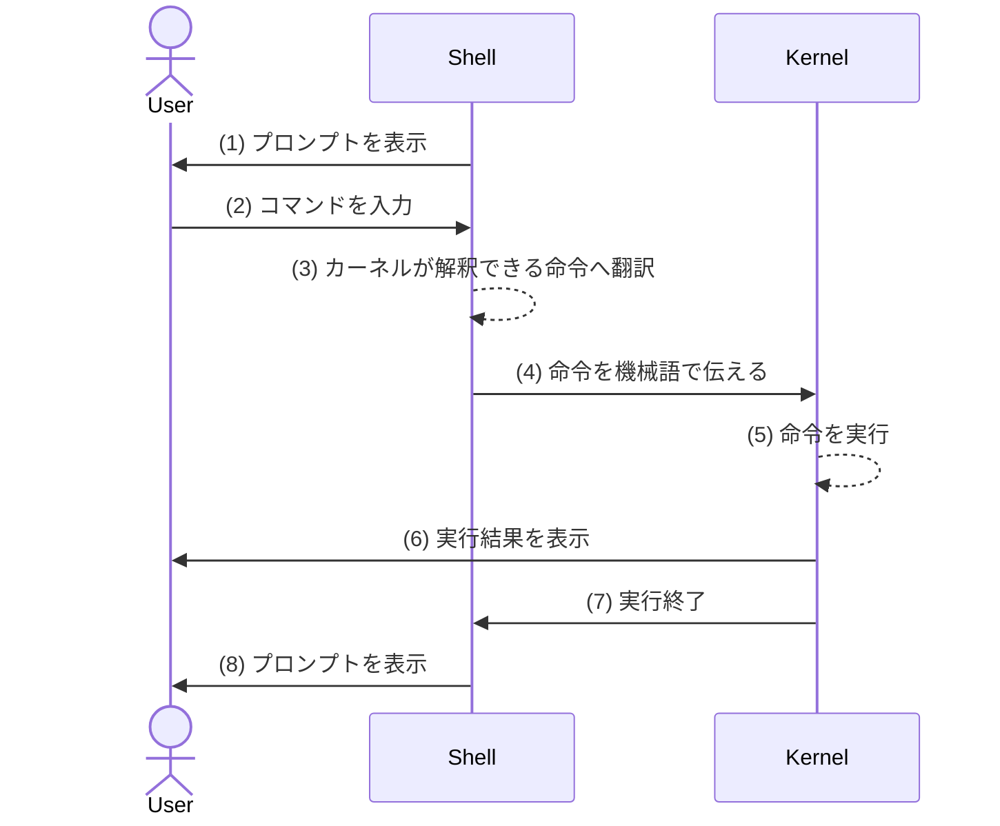
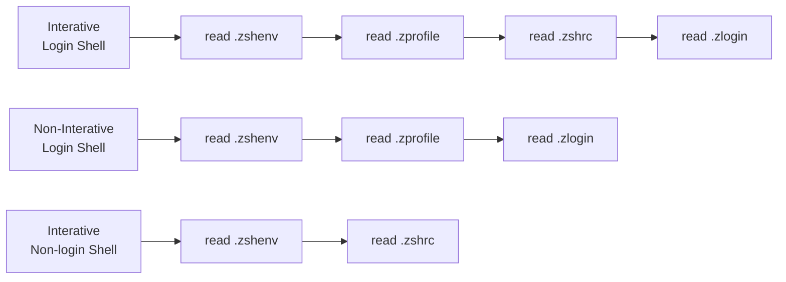

<div style='border-radius: 1em; border-style:solid; border-color:#D3D3D3; background-color:#F8F8F8'>

<p class="h4">&nbsp;&nbsp;Table of Contents</p>

<!-- START doctoc generated TOC please keep comment here to allow auto update -->
<!-- DON'T EDIT THIS SECTION, INSTEAD RE-RUN doctoc TO UPDATE -->

- [Overview](#overview)
- [What is Z Shell(=zsh) ?](#what-is-z-shellzsh-)
  - [Shell and Kernel](#shell-and-kernel)
  - [Z shell: better than Bash?](#z-shell-better-than-bash)
    - [設定ファイルの種類](#%E8%A8%AD%E5%AE%9A%E3%83%95%E3%82%A1%E3%82%A4%E3%83%AB%E3%81%AE%E7%A8%AE%E9%A1%9E)
    - [設定ファイルが読み込まれるタイミング](#%E8%A8%AD%E5%AE%9A%E3%83%95%E3%82%A1%E3%82%A4%E3%83%AB%E3%81%8C%E8%AA%AD%E3%81%BF%E8%BE%BC%E3%81%BE%E3%82%8C%E3%82%8B%E3%82%BF%E3%82%A4%E3%83%9F%E3%83%B3%E3%82%B0)
- [Installing Zsh](#installing-zsh)
- [Configuration](#configuration)
  - [基本方針](#%E5%9F%BA%E6%9C%AC%E6%96%B9%E9%87%9D)
  - [`.zshrc`の設定](#zshrc%E3%81%AE%E8%A8%AD%E5%AE%9A)
    - [(1) ヒストリーサイズの再設定](#1-%E3%83%92%E3%82%B9%E3%83%88%E3%83%AA%E3%83%BC%E3%82%B5%E3%82%A4%E3%82%BA%E3%81%AE%E5%86%8D%E8%A8%AD%E5%AE%9A)
    - [(2) Zshのgit command補完を有効にする](#2-zsh%E3%81%AEgit-command%E8%A3%9C%E5%AE%8C%E3%82%92%E6%9C%89%E5%8A%B9%E3%81%AB%E3%81%99%E3%82%8B)
    - [(3) git-posh like git prompt](#3-git-posh-like-git-prompt)
- [Appendix](#appendix)
  - [chshコマンド](#chsh%E3%82%B3%E3%83%9E%E3%83%B3%E3%83%89)
  - [パスの設定](#%E3%83%91%E3%82%B9%E3%81%AE%E8%A8%AD%E5%AE%9A)
- [References](#references)

<!-- END doctoc generated TOC please keep comment here to allow auto update -->


</div>

## Overview

**想定環境**

|OS|CPU|
|---|---|
|Ubuntu 20.04 LTS|Intel Core i7-9700 CPU 3.00 GHz|
|Ubuntu 22.04.2 LTS|AMD Ryzen 9 7950X 16-Core Processor|

**What Did I Do?**

- zshのinstall
- `~/.zshenv`, `~/.zshrc`の設定
  - command補完機能の有効化
  - git branch statusを表示するPromptの設定
  - alias, 自作コマンドの読み込み 

## What is Z Shell(=zsh) ?

Z shell(= zsh)はシェルの一種で, bashやtcsh, kshの機能を取り入れる形でBourneシェルを改良したシェルのことです.
zsh以外の代表的なシェルは以下です:

---|---
`sh` | Bourne-shell. 動作は高速だが機能が貧弱という特徴がある. b-shellとも呼ばれる.
`bash` | Bourne-shellを大幅に改良したBourne Again SHell. Linuxでは標準シェルとして採用されている. 基本どこでも使えるシェルなので, シェルスクリプトは原則bashで記述するのが望ましい.
`csh` | DSD系UNIXで使われたシェル. C言語風のコマンド構文を持っているのが特徴.
`tcsh` | cshを改良したシェル
`ash` | shの代替となる,小型かつ高速なシェル.
`dash` | Debian版ash. 動作が軽量高速という特徴がある. `/bin/sh`はシンボリックリンク.
`ksh` | Korn-shell. bシェルを拡張したシェル. bashのバイナリよりも小さく, 多くの関数（`echo`や`getopts`など）が個別の実行ファイルではなくシェルの中に組み込まれていて, メモリ効率性の観点から実行スピードが速い特徴がある.
`zsh` | b-shellを拡張したシェル. bashやtcshの機能を取り入れた強力なシェル. 補完機能やプロンプトカスタムなどユーザーフレンドリーなシェル. 
`fish` | fish-shell. 2005年にリリースされた比較的新しいユーザーフレンドリーなシェル.

### Shell and Kernel

シェルは一言で言えば, 「**ユーザーの命令をカーネルに伝えるための道具**」です. 
このことを理解するためには, コンピューターの動作を管理しているOSの頭脳ともいうべき「**カーネル**」という概念をまず理解する必要があります.

<div style='padding-left: 2em; padding-right: 2em; border-radius: 1em; border-style:solid; border-color:#D3D3D3; background-color:#F8F8F8'>
<p class="h4"><ins>Def: Kernel </ins></p>

- カーネルとはOSの核になる部分のこと 
- カーネルプログラムによってコンピューターを構成するハードウェアとソフトウェアが管理されている
- OSによって異なるが, 実際にカーネルが担当する機能の例として Process Scheduling, Memory ManagementやSystem Callsがある


現在利用しているカーネルプログラムは `/boot/vmlinuz` がそのファイルとなるが, これは実際に利用しているカーネルプログラムに対するシンボリックリンクの形で存在してる:

```zsh
% ls -l /boot/vmlinuz
lrwxrwxrwx 1 root root 25 Jul 25 16:50 /boot/vmlinuz -> vmlinuz-5.19.0-50-generic
```

</div>

現在使用しているカーネルのバージョンを確認するには以下のいずれかのコマンドで確認できます:

```zsh
% cat /proc/version   
Linux version 5.4.0-58-generic (buildd@lcy01-amd64-004) (gcc version 9.3.0 (Ubuntu 9.3.0-17ubuntu1~20.04)) #64-Ubuntu SMP Wed Dec 9 08:16:25 UTC 2020

% uname -sr        
Linux 5.4.0-58-generic
```

上の例を見るとわかりますが, 「Linux」とはOS自体を指す言葉ではなく本来はLinux Kernelのようにカーネルの種類を指す名称です.
このLinux Kernelに, ライブラリ, シェル, GNUソフト, GUIシステムといったカーネル以外の機能を加え, １つのOSとして配布されているものが「Linuxディストリビューション」です.
普段の用語的には, 「Linux」という名称は, Linuxディストリビューションのことを指す場合が現在では多いです.

続いてシェルについて説明します.

上で説明したカーネルはハードウェアと密接に関連しており, ユーザーの命令が機械語で書かれない限り, その命令を直接理解する能力がありません. 
ユーザーからカーネルへ命令を伝える際の窓口として機能しているのがシェルです.


<div style='padding-left: 2em; padding-right: 2em; border-radius: 1em; border-style:solid; border-color:#D3D3D3; background-color:#F8F8F8'>
<p class="h4"><ins>Def: Shell</ins></p>

- ユーザーがOSとやり取りするためのインターフェスを提供するソフトウェアがシェル
- ユーザーからテキストベースコマンドを受け取り, それを機械語に翻訳した上でカーネルに実行させる機能を持っているのでcommand-line interpreterの一種と認識してもよい
- 種子の内部の核=カーネルに対して, 種子の殻=シェルから名付けられている. 

</div>

ユーザーはシェルを用いることで以下のようなフローでKernelとのやり取りをすることができる:



プロンプトとはbashならば`$`, zshならば`%`とコマンドラインに表示される記号のことです.
システムがコマンドの入力を待っている状態であることを示すために, シェルがプロンプトを表示してくれています.

もちろん気に食わなかったらユーザーの方で設定ファイルを修正することで, プロンプトを非表示に変更することも可能です.

### Z shell: better than Bash?

- Command-lineでの強力な補完機能
- 実行履歴をすべてのシェルで共有できる
- ユーザーフレンドリーな変数と配列操作
- named directoryを扱うことができる
- login shellとnot login shell両方に共通に読まれる設定ファイル`/etc/zshenv`と`~/.zshenv`がある
- Oh My Zshのような強力なPlug-inがある

named directory機能の例：
```
login_username@host_name ~ % test=~/Desktop
login_username@host_name ~ % cd ~test      
login_username@host_name ~test
 % pwd
/home/login_username/Desktop
```

#### 設定ファイルの種類

|File|説明|
|---|---|
|`.zshenv`| 	Usually run for every zsh.|
|`.zprofile`| 	Run for login shells.|
|`.zshrc`| 	Run for interactive shells.|
|`.zlogin`| 	Run for login shells.|
|`.zlogout`| 	Run for login shells.(ログアウト時に読み取る)|

それぞれのファイルは `/etc/`, `~/`の２つのクラスがあります.
`/etc/`クラスはthe system administratorによって設定され, すべてのユーザーに対して実行されます.
各ユーザーが独自に設定したい場合は`~/`クラスのファイルを編集します.


#### 設定ファイルが読み込まれるタイミング

login shellとnon-login shellの違いについては別記事でまとめる予定ですが, ユーザーがConfiguration関係で意識すべき違いは以下のフローとなります:




## Installing Zsh

zshのインストールはapt package manager経由で簡単に取得できます.
インストールの前にpackage情報を確認してみます:

```zsh
# 2023-07-27に実施
$ apt-cache show zsh
apt-cache show zsh
Package: zsh
Architecture: amd64
Version: 5.8.1-1
Priority: optional
Section: shells
...
```

[Z Shell公式ページ](https://zsh.sourceforge.io/News/)を確認してみると
2022-05-14に5.9がReleaseされているので, ちょっと古いZ shellであることがわかります.

```
$ sudo apt install zsh
$ zsh --version
zsh 5.8 (x86_64-ubuntu-linux-gnu)
```

次にzshをdefault login shellとして設定します.
default login shellを変更するとinterative non-login shellのデフォルトも同時に変更されます.

```bash
$ chsh -s $(which zsh)
```

シェルが変更されたかどうかを確認したい場合は

```
% echo $SHELL
/usr/bin/zsh
```

と表示されれば問題ありません.
その後, `reboot` としてシェルが実際に変更されているか確認してください.


## Configuration
### 基本方針

zshの設定に関する設定ファイルは, Home Directory直下に存在する `.zshenv`, `.zprofile`, `.zshrc`が代表的なファイルです.
普段使うshellはnon-login shellなので基本的には`~/.zshenv`と`~/.zshrc`の２つの設定で十分です. 

|File|設定方針|例|
|---|---|---|
|`~/.zshenv`|login, non-login, non-interactiveに共通して読み込ませたい場合|PATHの設定|
|`~/.zshrc`|ユーザー目線であったら嬉しい設定を記載|aliasの設定, prompt customize|


zsh configurationに関するファイル管理の観点から以下のような構成にします:

```
~
├── .zshrc                       # Promptやaliasの設定
├── .zshenv                      # PATH関連の設定
└── .zsh.d                       # zsh関連のファイル置き場.
       ├── bin                   # 自作設定ファイル置き場
       |    ├── git-prompt.sh    # git prommpt設定
       |    └── util_function.sh # zsh専用shell-script
       ├── .zsh_history          # history file
       ├── zshrc.bak             # backup file
       └── zshenv.bak            # backup file
```

### `.zshrc`の設定

<div style='padding-left: 2em; padding-right: 2em; border-radius: 1em; border-style:solid; border-color:#D3D3D3; background-color:#F8F8F8'>
<p class="h4"><ins>設定概要</ins></p>

1. ヒストリーサイズの再設定
2. Zshのgit command補完を有効にする
3. apt package suggest機能を有効にする
4. git branch statusを`posh-git` likeに表示
5. `ls`や`grep`コマンドを実行した結果で表示される項目のうち,ディレクトリやシンボリックリンクファイルの場合,色や記号が付与されるようにする

</div> 

2023-07時点で設定した`.zshrc`は以下:

```zsh
# -----------------------------
# General
# -----------------------------
# clear settings
unalias -a

# umask
umask 022

# autoload
autoload -Uz promptinit 

# Set up the prompt
promptinit

# -----------------------------
# Sensitive
# -----------------------------
# GPG key setting
export GPG_TTY=$(tty)


# -----------------------------
# History
# -----------------------------
HISTSIZE=1000
SAVEHIST=1000000
HISTFILE=~/.zsh.d/.zsh_history
setopt extended_history # record shitory with timestamp
setopt hist_ignore_space
setopt inc_append_history
setopt share_history # share history between terminals


# -----------------------------
# PATH
# -----------------------------
# drop path duplicate
typeset -U path PATH

# general
export PATH="$HOME/bin:$PATH"

# zsh completion
fpath+=~/.zsh.d/.zfunc

#-------------------------------------
# Alias settings
#-------------------------------------
# basic
alias grep='grep --color=auto'
alias ls='ls -F --color=auto --group-directories-first'
alias log-out='gnome-session-quit'

# git
alias git-cd='cd "$(git root)"'

# vscode
alias code-cd='if [[ -z $VSCODE_WS ]]; then echo "There is no VSCODE_WS variable"; else cd $VSCODE_WS; fi'


#-------------------------------------
# Function settings
#-------------------------------------
# general
source ~/.zsh.d/bin/util_function.sh

# package suggest
function command_not_found_handler() {
  # check because c-n-f could've been removed in the meantime
  if [ -x /usr/lib/command-not-found ]; then
	   /usr/lib/command-not-found -- "$1"
     return $?
  elif [ -x /usr/share/command-not-found/command-not-found ]; then
	   /usr/share/command-not-found/command-not-found -- "$1"
     return $?
	else
		 printf "%s: command not found\n" "$1" >&2
		 return 127
	fi
}


#-------------------------------------
# Completion
#-------------------------------------
# general
autoload -Uz compinit && compinit
setopt complete_in_word # enable Tab completion even while typing a word

# suggest
zstyle ':completion:*' completer _complete _match _prefix:-complete _list _correct _approximate _prefix:-approximate 
zstyle ':completion:*' group-name ''
zstyle ':completion:*' list-prompt %SAt %p: Hit TAB for more, or the character to insert%s
zstyle ':completion:*' verbose yes

# style: info
zstyle ':completion:*:descriptions' format $'%{\e[01;31m%}---- %d%{\e[m%}'
zstyle ':completion:*:messages' format $'%{\e[01;04;31m%}---- %d%{\e[m%}'
zstyle ':completion:*:warnings' format $'%{\e[01;04;31m%}---- No matches for: %d%{\e[m%}'
zstyle ':completion:*:corrections' format $'%{\e[0;31m%}%d (errors: %e)%{\e[m%}'

# style: matching
zstyle ':completion:*' matcher-list '' 'm:{a-z}={A-Z}' 'm:{a-zA-Z}={A-Za-z}' 'r:|[._-]=* r:|=* l:|=*'
zstyle ':completion:*' use-compctl false # turn off old compctl completion

# style: color
eval $(dircolors)
zstyle ':completion:*' list-colors ${(s.:.)LS_COLORS}
autoload colors && colors

# kill
zstyle ':completion:*:*:kill:*:processes' list-colors '=(#b) #([0-9]#)*=0=01;31'
zstyle ':completion:*:kill:*' command 'ps -u $USER -o pid,%cpu,tty,cputime,cmd'


#-------------------------------------
# Prompt setting: Git
#-------------------------------------
autoload -Uz add-zsh-hook 
source ~/.zsh.d/bin/git-prompt.sh
setopt PROMPT_SUBST

prompt_setup() {
    prompt_color1=${1:-'cyan'}
    prompt_color2=${2:-'green'}

    base_prompt="%F{$prompt_color1}%n@%m%f %F{$prompt_color2}%B%~%b%f "
    git_prompt='$(__posh_git_echo)'
    post_prompt=$'\n'"%# "

    PROMPT=$base_prompt$git_prompt$post_prompt
}

add-zsh-hook precmd prompt_setup
```


#### (1) ヒストリーサイズの再設定

ヒストリーサイズが小さいと振り返りがしづらくなるので変更する.

```zsh
# -----------------------------
# History
# -----------------------------
HISTSIZE=1000                   # history -xのxのlimit
SAVEHIST=100000000              # 4年後replaceを考えているので全部記録程度
HISTFILE=~/.zsh.d/.zsh_history  # history fileの保存先の指定
setopt extended_history         # record shitory with timestamp, history -i
setopt hist_ignore_space        # スペースで始まるコマンドラインはヒストリに追加しない.
setopt inc_append_history       # すぐにヒストリファイルに追記する.
setopt share_history            # share history between zsh processes
```

#### (2) Zshのgit command補完を有効にする

Zshには,Git用のタブ補完ライブラリも同梱されています.
`.zshrc`に`autoload -Uz compinit && compinit`という行を追加するだけで
使えるようになります.使用感は以下のような感じです: 

```
% git che<tab>
check-attr        -- display gitattributes information
check-ref-format  -- ensure that a reference name is well formed
checkout          -- checkout branch or paths to working tree
checkout-index    -- copy files from index to working directory
cherry            -- find commits not merged upstream
cherry-pick       -- apply changes introduced by some existing commits
```


#### (3) git-posh like git prompt 

目指したい形はTerminal上にpowershell-likeに以下の表示をさせることです

```zsh
username@hostname ~/test_dir [branch_name ≡ +1 ~2 -0 !]
% 
```


> Requirement

パワーライン用のフォントをapt package manager経由でインストールします.

```zsh
% sudo apt install powerline
```

posh-git-shの`git-prompt.sh`をLocalの任意の場所(`~/.zsh.d/bin/git-prompt.sh`)にcopy

```zsh
% curl https://raw.githubusercontent.com/lyze/posh-git-sh/master/git-prompt.sh > ~/.zsh.d/bin/git-prompt.sh
```

> `~/.zshrc`での書き方

```zsh
#-------------------------------------
# Prompt setting: Git
#-------------------------------------
autoload -Uz add-zsh-hook 
source ~/.zsh.d/bin/git-prompt.sh
setopt PROMPT_SUBST

prompt_setup() {
    prompt_color1=${1:-'cyan'}
    prompt_color2=${2:-'green'}

    base_prompt="%F{$prompt_color1}%n@%m%f %F{$prompt_color2}%B%~%b%f "
    git_prompt='$(__posh_git_echo)'
    post_prompt=$'\n'"%# "

    PROMPT=$base_prompt$git_prompt$post_prompt
}

add-zsh-hook precmd prompt_setup
```


<div style='padding-left: 2em; padding-right: 2em; border-radius: 1em; border-style:solid; border-color:#e6e6fa; background-color:#e6e6fa'>
<p class="h4"><ins>Column: aliasを一時的に解除したい場合</ins></p>

`.zshrc`にて, `ls`と`grep`コマンドのaliasを設定していますが, 一時的に解除してそれぞれのコマンドを実行したい場合は, `\`をコマンドに付与して実行します:

```zsh
### 一時的にaliasを解除したい場合
% \ls

### aliasを解除したい場合（session中解除される）
% unalias ls
```

</div>


## Appendix
### chshコマンド

**機能**

- ログインシェルを変更するコマンド
- 一般ユーザは自分のアカウントのログインシェルのみを変更できるが, スーパーユーザは全てのアカウントのログインシェルを変更できます

**Syntax**

```zsh
chsh [-s login_shell] [user]
```

---|---
`-h, --help`            |ヘルプメッセージの表示
`-R, --root CHROOT_DIR` |directory to chroot into
`-s, --shell SHELL`     |現在のユーザーのログインシェルを設定

**Exmaple**

```bash
#bashに変更
chsh -s /bin/bash
```

**設定可能なログインシェルリストの表示**

設定可能なシェルは`/etc/shells`ファイルに登録されているのでこれを表示させれば十分です.

```zsh
% cat /etc/shells
# /etc/shells: valid login shells
/bin/sh
/bin/bash
/usr/bin/bash
/bin/rbash
/usr/bin/rbash
/bin/dash
/usr/bin/dash
/bin/zsh
/usr/bin/zsh
```

### パスの設定

<div style='padding-left: 2em; padding-right: 2em; border-radius: 1em; border-style:solid; border-color:#D3D3D3; background-color:#F8F8F8'>
<p class="h4"><ins>Def: PATHを通す</ins></p>

コマンドのあるディレクトのパスを設定することでを環境変数`PATH`に登録することを「**PATHを通す**」という.
PATHを通すことによって, 

- コマンド実行時にKernelが環境変数`PATH`で指定されたディレクトリを確認
- 各コマンドの実行ファイルを見つけ出す
- 入力されたコマンド使える

という仕組みになっている
</div>


現在のシェルのPATH変数は以下のコマンドで確認できます:

```zsh
% echo $PATH
/home/hoge/.local/bin:/usr/local/sbin:/usr/local/bin:/usr/sbin:/usr/bin:/sbin:/bin:/usr/games:/usr/local/games:/snap/bin
```

上記の例でわかるように, 複数のPATHは `:` で繋がれています. 前にある方が優先順位が高く,
`/usr/local/bin:/bin:/usr/bin` と指定されている場合は `/usr/local/bin` にある実行可能ファイルが優先されます.

```zsh
# $HOME/binを優先したい場合
% export PATH="$HOME/bin:$PATH"

# $HOME/binを最後に見るように設定したい場合
% export PATH="$PATH:$HOME/bin"
```


References
-----------

> General

- [Z shell official website](https://zsh.sourceforge.io/)

> git-prompt

- [GitHub.com > lyze/posh-git-sh](https://github.com/dahlbyk/posh-git)

> apt package suggestion

- [Ryo's Tech Blog > Linux基礎知識：bash環境でのパッケージのサジェスト機能](https://ryonakagami.github.io/2022/02/06/suggest-apt-packages-function/)