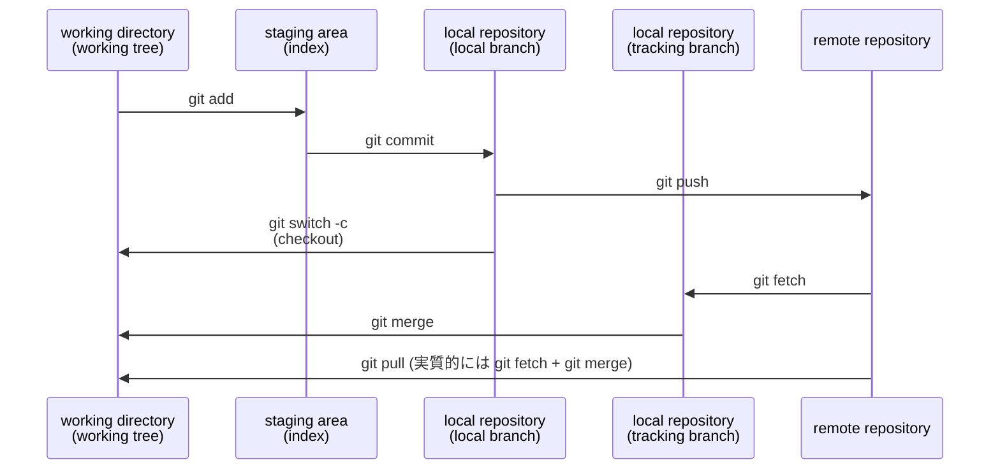
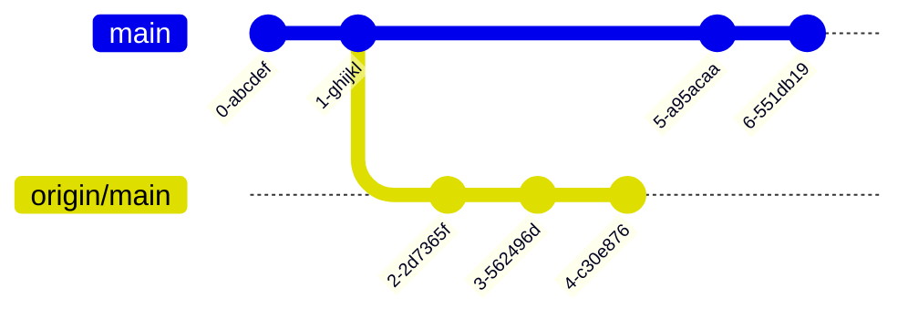
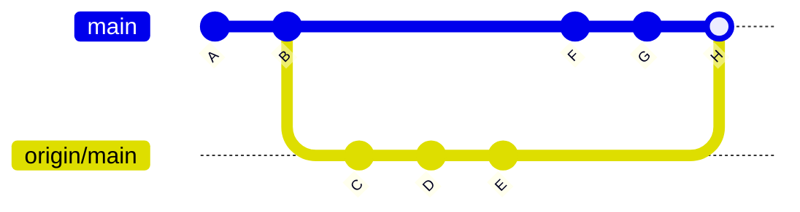
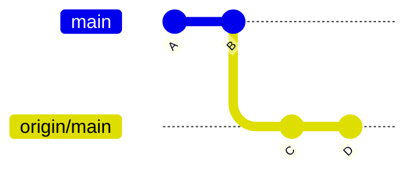
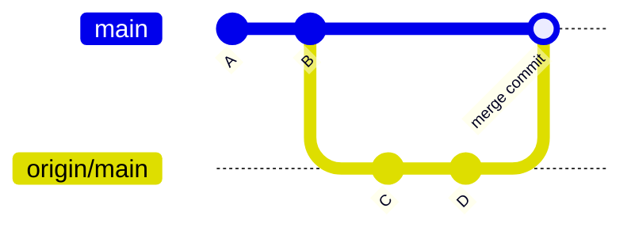
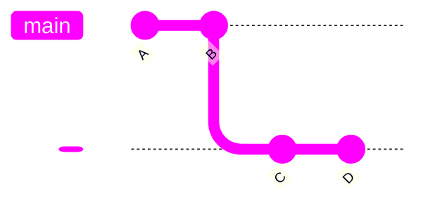
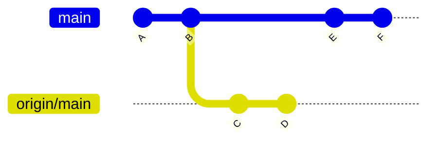
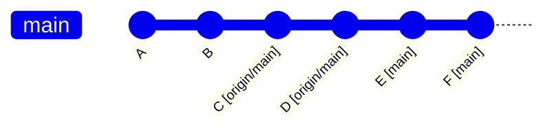

<div style='border-radius: 1em; border-style:solid; border-color:#D3D3D3; background-color:#F8F8F8'>

<p class="h4">&nbsp;&nbsp;Table of Contents</p>

<!-- START doctoc generated TOC please keep comment here to allow auto update -->
<!-- DON'T EDIT THIS SECTION, INSTEAD RE-RUN doctoc TO UPDATE -->

- [What is `git fetch`?](#what-is-git-fetch)
  - [`git fetch` Use-case: Refresh the list of remote branches](#git-fetch-use-case-refresh-the-list-of-remote-branches)
- [What is `git pull`?](#what-is-git-pull)
  - [Three Types of `git pull`](#three-types-of-git-pull)
    - [non-fast-forward vs fast-forward](#non-fast-forward-vs-fast-forward)
    - [When fast-forward impossible: `git pull --rebase`](#when-fast-forward-impossible-git-pull---rebase)
    - [When Conflict happens: `git pull --rebase`](#when-conflict-happens-git-pull---rebase)
  - [Why `git config --global pull.ff only` is recommended?](#why-git-config---global-pullff-only-is-recommended)
- [References](#references)

<!-- END doctoc generated TOC please keep comment here to allow auto update -->


</div>


## What is `git fetch`?

`git pull` と `git fetch`はともにremote repositoryの変更をlocalへ伝えるコマンドですが, 以下のような違いがあります:

- `git fetch`: remote repositoryの変更情報を`.git`repository経由でlocalへ通知するが, 変更自体をlocal branchへはmergeしない
- `git pull`: remote repositoryの変更をlocal branchへmergeする





### `git fetch` Use-case: Refresh the list of remote branches

Remote repository側ですでに消去されたBranchの履歴がLocal側でremote tracking branchとして残るケースは多々あります.
すでに不必要なremote tracking branchを書経する場合の1つの手法として, `git fetch --prune`があります

```zsh
% man git fetch|grep -A5 "^ *-p"  
-p, --prune
           Before fetching, remove any remote-tracking references that no longer exist on the remote. Tags are not subject to pruning if they are fetched only because of the default tag auto-following or due to a --tags option. However, if tags are fetched due to an explicit
           refspec (either on the command line or in the remote configuration, for example if the remote was cloned with the --mirror option), then they are also subject to pruning. Supplying --prune-tags is a shorthand for providing the tag refspec.

           See the PRUNING section below for more details.
```

実行コマンドは以下, 

```zsh
% git fetch -p 
```

## What is `git pull`?

`git pull`の内部的挙動は, `git fetch` + `git merge FETCH_HEAD`です.
`git fetch`で取得したremote content refsとheadsをlocal branchへmerge commitするのが基本です.




この例の場合, localの`main`はremoteの`origin/main`に対して, 2 ahead, 3 behindの
状態となっています. このときに, `git pull`を実行すると, `B` 以後に発生したdiffを解消するため
のmergeが走り, `H` のmerge commit hashが作成されます.




> REMARKS: Should We use `git pull`?

remote repositoryに他の開発者がエラーを含んだコードを上げてしまった場合, そのバグもローカルへ取り込んでしまうリスクが
`git pull`にはあります. 開発者の言葉として,

- `git pull` is evil!
- Avoid using git pull, unless you're the sole owner and user of the repository

という人がいるくらいです. 実際に`develop`, `feature` branchをどのように運用していくかは
チームごとの方針なので, ちゃんとチームメンバーとコミュニケーションしましょう. 


### Three Types of `git pull`

多くの開発者が`git pull` のoptionとして, `git pull –ff-only` を設定することを推奨しています.
`.gitconfig`への設定は

```zsh
% git config --global pull.ff only
```

で終わりますが, そもそもこの設定はどのような挙動なのか？の理解するには, `git merge`の形式として

- non-fast-forward(=merge commit)
- fast-forward
- rebase

の3つの違いがあり, この違いが `git pull`の3つの種類に関連していることを理解する必要があります.


#### non-fast-forward vs fast-forward

mainで2回commitしたあとにremoteへpush. その後, remote側で2回修正が入った状況を考えます.



上記の状況を考えた時, non-fast-forwardでは



以上のように, merge commitが入るかたちで変更がlocalへ反映されます. logを確かめると以下のようになります:

```zsh
% git log --oneline --graph 
*   930abe8 (HEAD -> main) Merge branch 'main' of https://github.com/user/hogehoge
|\  
| * ae34bf4 (origin/main) DOC: Update README.md, fixing a doctoc
| * b9f6ba3 DOC: Update README.md, adding a header
|/  
* f35ecd7 DOC: Update README adding the second line
* 66b3811 DOC: Update README adding the first line
```

一方, fast-forwardの場合は merge commitを作成することなく, `main`のHEADを`origin/main`の
HEADまで移動させる形で2つのbranchを統合します. イメージとしては以下:



`git log`コマンド確認してみると, commit logが以下のように一直線にきれいに見えることがわかります:

```zsh
% git log --oneline --graph 
* ae34bf4 (HEAD -> main, origin/main) DOC: Update README.md, fixing a doctoc
* b9f6ba3 DOC: Update README.md, adding a header  
* f35ecd7 DOC: Update README adding the second line
* 66b3811 DOC: Update README adding the first line
```

> REMARKS

- `git 2.41.0` 時点では fast-forwardがdefaultの挙動となる
- fast-forwardが出来ない時は, `--ff-only`がDefaultの挙動なのでエラーが返ってくる

<div style='padding-left: 2em; padding-right: 2em; border-radius: 0em; border-style:solid; border-color:#D3D3D3; background-color:#F8F8F8'>
<p class="h4"><ins>Git公式Document git pull Description</ins></p>

Incorporates changes from a remote repository into the current branch. If the current branch is behind the remote, then by default it will fast-forward the current branch to match the remote.

...

--ff-only

    Only update to the new history if there is no divergent local history. This is the default when no method for reconciling divergent histories is provided (via the --rebase=* flags).

</div>

#### When fast-forward impossible: `git pull --rebase`

次は, `main`と`origin/main`でそれぞれ別の作業をした結果, どちらも2 ahead/2 behindの状況が発生したとします.



この局面の場合, conflictが存在しない場合でも, fast-forward pullは実行できません. `git pull`を実行すると以下のようなエラーメッセージが出力されます:

```
hint: Diverging branches can't be fast-forwarded, you need to either:
hint: 
hint:   git merge --no-ff
hint: 
hint: or:
hint: 
hint:   git rebase
hint: 
hint: Disable this message with "git config advice.diverging false"
fatal: Not possible to fast-forward, aborting.
```

このdivergening branchesの状態は, `merge` か `rebase` で対応する必要があります. Mergeの場合はMerge commitが作成されるのは上で説明したとおりです. `rebase` で対応(=`git pull --rebase`)する場合は, 以下のような挙動になります: 



実際に挙動を手元で確認してみると, branchが分岐することなく一つの直線でlogが出力されます: 

```zsh
% git log --oneline --graph
* 04a33b9 (HEAD -> main) DOC: add a new line '5'
* b6bd960 DOC: add a new line '4'
* cb5c6c2 (origin/main) Update README.md add a line under header 2
* 0caae86 Update README.md, add a new header
* ef20373 CREATE README.md
```

#### When Conflict happens: `git pull --rebase`

`git pull --rebase`を試みた際にConflictが発覚した場合, 結論から言うと, 
conflictを解消するためのcommit rebaseが該当commitの分だけ発生します:


実際に試して見ると, 次のような指示がでます:

- conflict該当箇所と解消後に`git add/rm`でstaging areaに変更を上げろ
- `git rebase --continue`を入力せよ
- 作業を止めたい場合は, `git rebase --abort`を入力せよ

```
Auto-merging README.md
CONFLICT (content): Merge conflict in README.md
error: could not apply b11806c... DOC: add a new line '4'
hint: Resolve all conflicts manually, mark them as resolved with
hint: "git add/rm <conflicted_files>", then run "git rebase --continue".
hint: You can instead skip this commit: run "git rebase --skip".
hint: To abort and get back to the state before "git rebase", run "git rebase --abort".
```

その後, EditorでConflictを解消し, `git rebase --continue`を実行すると, `pull`が完了します:

```zsh
% git reabse --continue
[detached HEAD c873c3c] GPRSC: Solve the conflict between local and remote on README.md
 1 file changed, 2 insertions(+), 1 deletion(-)
Successfully rebased and updated refs/heads/main.
```

### Why `git config --global pull.ff only` is recommended? 

`git pull`のfast-forward optionの指定の仕方は以下の3つとなります:

|option| 	fast-forward 可能な場合 	|fast-forward できない場合|
|---|----|---|
|`--ff` |fast-forwardでpull 	|merge commit 生成|
|`--no-ff`| 	merge commit生成 	|merge commit を生成|
|`--ff-only`| 	fast-forwardでpull 	|エラー終了|

`--ff-only`を指定することで, 

- accidentalなcommit hashの生成を防ぐことができる
- conflictを解消する際にmerge/rebaseどちらで対応するにあたっても, 人の意思がしっかり入る
- 開発者が想定していない挙動を勝手にGitが実行してしまうことを防げる

というメリットを享受することができます. 


## References

> 関連記事

- [Ryo's Tech Blog > git tips: リモートリポジトリの更新後にローカルリポジトリを編集 & commitした場合のエラー対策](https://ryonakagami.github.io/2020/12/30/git-pull-error-updating-local-after-remote-change/)

> 公式ドキュメント

- [Git公式ドキュメント > git-pull](https://git-scm.com/docs/git-pull/2.34.0)
- [Git公式ドキュメント > FAST-FORWARD MERGE](https://git-scm.com/docs/git-merge#_fast_forward_merge)