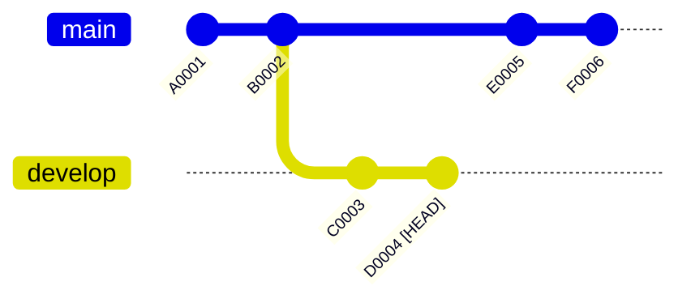
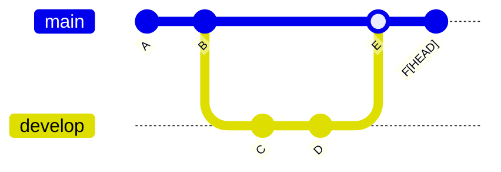

<div style='border-radius: 1em; border-style:solid; border-color:#D3D3D3; background-color:#F8F8F8'>

<p class="h4">&nbsp;&nbsp;Table of Contents</p>

<!-- START doctoc generated TOC please keep comment here to allow auto update -->
<!-- DON'T EDIT THIS SECTION, INSTEAD RE-RUN doctoc TO UPDATE -->

- [Difference between `HEAD~` and `HEAD^`](#difference-between-head-and-head%5E)
  - [What is Git HEAD?](#what-is-git-head)
  - [What is `HEAD~`?](#what-is-head)
  - [What is `HEAD^`?](#what-is-head%5E)
- [How to Use `HEAD~` and `HEAD^` in Git?](#how-to-use-head-and-head%5E-in-git)
  - [Checking the diff between HEAD and the last commit by using `git difftool`](#checking-the-diff-between-head-and-the-last-commit-by-using-git-difftool)
- [References](#references)

<!-- END doctoc generated TOC please keep comment here to allow auto update -->


</div>

## Difference between `HEAD~` and `HEAD^`

`git diff`や`git reset`のとき直面する`HEAD^`(caret)と`HEAD~`(tilde)はどのような違いがあるのか？
という疑問にぶち当たったのでまとめてみました. サマリーは以下のテーブルとなります:

|表記|意味|
|---|---|
|`~N`|`N`-th前のcommit|
|`^N`|`N`番目のparent commit|

### What is Git HEAD?

[Git 公式ドキュメント](https://git-scm.com/docs/git-rev-parse#Documentation/git-rev-parse.txt-emltrevgtltngtemegemmaster3em)を見てみると, `HEAD`について以下のような説明がされています:

- `HEAD` names the commit on which you based the changes in the working tree.

単純化してしまうと, `HEAD`は現在のworking areaのベースとなる場所を指し示すポインターのことです. `HEAD`というポインターがどこを示しているかは, repositoryの中の `.git/HEAD` に格納されています.




上記の流れで開発が進行した状況を考えます. そして現在`develop` branchにいるとします. まずこのときのHEADを以下のコマンドで確認してみます. 

```zsh
% cat .git/HEAD
ref: refs/heads/develop
% cat .git/refs/heads/develop
D0004
```

このように`develop`にいるときのHEADは`develop` branch自体を指しており, `develop` branchは`D0004`という最新のcommitを指しています. 

次に, `main`へswitchしてから`HEAD`を確認してみます:

```zsh
% git switch main
% cat .git/HEAD
ref: refs/heads/main
% cat .git/refs/heads/develop
F0006
```

`main`にいるときのHEADは`main` branch自体を指しており, `main` branchは`F0006`という最新のcommitを指しています. これは`Git`の内部挙動的には, branchが`commit-hash`をreferenceしているに過ぎないものというのに関係しています. 

最後に, 任意の過去の`commit-hash`を指定してcheckoutした時の`HEAD`を確認してみます.

```zsh
% git switch --detach B0002
% cat .git/HEAD
B0002
```

このとき, `HEAD`は直接`commit-hash`を参照しています. このようにbranchを介さずに直接`commit-hash`を参照している `HEAD` のことを特に `DETACHED HEAD` と呼びます.

`DETACHED HEAD`のときは, branchがない状態と理解しても大丈夫です.


<div style='padding-left: 2em; padding-right: 2em; border-radius: 0em; border-style:solid; border-color:#D3D3D3; background-color:#F8F8F8'>
<p class="h4"><ins>Column: DEATCHED HEADはいつ使うのか？</ins></p>

特定のコミット時点でのコード全体をreview, testをする際に`DETACHED HEAD`を使います.

`DETACHED HEAD`状態から新たに開発の必要性が出た場合は, 

```zsh
% git switch -c <new-branch-name>
```

でbranchを新たに作成してから開発する必要があります. これを未実行のまま, 開発を進めcommitを作成しても一度ほかのbranchへswitchした瞬間にそれまでの作業記録がなくなってしまいます. (逆に, 他のbranchに移る前にbranchを新たに作成すれば作業変更記録がlogとして残ります)

</div>

### What is `HEAD~`?

公式ドキュメントの定義を確認します:

<div style='padding-left: 2em; padding-right: 2em; border-radius: 0em; border-style:solid; border-color:#D3D3D3; background-color:#F8F8F8'>

A suffix `~` to a revision parameter means the first parent of that commit object. 
A suffix `~<n>` to a revision parameter means the commit object that is 
the `<n>`th generation ancestor of the named commit object, following only the first parents. 

</div>


単純化すると, Gitの文脈における `~N` は, 指定したcommitから数えて同じbranchの`N`-th step前の`commit-hash`を指し示すシンボルです.



上記の例の場合, 

- `HEAD~`: commit E
- `HEAD~2`: commit B
- `HEAD~~`: commit B
- `E~`: commit B
- `E~2`: commit A

を指し示します. 

<div style='padding-left: 2em; padding-right: 2em; border-radius: 1em; border-style:solid; border-color:#e6e6fa; background-color:#e6e6fa'>
<p class="h4"><ins>Column: `HEAD~` is different from `ORIG_HEAD`</ins></p>

- `ORIG_HEAD`は`HEAD`の直前の状態を示すシンボル
- `git reflog`コマンドで確認できる`HEAD@{1}`に相当

</div> 

### What is `HEAD^`?

公式ドキュメントの定義を確認します:

<div style='padding-left: 2em; padding-right: 2em; border-radius: 0em; border-style:solid; border-color:#D3D3D3; background-color:#F8F8F8'>
<p class="h4"><ins>Def: </ins></p>

A suffix `^` to a revision parameter means the first parent of that commit object. 
`^<n>` means the `<n>th` parent (i.e. `<rev>^` is equivalent to `<rev>^1`). 
As a special rule, `<rev>^0` means the commit itself

</div>

`HEAD`に対して, `N`番目のparent commitを指し示すのが `HEAD^N`となります.
基本的には余り使わないほうが良いと思います.


上記の例の場合, 

- `HEAD^`: commit E
- `HEAD^2`: 存在しない(`fatal: invalid reference: HEAD^2`)
- `HEAD^^`: commit B(=親の親なので)
- `E^`: commit B
- `E^^`: commit A
- `E^2`: commit D(2人の親はmerge source branch)
- `E^2~`: commit C
- `E^2~3`: commit A

を指し示します. 


## How to Use `HEAD~` and `HEAD^` in Git?
### Checking the diff between HEAD and the last commit by using `git difftool`

Editor経由で直前のcommitとの（または`N`-th前の）差分を`git difftool`との組合せで
簡単に確認することができます. 

```zsh
# 直前のcommitとの差分を確認したい場合
% git difftool HEAD~  
# 特定のファイルについて, 直前のcommitとの差分を確認したい場合
% git difftool HEAD~ <file-name>  
```

merge commitの直後に, mergeによる変更前のconflictを含む差分は以下のコマンドで確認することが出来ます

```zsh
% git difftool HEAD~ HEAD^2
```

## References

- [Git 公式ドキュメント > HEAD, ORIG_HEAD, MERGE_HEAD etc](https://git-scm.com/docs/git-rev-parse#Documentation/git-rev-parse.txt-emltrevgtltngtemegemmaster3em)
- [Git 公式ドキュメント > DETACHED HEAD](https://git-scm.com/docs/git-checkout#_detached_head)
- [stackoverflow > What's the difference between HEAD^ and HEAD~ in Git?](https://stackoverflow.com/questions/2221658/whats-the-difference-between-head-and-head-in-git)