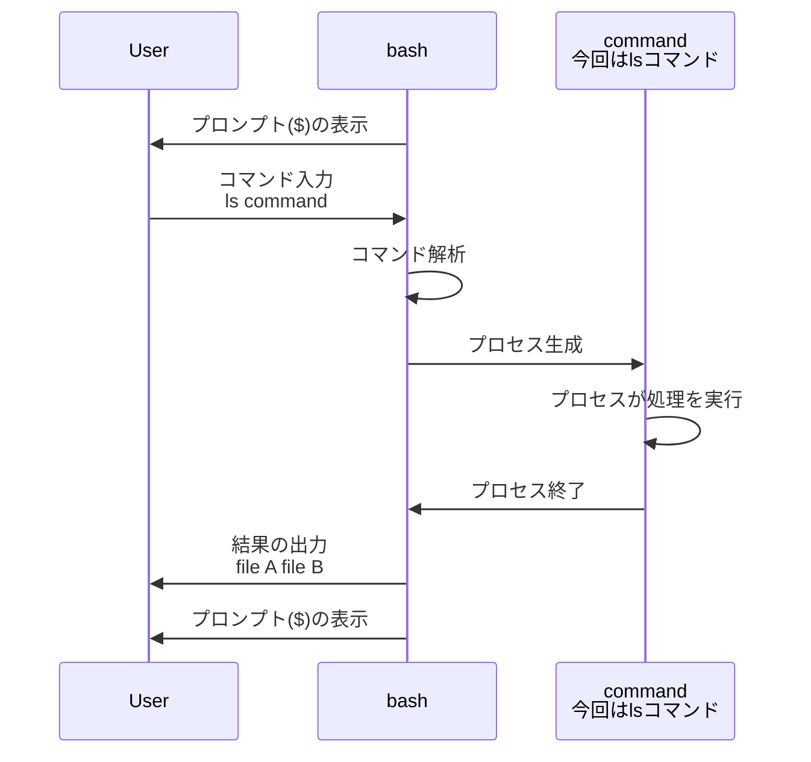

<div style='border-radius: 1em; border-style:solid; border-color:#D3D3D3; background-color:#F8F8F8'>

<p class="h4">&nbsp;&nbsp;Table of Contents</p>

<!-- START doctoc generated TOC please keep comment here to allow auto update -->
<!-- DON'T EDIT THIS SECTION, INSTEAD RE-RUN doctoc TO UPDATE -->

- [シェルの復習](#%E3%82%B7%E3%82%A7%E3%83%AB%E3%81%AE%E5%BE%A9%E7%BF%92)
  - [シェル変数と環境変数](#%E3%82%B7%E3%82%A7%E3%83%AB%E5%A4%89%E6%95%B0%E3%81%A8%E7%92%B0%E5%A2%83%E5%A4%89%E6%95%B0)
- [コマンドの実行結果をシェル変数に格納する](#%E3%82%B3%E3%83%9E%E3%83%B3%E3%83%89%E3%81%AE%E5%AE%9F%E8%A1%8C%E7%B5%90%E6%9E%9C%E3%82%92%E3%82%B7%E3%82%A7%E3%83%AB%E5%A4%89%E6%95%B0%E3%81%AB%E6%A0%BC%E7%B4%8D%E3%81%99%E3%82%8B)
  - [`unset`コマンド: 変数を削除する](#unset%E3%82%B3%E3%83%9E%E3%83%B3%E3%83%89-%E5%A4%89%E6%95%B0%E3%82%92%E5%89%8A%E9%99%A4%E3%81%99%E3%82%8B)
  - [一時的に変数を作成して続けて実行するコマンドに渡す](#%E4%B8%80%E6%99%82%E7%9A%84%E3%81%AB%E5%A4%89%E6%95%B0%E3%82%92%E4%BD%9C%E6%88%90%E3%81%97%E3%81%A6%E7%B6%9A%E3%81%91%E3%81%A6%E5%AE%9F%E8%A1%8C%E3%81%99%E3%82%8B%E3%82%B3%E3%83%9E%E3%83%B3%E3%83%89%E3%81%AB%E6%B8%A1%E3%81%99)
- [変数の操作](#%E5%A4%89%E6%95%B0%E3%81%AE%E6%93%8D%E4%BD%9C)
  - [変数の一部を使用する:変数展開](#%E5%A4%89%E6%95%B0%E3%81%AE%E4%B8%80%E9%83%A8%E3%82%92%E4%BD%BF%E7%94%A8%E3%81%99%E3%82%8B%E5%A4%89%E6%95%B0%E5%B1%95%E9%96%8B)
  - [文字列変数の結合](#%E6%96%87%E5%AD%97%E5%88%97%E5%A4%89%E6%95%B0%E3%81%AE%E7%B5%90%E5%90%88)
  - [文字列変数の置換](#%E6%96%87%E5%AD%97%E5%88%97%E5%A4%89%E6%95%B0%E3%81%AE%E7%BD%AE%E6%8F%9B)

<!-- END doctoc generated TOC please keep comment here to allow auto update -->


</div>

## シェルの復習

- シェルはLinuxでOSとユーザーの仲立ちをするユーザーインターフェース
- ユーザーが入力したコマンドを解釈＆実行するインタプリタのこと



### シェル変数と環境変数

シェルが扱う変数には

- シェル変数: 設定されたシェルだけが使用する変数．子プロセスには引き継がれない，
- 環境変数: 設定されたシェルとそのシェルで起動したプログラムが使用する変数，子プロセスに引き継がれる

の２種類があり，それぞれ確認方法や定義に差異があります．

<div style="display: inline-block; background: #D3D3D3;; border: 1px solid #D3D3D3; padding: 3px 5px;color:black"><span >TL;DR</span>
</div>
<div style="border: 1px solid #D3D3D3; font-size: 100%; padding: 5px;">

- シェル変数は`set`で確認できるもの
- 環境変数は`export`や`declare -x`で定義するもの，`env`や`printrnv`コマンドで確認できるもの

</div>

## コマンドの実行結果をシェル変数に格納する

<div style='padding-left: 2em; padding`$`-right: 2em; border-radius: 0em; border-style:solid; border-color:#D3D3D3; background-color:#F8F8F8'>
<p class="h4"><ins>実行結果の変数定義</ins></p>

コマンドの実行結果をシェル変数に代入するには以下の2通りがある:

- コマンドを`$()`で囲んで, その結果をシェル変数に代入する
- コマンドをバッククォートで囲んで, その結果をシェル変数に代入する
`$`
</div>

<br>

```zsh
# (1) コマンドを`$()`で囲む場合
% a=$(which bash) && echo $a
/usr/bin/bash

# (2) コマンドをバッククォートで囲む場合
% a=`which bash` && echo $a
/usr/bin/bash
```

よくある間違いとして, **`=`の前後に空白をいれるとエラーになります**.

```zsh
% a = $(which bash) && echo $a
a: command not found
```

これはシェルが`a`をコマンドと認識して, `=`以降を引数と解釈してしまっているからです. そのため, エラーメッセージも`a: command not found`となっています.

<div style='padding-left: 2em; padding-right: 2em; border-radius: 0em; border-style:solid; border-color:#D3D3D3; background-color:#F8F8F8'>
<p class="h4"><ins>算術演算の場合</ins></p>

算術演算の結果を格納する場合は

- `expr`を用いて上の「実行結果の変数定義」と同じ方法で代入する
- 二重括弧`(( ))`を用いて, 変数に代入する
`$`
</div>

例として, 

```zsh
% echo $((1+1)) 
2
% echo `expr 1 + 1`
2
% echo $(expr 1 + 1)
2`$`
% echo `((1+1))`

% a=`date +%H%M%S` && b=$(($a+10)) && echo $a $b
172112 172122
% a=2;b=8 && echo $((b<<a))
32
```

注意としては二重括弧`(( ))`を用いる場合はバッククォートの参照は上手く行きません.

`<<`はビットシフト演算子です. 最後の二重括弧の中の変数は`$`をつけないでも計算することができます. ただし, 基本的には変数は変数とわかるように`$`をつけたほうが良いと考えます.

<div style='padding-left: 2em; padding-right: 2em; border-radius: 0em; border-style:solid; border-color:#e6e6fa; background-color:#e6e6fa'>
<p class="h4"><ins>Column: 主なシェル変数</ins></p>

|変数名|説明|
|---|---|
|`PWD`|カレントディレクトリの絶対パス|
|`PATH`|コマンド検索パス|
|`HOME`|ユーザーのホームディレクトリ|
|`PS1`|プロンプト定義|
|`PS2`|２次プロンプト定義|
|`HISTFILE`|コマンド利益を格納するファイルパス|
|`LANG`|言語情報|

</div>

### `unset`コマンド: 変数を削除する

シェル変数，環境変数問わず以下のコマンドで指定した変数を削除する(=未定義に戻す)ことができます．

```zsh
% unset 変数名
```

空にするだけの場合は

```zsh
% 変数名=
```

でも可能です．空にする場合と未定義に戻すことに違いは シェルスクリプトなどでよく見る`set -u`で未定義の変数を参照した場合にエラーを返すか返さないかの違いとなります．

```bash
$ echo $a

$ set -u
$ echo $a
bash: a: unbound variable
```

|bash|zsh|
|---|---|
|`set -u`|`unsetopt unset` or `set -u`|
|`set +u`|`setopt unset` or `set +u`|

### 一時的に変数を作成して続けて実行するコマンドに渡す

<div style='padding-left: 2em; padding-right: 2em; border-radius: 0em; border-style:solid; border-color:#D3D3D3; background-color:#F8F8F8'>
<p class="h4"><ins>一時的にコマンドへ変数を渡す場合</ins></p>

一時的に変数`VAR`を作成し, 続けて実行するCOMMANDにて一時的に変数`VAR`を使用する場合は
以下のようにCLIへ入力する

```bash
$ VAR="Kirby" COMMAND
```

</div>

bashシェルスクリプトファイル `testshell`を以下のように独自に定義する

```bash
#!/bin/bash

echo $VAR
```

このとき, シェル変数を定義するのみだと`testshell`はシェル変数を参照することができません.

```bash
$ set | grep "^VAR"
VAR=Kirby
$ set | grep "^VAR="
VAR=Kirby
$ bash testshell

```

一方, 以下のように同じラインで定義 & 実行をするとシェル変数を参照してくれます．

```bash
$ VAR="Kirby" bash testshell
Kirby
```

最後に`$ echo $VAR`を続けて実行すると，あくまで`$VAR`は一時的に定義された変数なので，
次回以降のプロンプトではundefinedとして処理されます．

```bash
$ VAR="Kirby" bash testshell
Kirby

# 続けて実行すると何も出力されない
$ echo $VAR

```

## 変数の操作
### 変数の一部を使用する:変数展開

変数名の一部を使用したい場合は, `${変数名:開始位置:長さ}` のように指定することで
部分文字列のみを抽出することができます,

|指定パターン|挙動|
|---|---|
|`${変数名:開始位置:長さ}`|開始位置から指定した長さ分の文字列を切り出す|
|`${変数名#パターン}`|パターン部分（前方一致）を削除. `#`の場合は最短一致|
|`${変数名##パターン}`|パターン部分（前方一致）を削除. `##`の場合は最長一致|
|`${変数名%文字列}`|パターン部分（後方一致）を削除．`%`の場合は最短一致|
|`${変数名%%文字列}`|パターン部分（後方一致）を削除．`%%`の場合は最長一致|
|`${変数名:-文字列}`| 	変数の内容を取得．<br>変数がセットされていない場合は指定した文字列を返す|
|`${変数名:=文字列}`| 	変数の内容を取得．<br>変数がセットされていない場合は文字列．<br>変数がセットされていない場合は変数に指定した文字列をセットした上で返す|
|`${#変数名}`| 	変数の文字数（配列の場合は要素数）|

```zsh
% echo "$LANG" 
en_US.UTF-8
% echo "${LANG:0:5}" #先頭５文字
en_US
% echo "${LANG#*U}" #前方一致削除（最短）
S.UTF-8
% echo "${LANG##*U}" #前方一致削除（最長）
TF-8
% echo "${LANG%U*}" #後方一致削除（最短）
en_US.
% echo "${LANG%%U*}" #後方一致削除（最長）
en_
% echo ${#LANG}
11
```

### 文字列変数の結合

<div style='padding-left: 2em; padding-right: 2em; border-radius: 1em; border-style:solid; border-color:#D3D3D3; background-color:#F8F8F8'>
<p class="h4"><ins>文字列変数の結合</ins></p>

文字列を連結させたいときは大まかに以下２種類の方法がある:

- `$var_A$var_B`と続けて記述
- 各変数の定義後, `var_A+=$var_B`すると, `$var_A`の中身が結合した文字列になる

</div>

```zsh
% a="Bob"; b="Mary"; echo $a$b
BobMary
% a="Bob"; b="Mary"; a+=$b; echo $a  
BobMary
```

### 文字列変数の置換

|パターン|挙動|
|---|---|
|`${変数/検索文字列/置換文字列}`|最初にマッチしたもののみ文字列を置換|
|`${変数//検索文字列/置換文字列}`|全ての文字列を置換|

```zsh
# 前方一致
% a="bobbobobob"; echo $a ${a/ob/ca}   
bobbobobob bcabobobob
# globalで変換
% a="bobbobobob"; echo $a ${a//ob/ca}
bobbobobob bcabcacaca
```
