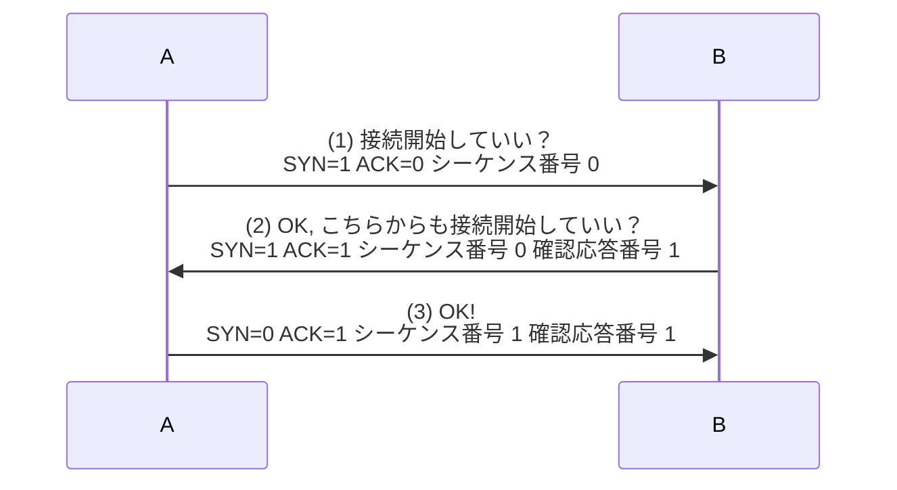

<div style='border-radius: 1em; border-style:solid; border-color:#D3D3D3; background-color:#F8F8F8'>

<p class="h4">&nbsp;&nbsp;Table of Contents</p>

<!-- START doctoc generated TOC please keep comment here to allow auto update -->
<!-- DON'T EDIT THIS SECTION, INSTEAD RE-RUN doctoc TO UPDATE -->

- [ポートスキャンツールとしてのNmap](#%E3%83%9D%E3%83%BC%E3%83%88%E3%82%B9%E3%82%AD%E3%83%A3%E3%83%B3%E3%83%84%E3%83%BC%E3%83%AB%E3%81%A8%E3%81%97%E3%81%A6%E3%81%AEnmap)
  - [(1) スキャンタイプ](#1-%E3%82%B9%E3%82%AD%E3%83%A3%E3%83%B3%E3%82%BF%E3%82%A4%E3%83%97)
  - [(2) ホストの発見方法：どの範囲を対象とするか？](#2-%E3%83%9B%E3%82%B9%E3%83%88%E3%81%AE%E7%99%BA%E8%A6%8B%E6%96%B9%E6%B3%95%E3%81%A9%E3%81%AE%E7%AF%84%E5%9B%B2%E3%82%92%E5%AF%BE%E8%B1%A1%E3%81%A8%E3%81%99%E3%82%8B%E3%81%8B)
  - [(3) スキャンタイミング：効率化を図るための設定](#3-%E3%82%B9%E3%82%AD%E3%83%A3%E3%83%B3%E3%82%BF%E3%82%A4%E3%83%9F%E3%83%B3%E3%82%B0%E5%8A%B9%E7%8E%87%E5%8C%96%E3%82%92%E5%9B%B3%E3%82%8B%E3%81%9F%E3%82%81%E3%81%AE%E8%A8%AD%E5%AE%9A)
  - [(4) スキャンポートの指定](#4-%E3%82%B9%E3%82%AD%E3%83%A3%E3%83%B3%E3%83%9D%E3%83%BC%E3%83%88%E3%81%AE%E6%8C%87%E5%AE%9A)
  - [(5) そのほかのオプション](#5-%E3%81%9D%E3%81%AE%E3%81%BB%E3%81%8B%E3%81%AE%E3%82%AA%E3%83%97%E3%82%B7%E3%83%A7%E3%83%B3)
  - [(6) ターゲットアドレス：対象のマシンを指定する](#6-%E3%82%BF%E3%83%BC%E3%82%B2%E3%83%83%E3%83%88%E3%82%A2%E3%83%89%E3%83%AC%E3%82%B9%E5%AF%BE%E8%B1%A1%E3%81%AE%E3%83%9E%E3%82%B7%E3%83%B3%E3%82%92%E6%8C%87%E5%AE%9A%E3%81%99%E3%82%8B)
- [Appendix: TCP 3ウェイハンドシェイク](#appendix-tcp-3%E3%82%A6%E3%82%A7%E3%82%A4%E3%83%8F%E3%83%B3%E3%83%89%E3%82%B7%E3%82%A7%E3%82%A4%E3%82%AF)
- [References](#references)

<!-- END doctoc generated TOC please keep comment here to allow auto update -->


</div>

## ポートスキャンツールとしてのNmap

<div style='padding-left: 2em; padding-right: 2em; border-radius: 1em; border-style:solid; border-color:#D3D3D3; background-color:#F8F8F8'>
<p class="h4"><ins>Def: Nmap</ins></p>

Nmap(Network Mapper)は, ポートの開放状態やネットワーク調査を行うためのオープンソースのツール.

Raw IPパケットを用いて,

    ネットワーク上でどのようなホストか利用可能になっているか
    これらのホストが提供しているサービス(アプリケーション名とバージョン)は何か
    ホストが実行しているOS(OS名とバージョン)は何か
    どのような種類のパケットフィルタ/ファイアウォールが使用されているか

などの情報を判別 & ユーザーに提供することができる.

```zsh
% nmap [scan type] [option] {target}
```

</div>

コンピュータが通信を行う際にはポートという仮想的な送受信を行うためにTCP, UDPともに0番から65535番までのポートを利用しています.
何らかのサービスを外部に提供している場合, いずれかのポートが開放されていることになりますが, このポートの開放を調べることができるツールがNmapです.

Nmapのコマンドラインの指定個所は大きく分けて7つの部分に分かれます

1. スキャンタイプ
2. ホストの発見方法
3. スキャンタイミング
4. スキャンポートの指定
5. そのほかのオプション
6. ターゲットアドレス, アドレス帯

以下説明するオプションを活用した入力例として

```zsh
% nmap -sS -P0 -T4 -p 1-65535 -oN result.txt -v -A 192.168.1.1
```


### (1) スキャンタイプ

代表的なスキャンタイプは主に３つ:

|タイプ|Option|説明|
|---|---|---|
|TCP SYNスキャン|`-sS`|Nmapのデフォルトのスキャンタイプ|
|TCP Connectスキャン|`-sT`|ネットワークの接続で通常使用されるTCPの接続方法を用いるスキャンタイプ|
|UDPスキャン|`-sU`|UDPポートを検出するスキャンタイプ|

TCP SYNスキャンはハーフオープンスキャンとも呼ばれたりします.
通常のTCPにおける通信確立が

1. 接続要求（SYNパケット）
2. 接続許可（SYN／ACK） or 接続拒否（RST）
3. SYN／ACKを受け取った接続を開始（ACK）

という3ウェイハンドシェイクを行うのに対して, TCP SYNスキャンは, 2のパケットの内容を確認することでポートのオープン／クローズは判断する(=3番目をやらないので完全な接続確立を行わない)ためハーフオープンスキャンと呼ばれます. そのため, ネットワークの接続で通常使用されるTCPの接続方法を用いるTCP Connectスキャンよりも短い時間で実行できます. 

UDPスキャンはUDPポートを検出するスキャンタイプであり, プロトコルやOS側の実装などの理由からTCPに関するスキャンよりも時間がかかる傾向があります.

### (2) ホストの発見方法：どの範囲を対象とするか？

IPアドレス範囲を指定してスキャンを行うことが可能です. この場合, 中には稼働しているホストもあれば, 稼働していないホストもありえます. 稼働していないホストに対して稼働しているホストと同じスキャンを行っても時間の無駄でなので, Nmapでは発見されたホストのみスキャンを行うためのホストの発見方法が用意されてます.

|Option|説明|
|---|---|
|`-PS`|SYNフラグ付きのパケットを送信することでホストの発見を行う. デフォルトではTCP80番での確認を行う.|
|`-PA`|ACKフラグ付きのパケットを送信することでホストの発見を行う. デフォルトではTCP80番での確認を行う.|
|`-PU`|UDPパケットを特定のポートに送信することでホストの発見を行う. デフォルトで送信するポートはUDP31338番|
|`-PE`|ICMP Echoによるホスト発見を行う|
|`-PP`|ICMP Timestamp によるホスト発見を行う|
|`-PM`|ICMP Address Mask によるホスト発見を行う|
|`-PR`|ARPによるホスト発見を行う|
|`-P0`|ホストの発見を省略する. 検査する対象が明確な場合はこのオプションを用いる|


### (3) スキャンタイミング：効率化を図るための設定

`nmap`コマンドはパケットの送信間隔やタイムアウトなどをミリ秒単位で設定することも可能ですが, テンプレートで
タイミングを指定することができます.

|Option|説明|
|---|---|
|`-T0`|paranoid|
|`-T1`|sneaky|
|`-T2`|polite|
|`-T3`|normal, default|
|`-T4`|aggressive|
|`-T5`|insane|

- `paranoid(0)`から`insane(5)`と順番にスキャン速度が速くなる
- `insane(5)`のような速度の速いテンプレートは高速なネットワーク上であることが要求される
    - 低速なネットワークで実行した場合はNmapのオープンポート検出の精度が犠牲となることがある


### (4) スキャンポートの指定

|指定したいポート|オプション例|
|---|---|
|22番ポート|`-p 22`|
|22番, 25番, 53番|`-p 22, 25, 80`|
|20番から200番まで|`-p 20-200`|
|TCP 22番、25番、53番およびUDP 53番、123番|`-p T:22, 25, 53,U:53, 123`|

### (5) そのほかのオプション

|Option|説明|
|---|---|
|`-v`|標準出力に進行中のスキャンに関して, 見つかり次第出力|
|`-O`|スキャン対象のOSの挙動から利用されているOSの推測を行う|
|`-sV`|Nmapで発見されたポートでどのようなサービスが稼働しているかの検出|
|`-oN target_file`|通常の出力結果をtarget_fileへ保存|
|`-A`|`-O`, `-sV`の同時実行|


### (6) ターゲットアドレス：対象のマシンを指定する

スキャンする対象についてはIPアドレスをそのまま指定することも可能ですが, 範囲を指定することも可能です. 例えば `192.168.0.1`から`192.168.0.100`までをスキャンしたい場合は`192.168.0.1-100`と指定することが可能です.


## Appendix: TCP 3ウェイハンドシェイク

TCPはコネクション型プロトコル（通信相手の応答があってはじめて通信を開始する）であることから,
データ転送を行う前にコネクションの確立を行います. このTCPにおいて使用されるコネクションの確立
のことを3ウェイハンドシェイクといいます. 



- コネクション要求する際は `SYN=1` otherwise `SYN=0`
- コネクション要求に応える場合は `ACK=1` otherwise `ACK=0`
- シーケンス番号は最初だけランダムな値が割り当てるので上の例の(1)では `0` と仮置きしている
    - 最初以外では, シーケンス番号は、「相手から受信した確認応答番号」を使用する
- 確認応答番号は「相手から受信したシーケンス番号」＋「データサイズの値」
    - 3ウェイハンドシェイクでは「相手から受信したシーケンス番号」に `１` を加算した値となる


References
----------
- [Ryo's Tech Blog > デバイスが利用しているグローバルIPアドレスとローカルネットワーク内のデバイスの検索](https://ryonakagami.github.io/2020/10/27/find-device-within-local-network/)
- [ネットワークエンジニアとして > TCP three-way handshaking](https://www.infraexpert.com/study/tcpip9.html)
