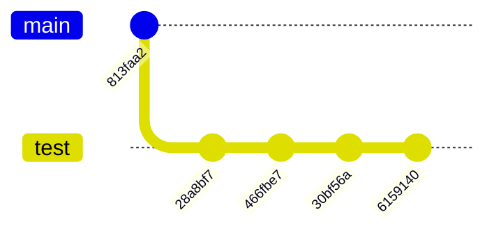
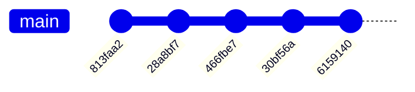

<div style='border-radius: 1em; border-style:solid; border-color:#D3D3D3; background-color:#F8F8F8'>

<p class="h4">&nbsp;&nbsp;Table of Contents</p>

<!-- START doctoc generated TOC please keep comment here to allow auto update -->
<!-- DON'T EDIT THIS SECTION, INSTEAD RE-RUN doctoc TO UPDATE -->

- [本日の問題: 誤ったブランチにcommitしてしまっていた](#%E6%9C%AC%E6%97%A5%E3%81%AE%E5%95%8F%E9%A1%8C-%E8%AA%A4%E3%81%A3%E3%81%9F%E3%83%96%E3%83%A9%E3%83%B3%E3%83%81%E3%81%ABcommit%E3%81%97%E3%81%A6%E3%81%97%E3%81%BE%E3%81%A3%E3%81%A6%E3%81%84%E3%81%9F)
  - [Solution: `git reset`を用いる](#solution-git-reset%E3%82%92%E7%94%A8%E3%81%84%E3%82%8B)
- [References](#references)

<!-- END doctoc generated TOC please keep comment here to allow auto update -->


</div>

## 本日の問題: 誤ったブランチにcommitしてしまっていた

<div style="display: inline-block; background: #D3D3D3;; border: 1px solid #D3D3D3; padding: 3px 5px;color:black"><span >問題設定</span>
</div>

<div style="border: 1px solid #D3D3D3; font-size: 100%; padding: 5px;">


git repositoryを新規に立ち上げけたとします．当初は`README.md`などを編集した`first commit`の後，新たに`test`ブランチを切って
作業を実施する予定でしたが，実際には`main`ブランチで引き続き操作をしてしまっていました．

このとき，以下を実行するためのgit commandを答えよ:

- `first commit`からの一連のcommit-idの列を保持しつつ，当初意図した形ブランチの形に持っていく
- つまり，`first commit`のところまでresetして，同じ作業を新しいbranchで再現するのはダメ
- working branchを`test`ブランチへcheckoutする

<strong > &#9654;&nbsp; 意図していた操作</strong>



<strong > &#9654;&nbsp; 実際の操作</strong>




</div>


### Solution: `git reset`を用いる

<div style="display: inline-block; background: #6495ED;; border: 1px solid #6495ED; padding: 3px 5px;color:#FFFFFF"><span >方針</span>
</div>

<div style="border: 1px solid #6495ED; font-size: 100%; padding: 5px;">

- 現在のHEADの状態をベースに`test`ブランチを新規作成する
- `main`ブランチを`first commit`直後の状態にな戻す
- `test`ブランチに切り替える


</div>

<br>

<strong > &#9654;&nbsp; Commands</strong>

```zsh
## 現在のHEADの状態をベースに`test`ブランチを新規作成
% git branch test

## mainブランチをfirst commit直後の状態に戻す
% git reset 813faa2 --hard

## testブランチに切り替える
% git switch test
```

<strong > &#9654;&nbsp; 解説</strong>

- `git branch <branch-name>`で現在のHEADをベースにswitchすることなく新規ブランチが作成できます
- `git reset --hard`としているのはデフォルトでは`git reset --soft`となってしまい，currentブランチにインデックス，ファイルの変更は残ってしまうからです
- currentブランチに修正ファイルが残ってしまうと，`git stash` or `git clean`の実施が必要となります

<div style='padding-left: 2em; padding-right: 2em; border-radius: 0em; border-style:solid; border-color:#ffa657; background-color:#F8F8F8'>
<strong style="color:#ffa657">警告 !</strong> <br> 

- もし，commit-id `6159140`の時点ですでにremote repositoryへpushしてしまっていたならば，他の開発者の迷惑になるので上記Solutionは実行しないほうが良いです


</div>

References
----------
- [Ryo's Tech Blog > リモートリポジトリの更新後にローカルリポジトリを編集 & commitした場合のエラー対策](https://ryonakagami.github.io/2020/12/30/git-pull-error-updating-local-after-remote-change/)
