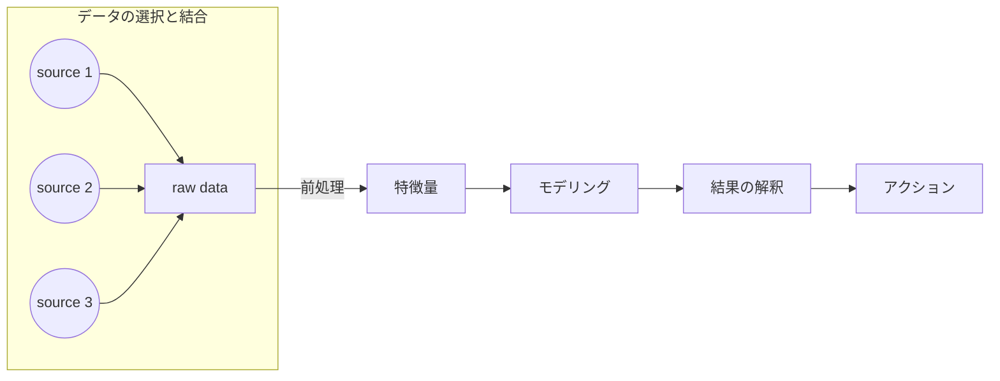

&nbsp;&nbsp;Table of Contents

<!-- START doctoc generated TOC please keep comment here to allow auto update -->
<!-- DON'T EDIT THIS SECTION, INSTEAD RE-RUN doctoc TO UPDATE -->

- [機械学習モデリングで意識すべきデータの分類: wrong, redundant, missing](#%E6%A9%9F%E6%A2%B0%E5%AD%A6%E7%BF%92%E3%83%A2%E3%83%87%E3%83%AA%E3%83%B3%E3%82%B0%E3%81%A7%E6%84%8F%E8%AD%98%E3%81%99%E3%81%B9%E3%81%8D%E3%83%87%E3%83%BC%E3%82%BF%E3%81%AE%E5%88%86%E9%A1%9E-wrong-redundant-missing)
  - [wrong/missing dataの例](#wrongmissing-data%E3%81%AE%E4%BE%8B)
- [前処理によるデータの誤り](#%E5%89%8D%E5%87%A6%E7%90%86%E3%81%AB%E3%82%88%E3%82%8B%E3%83%87%E3%83%BC%E3%82%BF%E3%81%AE%E8%AA%A4%E3%82%8A)
- [References](#references)

<!-- END doctoc generated TOC please keep comment here to allow auto update -->

## 機械学習モデリングで意識すべきデータの分類: wrong, redundant, missing

**「Garbage in, Garbage out**という言葉があるように, 
品質の悪い不完全なデータを入力したり品質の悪い特徴量を作成したりすると品質の悪い不完全な機械学習済みモデルが出力される, 
というデータ分析の基本原則があります. 質の良いデータ, 質の悪いデータを理解するにあたって機械学習や統計分析で扱うデータの種類について
ここで考えてみます.

機械学習で取り扱うデータについて,

- wrong
- redundant
- missing

といった区分がよく用いられます.

|データの種類|説明|
|---|---|
|`wrong data`|測定時の失敗による結果を表したデータのこと. 機器個別のセンサー値をインターネット経由でクラウドに収集している際に, 個別の機器のアドレス設定を間違えて誤った機器の値を実現値として収集してしまったケースが例|
|`redundant data`|全く同じ情報を意味する要素が複数含まれているデータのこと. 曜日情報がISO8601で1（月曜日）~7（日曜日）で表現されているにも関わらず, 文字列でMondayとかでデータ内に存在しているケースが例|
|`missing data`|一部のデータポイントにおいて, 計測されるべき情報が存在しない(`None`や`Na`で表現されている)ときが該当する|

### wrong/missing dataの例

機器運転データを格納しているサーバーがあり, 格納対象としている機器とインターネットを介した通信することでその運転データを収集しているとします.
インターネットを介した通信を実現するにあたって, 個々の機器が固有に持つアドレスに対応する形でサーバー側にアドレスを設定する必要があり, 
そのアドレスが適切に設定されることでサーバーにデータが上がってくる仕組みになっています.

個別の機器には, データの種類に応じて異なるアドレスが使用されていて, 合計で２つのアドレスが存在しています. 例として, 

- アドレス1: 機器本体のセンサデータを収集するために使用されるアドレス
- アドレス2: 機器本体の制御モードに関するデータを収集するために使用されるアドレス

このとき, サーバー側で機器Aについてアドレス1については設定していたがアドレス2について未設定であった場合, 制御モードデータについて`missing data`問題が発生します.
一方, アドレス1については設定していたがアドレス2について誤って機器Bのアドレスを機器Aのものとして設定してしまっていた場合, 制御モードデータについて`wrong data`問題が発生します.

<ins>機械学習パイプラインにおけるデータの立ち位置</ins>

## 前処理によるデータの誤り

上で`wrong data`として, 測定時の失敗に起因する質の悪いデータを紹介しましたが, 内容が誤ったデータという観点では
「**未加工データに行った処理によってシステマティックに発生する誤り**」というパターンもあります. これをここでは
「**前処理によるデータの誤り**」と呼ぶとします.

一般にこの種の問題は, 未加工のraw dataが残っていれば, 処理を修正することによって問題を是正することができますが

- データの誤りをどのように見つけるか？

がわからないと, そもそも問題が発生しているのかどうかすらわからず修正することができません.

<ins>Tips: 仮説を持ってデータを眺める</ins>

- データの誤りを見つけるためのポイントは, 予想に反するものを見つけること
- データをただ眺めるのではなく, 背景知識などを駆使してあるべきデータの形を意識して解釈すること

仮想的な例として, 研究者がとある有名ジャーナルにおいて初めて論文を出版した年度の分布を調べてみたいと思い, データを収集してhistogramを作成したら以下のような結果が現れたとします.



直感的には, 初めて論文をジャーナルに出版する年度は個々人によってブレはあるものの, 博士課程中にsubmitとして, そこから査読審査を経てからpublishすることを考えると, 年度別の大学院博士課程在籍人数に比例する形で初めて年度別初掲載人数がデータとして現れると予想できる. ただし, 集計した結果を見ると1965年と2002年にピークがある形となっており, 年度別の大学院博士課程在籍人数がこのように特定の年度だけ跳ね上がることが少ないことを考えると違和感のある結果となっている. 

この違和感こそが「**前処理によるデータの誤り発見の手がかり**」となります.

調査を進めてみると以下のことがわかったとします:

1. ジャーナルDBに記録されているデータを用いて研究者別初publish年度を掲載している
2. このジャーナルは1960年から始まり, データベースに記録するようになったのは1965年. DB登場前にpublishしたとしても一部したDBには記録されず, 1965年から過去分含めすべてがpublishされたタイミングでDBに記録されるようになった
3. 2002年からDBにおけるauthor nameを`Initial, Family Name` から`First name, Family Name`と表記を変更した

ここから違和感の正体について以下のことがわかります

- 1965年ピークの理由は「**wrong data**」に起因するもの（過去出版分も1965年出版と扱われた）
- 2002年ピークは「**データ処理による誤り**」に起因するもの

そのため, 前者についてはそもそもDB上に記録されたデータが間違っているのでどうしようもないが, 後者については
名前表記をどの年代に追いても`First name, Family Name`と統一することができれば補正できる誤りということがわかります.

References
----------
- [機械学習のための特徴量エンジニアリング ―その原理とPythonによる実践](https://www.oreilly.co.jp/books/9784873118680/)
