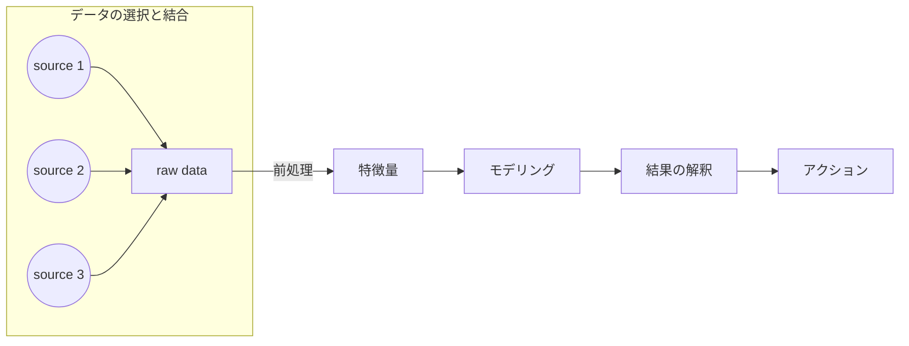

&nbsp;&nbsp;Table of Contents

<!-- START doctoc generated TOC please keep comment here to allow auto update -->
<!-- DON'T EDIT THIS SECTION, INSTEAD RE-RUN doctoc TO UPDATE -->

- [機械学習モデリングで意識すべきデータの分類: wrong, redundant, missing](#%E6%A9%9F%E6%A2%B0%E5%AD%A6%E7%BF%92%E3%83%A2%E3%83%87%E3%83%AA%E3%83%B3%E3%82%B0%E3%81%A7%E6%84%8F%E8%AD%98%E3%81%99%E3%81%B9%E3%81%8D%E3%83%87%E3%83%BC%E3%82%BF%E3%81%AE%E5%88%86%E9%A1%9E-wrong-redundant-missing)
  - [wrong/missing dataの例](#wrongmissing-data%E3%81%AE%E4%BE%8B)
- [References](#references)

<!-- END doctoc generated TOC please keep comment here to allow auto update -->

## 機械学習モデリングで意識すべきデータの分類: wrong, redundant, missing

機械学習で取り扱うデータについて,

- wrong
- redundant
- missing

といった区分を意識することは有用です.

|データの種類|説明|
|---|---|
|`wrong data`|測定時の失敗による結果を表したデータのこと. 機器個別のセンサー値をインターネット経由でクラウドに収集している際に, 個別の機器のアドレス設定を間違えて誤った機器の値を実現値として収集してしまったケースが例|
|`redundant data`|全く同じ情報を意味する要素が複数含まれているデータのこと. 曜日情報がISO8601で1（月曜日）~7（日曜日）で表現されているにも関わらず, 文字列でMondayとかでデータ内に存在しているケースが例|
|`missing data`|一部のデータポイントにおいて, 計測されるべき情報が存在しない(`None`や`Na`で表現されている)ときが該当する|

### wrong/missing dataの例

機器運転データを格納しているサーバーがあり, 格納対象としている機器とインターネットを介した通信することでその運転データを収集しているとします.
インターネットを介した通信を実現するにあたって, 個々の機器が固有に持つアドレスに対応する形でサーバー側にアドレスを設定する必要があり, 
そのアドレスが適切に設定されることでサーバーにデータが上がってくる仕組みになっています.

個別の機器には, データの種類に応じて異なるアドレスが使用されていて, 合計で２つのアドレスが存在しています. 例として, 

- アドレス1: 機器本体のセンサデータを収集するために使用されるアドレス
- アドレス2: 機器本体の制御モードに関するデータを収集するために使用されるアドレス

このとき, サーバー側で機器Aについてアドレス1については設定していたがアドレス2について未設定であった場合, 制御モードデータについて`missing data`問題が発生します.
一方, アドレス1については設定していたがアドレス2について誤って機器Bのアドレスを機器Aのものとして設定してしまっていた場合, 制御モードデータについて`wrong data`問題が発生します.

<ins>Column: 機械学習パイプラインにおけるデータの立ち位置</ins>

References
----------
- [機械学習のための特徴量エンジニアリング ―その原理とPythonによる実践](https://www.oreilly.co.jp/books/9784873118680/)