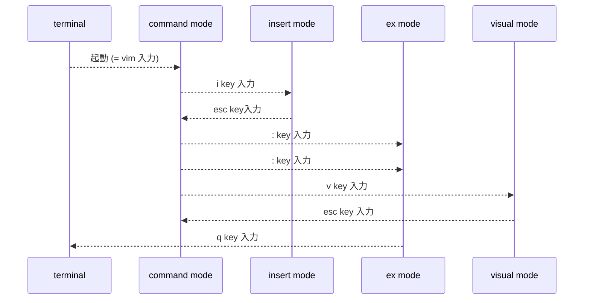

<div style='border-radius: 1em; border-style:solid; border-color:#D3D3D3; background-color:#F8F8F8'>

<p class="h4">&nbsp;&nbsp;Table of Contents</p>

<!-- START doctoc -->
<!-- END doctoc -->


</div>

## What I want to do?

- Vim Hugeのインストール
- Vimの使い方を覚える

## Vimのインストール

### デフォルトのvim

Ubuntu 20.04 LTSのデフォルトでは、`vim`はインストールされていますが「vim-tiny」という簡易版です。`vim`コマンド自体は存在せず`vi`コマンドで立ち上げる必要があります. このときの、バージョンを

```zsh
% vi --version
```

で確認すると、「Small version without GUI」となっています. 

Vimの種類はたくさんあり, ディストリビューションごとに最適化されたもの（例: `vim-gtk`）や, 
そもそも Vim 自体の機能が制限されたもの（例: `vim-tiny`）などが存在します.

```zsh
% apt search vim-
```

で様々な種類のvimのパッケージが存在することが確認できます. 

<div style='padding-left: 2em; padding-right: 2em; border-radius: 1em; border-style:solid; border-color:#e6e6fa; background-color:#e6e6fa'>
<p class="h4"><ins>Column: Vimの種類</ins></p>

環境に依存しない Vim 自体の種類（タイプ）として基本的に以下の5つに大別できます:

---|---
`tiny`|vim-tiny とは、最小構成でビルドされた Vim です。シンタックスハイライト（:syntax on）が有効にならなかったり、複数バッファ（:n など）、テキストオブジェクト（ciw）などが使用できない
`small`|一部の機能を無効にしてコンパイル
`normal`|標準の機能を有効にしてコンパイル
`big`|多くの機能を有効にしてコンパイル
`huge`|ほとんどの機能を有効にしてコンパイル

</div>

### Vimのインストール

今回はとりあえず、huge な Vim をインストールします.

```zsh
% sudo apt install vim
% vim --version
VIM - Vi IMproved 8.1 (2018 May 18, compiled Apr 15 2020 06:40:31)
Included patches: 1-2269
Modified by team+vim@tracker.debian.org
Compiled by team+vim@tracker.debian.org
Huge version without GUI.  Features included (+) or not (-):
+acl               -farsi             -mouse_sysmouse    -tag_any_white
+arabic            +file_in_path      +mouse_urxvt       -tcl
+autocmd           +find_in_path      +mouse_xterm       +termguicolors
+autochdir         +float             +multi_byte        +terminal
-autoservername    +folding           +multi_lang        +terminfo
-balloon_eval      -footer            -mzscheme          +termresponse
+balloon_eval_term +fork()            +netbeans_intg     +textobjects
-browse            +gettext           +num64             +textprop
++builtin_terms    -hangul_input      +packages          +timers
+byte_offset       +iconv             +path_extra        +title
+channel           +insert_expand     -perl              -toolbar
+cindent           +job               +persistent_undo   +user_commands
-clientserver      +jumplist          +postscript        +vartabs
-clipboard         +keymap            +printer           +vertsplit
+cmdline_compl     +lambda            +profile           +virtualedit
+cmdline_hist      +langmap           -python            +visual
+cmdline_info      +libcall           +python3           +visualextra
+comments          +linebreak         +quickfix          +viminfo
+conceal           +lispindent        +reltime           +vreplace
+cryptv            +listcmds          +rightleft         +wildignore
+cscope            +localmap          -ruby              +wildmenu
+cursorbind        -lua               +scrollbind        +windows
+cursorshape       +menu              +signs             +writebackup
+dialog_con        +mksession         +smartindent       -X11
+diff              +modify_fname      +sound             -xfontset
+digraphs          +mouse             +spell             -xim
-dnd               -mouseshape        +startuptime       -xpm
-ebcdic            +mouse_dec         +statusline        -xsmp
+emacs_tags        +mouse_gpm         -sun_workshop      -xterm_clipboard
+eval              -mouse_jsbterm     +syntax            -xterm_save
+ex_extra          +mouse_netterm     +tag_binary        
+extra_search      +mouse_sgr         -tag_old_static    
   system vimrc file: "$VIM/vimrc"
     user vimrc file: "$HOME/.vimrc"
 2nd user vimrc file: "~/.vim/vimrc"
      user exrc file: "$HOME/.exrc"
       defaults file: "$VIMRUNTIME/defaults.vim"
  fall-back for $VIM: "/usr/share/vim"
Compilation: gcc -c -I. -Iproto -DHAVE_CONFIG_H   -Wdate-time  -g -O2 -fdebug-prefix-map=/build/vim-iU6mZD/vim-8.1.2269=. -fstack-protector-strong -Wformat -Werror=format-security -D_REENTRANT -U_FORTIFY_SOURCE -D_FORTIFY_SOURCE=1       
Linking: gcc   -Wl,-Bsymbolic-functions -Wl,-z,relro -Wl,-z,now -Wl,--as-needed -o vim        -lm -ltinfo -lnsl  -lselinux  -lcanberra -lacl -lattr -lgpm -ldl     -L/usr/lib/python3.8/config-3.8-x86_64-linux-gnu -lpython3.8 -lcrypt -lpthread -ldl -lutil -lm -lm  
```

「`Huge version`」となっており, いろいろな機能が含まれた状態のVimがインストールされていることが分かります.
また, この時点ですでに `vi`と実行しても、新しくインストールしたvimが起動する様になっています.


### Vimの初期設定

Vimの設定を行うには、ターミナル上で `.vimrc` というファイルをホームディレクトリ上に作成する必要があります。

```zsh
% cd　#ホームディレクトリに移動
% code ~/.vimrc #vimrcを作成し、中身をvimで表示する
```

設定は以下

```
"""""""""""""""""""""""""""""""""""""""""""""""""""""""""""""""
" Maintainer: 
"       Ryo Nakagami
"
" Reference
"       https://github.com/amix/vimrc/blob/master/vimrcs/basic.vim
"
" updatetimestamp
"       2021-06-15 00:34:23
"
" Sections:
"    -> General
"    -> VIM user interface
"    -> Colors and Fonts
"    -> Files and backups
"    -> Text, tab and indent related
"
"""""""""""""""""""""""""""""""""""""""""""""""""""""""""""""""


"""""""""""""""""""""""""""""""""""""""""""""""""""""""""""""""
" => General
"""""""""""""""""""""""""""""""""""""""""""""""""""""""""""""""
" Sets how many lines of history VIM has to remember
set history=500

" Enable filetype plugins
filetype plugin on
filetype indent on

" Set to auto read when a file is changed from the outside
set autoread
au FocusGained,BufEnter * checktime


"""""""""""""""""""""""""""""""""""""""""""""""""""""""""""""""
" => VIM user interface
"""""""""""""""""""""""""""""""""""""""""""""""""""""""""""""""
" Ignore case when searching
set ignorecase

" When searching try to be smart about cases 
set smartcase

" Highlight search results
set hlsearch

" show the row number
set number

" highlight the space at the end
set listchars=tab:^\ ,trail:~

" set no beep
set noerrorbells

"""""""""""""""""""""""""""""""""""""""""""""""""""""""""""""""
" => Colors and Fonts
"""""""""""""""""""""""""""""""""""""""""""""""""""""""""""""""
" Enable syntax highlighting
syntax enable 

" highlight the comment with light-blue colour
hi Comment ctermfg=3


set background=dark

set encoding=utf-8

set fileformats=unix,dos,mac


"""""""""""""""""""""""""""""""""""""""""""""""""""""""""""""""
" => Files, backups and undo
"""""""""""""""""""""""""""""""""""""""""""""""""""""""""""""""
" Turn backup off, since most stuff is in SVN, git etc. anyway...
set nobackup
set nowb
set noswapfile


"""""""""""""""""""""""""""""""""""""""""""""""""""""""""""""""
" => Text, tab and indent related
"""""""""""""""""""""""""""""""""""""""""""""""""""""""""""""""
" Use spaces instead of tabs
set expandtab

" 1 tab == 4 spaces
set shiftwidth=4
set tabstop=4

" Linebreak on 500 characters
set lbr
set tw=500

set ai "Auto indent
set si "Smart indent
set wrap "Wrap lines

set fileencodings=utf-8,cp932,sjis
scriptencoding utf-8

" set no bom
set nobomb
```

## Vimの基本

Vimでは, 行う作業に応じて

- コマンドモード: 入力コマンド待機状態
- インサートモード: テキスト入力を行うモード
- exモード: ファイルの保存やVimの終了といった処理を行う

の３つがあります.



### コマンドモードでの操作の基本

コマンドモードでは, 画面のスクロールやカーソル移動を行います.

#### 画面のスクロール

基本的には, `pageup`, `pagedown`コマンドで十分ですが, キー入力で操作したい場合は以下,

|vi command|説明|
|---|---|
|`ctrl + b`|`pageup`|
|`ctrl + f`|`pagedown`|


#### カーソルの移動

vi commandでのカーソルに移動は以下、

```
             ^
             k              Hint:  The h key is at the left and moves left.
       < h       l >               The l key is at the right and moves right.
             j                     The j key looks like a down arrow.
             v
```

ただし, 基本的には矢印キーでもカーソル移動できるので覚えなくても大丈夫です.
どうしても覚えたいときは, 全角の矢印の方向と同じなのでそれで覚えれば大丈夫です.

|vi command|説明|
|---|---|
|`h` or `←`|カーソルを左に１文字移動|
|`j` or `↓`|カーソルを下に１文字移動|
|`k` or `↑`|カーソルを上に１文字移動|
|`l` or `→`|カーソルを右に１文字移動|
|`0`|現在の行の先頭へ移動|
|`^`|現在の行の空白を除く先頭へ移動|
|`$`|現在の行の末尾へ移動|
|`1G`|先頭へ移動|
|`G`|最終行へ移動|
|`nG`|n行へ移動|
|`H`|先頭へ移動|
|`gg`|先頭へ移動|

#### UNDO操作

|vi command|説明|
|---|---|
|`u`|最後に実行されたコマンドのUNDO|
|`U`|行をoriginalの状態（カーソルが合わせられる直前）まで戻す|
|`Ctrl + r`|UNDOのUNDO|


### ex modeでの操作

ファイルの保存や終了はex mode経由で実施します. 代表的なコマンドは以下です.

|vi command|説明|
|---|---|
|`:w`|ファイル名を変更せずに保存|
|`:w!`|ファイル名を変更せずに強制保存|
|`:w <filename>`|ファイル名を変更して保存|
|`:q`|ファイルを保存せずに終了|
|`:q!`|ファイルを保存せずに強制終了|
|`:wq`|ファイルを保存して終了|
|`:wq!`|強制的にファイルを保存&終了|
|`:wq <filename>`|ファイル名を変更して保存&終了|

<div style='padding-left: 2em; padding-right: 2em; border-radius: 1em; border-style:solid; border-color:#e6e6fa; background-color:#e6e6fa'>
<p class="h4"><ins>Column: .swpファイル</ins></p>

- `.swp`ファイルはスワップファイルと呼ばれるもの
- アプリケーションのクラッシュに備えて, vimエディタでの編集開始時に作成され, 編集後に削除される編集情報の記録ファイル
- vimエディタがシステムエラーで強制終了しても, `.swp`ファイルを用いてVimは保存前のデータを復元しようとしてくる

</div>

#### Vimを開きながらシェルコマンドを実行

Vimを開きながらシェルコマンドを実行するためにはex モードで以下のコマンドを入力します

```
:! shell-command
```

Vimの実行中にファイル保存しようと思ったときに, 書き込み権限がないことが判明し, 
Permissionを調べたいときなどに役に立ちます.

#### 編集ファイル上にシェルスクリプトの結果を出力

編集ファイル上にシェルスクリプトの結果を出力する場合は以下の手順で実行します

1. 入力したい行にカーソルを合わせる
2. `v`コマンドなどを用いてVisual Modeに移行する
3. `:! shell-command`を入力してEnter

```
#!/bin/bash
 
echo "Hello World!"
 
echo "Good Bye"
```

から, 4行目にカーソルを合わせてVisual Mode経由で`date`コマンドを実行すると,
以下のように標準出力結果をinsertすることができます

```
#!/bin/bash
 
echo "Hello World!"
Tue Apr 27 04:46:09 PM JST 2021
echo "Good Bye"
```

### insert modeでの操作

コマンドモードからinsert modeへの移行コマンドはいくつかあります

|vi command|挙動|
|---|---|
|`i`|カーソルの前に文字挿入|
|`a`|カーソルの後に文字挿入|
|`I`|カーソル行の先頭から文字挿入|
|`A`|カーソル行の末尾から文字挿入|
|`o`|カーソルの下に新しい行を作成し, 先頭から文字挿入|
|`O`|カーソルの上に新しい行を作成し, 先頭から文字挿入|


### 文字の削除

Vimにおける削除は基本的には「**切り取り**(=カット)」です.
削除の実行の仕方は, 「コマンドを用いる方法」と「コマンドを用いない方法」の２つがあります.

#### コマンドを用いない削除方法

コマンドモードに応じて使用できるコマンドが異なります

|key|mode|削除対象|
|---|---|---|
|`del`|insert mode<br>コマンドmode|カーソルのある文字を削除（感覚的には後ろ）|
|`backspace`|insert mode|カーソルの左文字を削除|


#### コマンドを用いる削除方法

コマンドモードにて, Vimでは文字, 単語, 行の削除を実行するコマンドが用意されています.

> 文字単位の削除

|vi command|挙動|
|---|---|
|`x`|カーソルのある文字を削除|
|`X`|カーソルの左にある文字を削除|
|`<数値>x`|カーソル右にn文字を削除|
|`<数値>X`|カーソル左にn文字を削除|


> 行指向の削除

|vi command|挙動|
|---|---|
|`J`|カーソルのある行の改行を削除|
|`dd`|カーソル行を削除|
|`<数値>dd`|カーソル行からn行削除|
|`D`|カーソル位置から行末まで削除|
|`d$`|カーソル行を削除(行自体は残す)|
|`dG`|カーソル行から最終行まで削除|
|`dH`|先頭からカーソル行まで削除|
|`:%d`|exモードにて全削除|

> 単語指向の削除

|vi command|挙動|
|---|---|
|`dw`|カーソルから１単語削除|
|`de`|カーソルから１単語削除(スペースは残す)|
|`d<数値>w`|カーソルからn単語削除|
|`d<数値>e`|カーソルからn単語削除(スペースは残す)|

### コピーと貼り付け

|vi command|挙動|
|---|---|
|`yy`|カーソル行をコピー|
|`yw`|カーソルから１単語コピー|
|`p`|カーソル位置から後ろに貼り付け|
|`P`|カーソル位置から前に貼り付け|


### 文字のReplace

---|---
operator `r` と変換したい文字の入力によって行う|「at the cursor」ベース
operator `c` と motion `e`を入力した後、文字列を入力する|「to change until the end of a word」ベース

### 文字列の検索

文字列を検索したい場合はNormal modeで`/`を入力し、文字列を入力します。その後, Enterを入力すると検索できます。同じ文字列を検索したい場合は`n`を入力、逆方向で検索を欠けたい場合は`N`を入力.

### 対応するカギカッコの検索

`(`, `[`, `{`のそれぞれに対応する`)`, `]`, `}`を検索したい場合は。カーソルを対応を検索したいカギカッコに合わせ `%` を入力.

### 文字の置換

行単位で thee を theに置換したい場合は、Normal modeで`:s/thee/the` `<Enter>`で置換できる. グローバルに置換したい場合は `:s/thee/the/g` `<Enter>`. 


References
--------------

- [ubuntu manuals: vimtutor](http://manpages.ubuntu.com/manpages/bionic/man1/vimtutor.1.html)
- [vimエディタが（勝手に）作成する、一見、不要に見えるファイルが何をしているか ](https://nanasi.jp/articles/howto/file/seemingly-unneeded-file.html#viminfo)