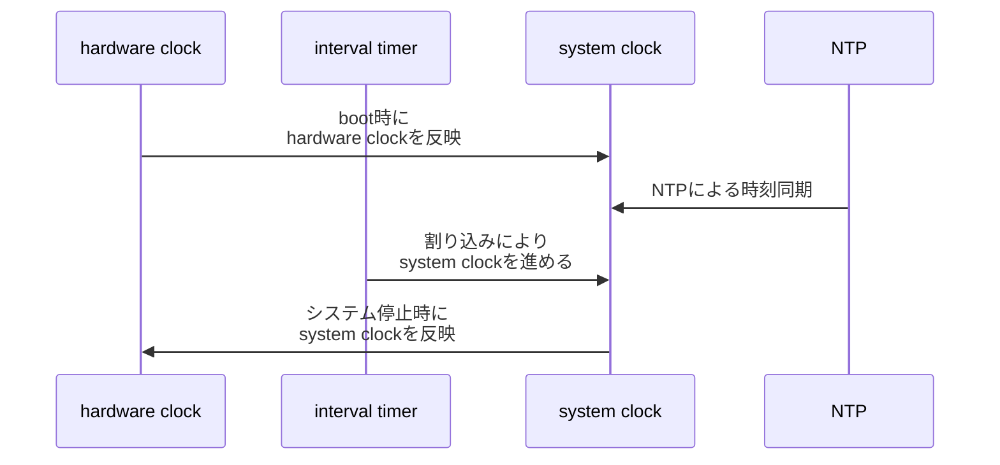

<div style='border-radius: 1em; border-style:solid; border-color:#D3D3D3; background-color:#F8F8F8'>

<p class="h4">&nbsp;&nbsp;Table of Contents</p>

<!-- START doctoc generated TOC please keep comment here to allow auto update -->
<!-- DON'T EDIT THIS SECTION, INSTEAD RE-RUN doctoc TO UPDATE -->

- [Why system clock is important?](#why-system-clock-is-important)
  - [システムクロックの確認](#%E3%82%B7%E3%82%B9%E3%83%86%E3%83%A0%E3%82%AF%E3%83%AD%E3%83%83%E3%82%AF%E3%81%AE%E7%A2%BA%E8%AA%8D)
    - [dateコマンドによる表示形式の調整](#date%E3%82%B3%E3%83%9E%E3%83%B3%E3%83%89%E3%81%AB%E3%82%88%E3%82%8B%E8%A1%A8%E7%A4%BA%E5%BD%A2%E5%BC%8F%E3%81%AE%E8%AA%BF%E6%95%B4)
  - [ハードウェアクロック](#%E3%83%8F%E3%83%BC%E3%83%89%E3%82%A6%E3%82%A7%E3%82%A2%E3%82%AF%E3%83%AD%E3%83%83%E3%82%AF)
- [NTPによる時刻管理](#ntp%E3%81%AB%E3%82%88%E3%82%8B%E6%99%82%E5%88%BB%E7%AE%A1%E7%90%86)
  - [NTPによる時刻修正方法](#ntp%E3%81%AB%E3%82%88%E3%82%8B%E6%99%82%E5%88%BB%E4%BF%AE%E6%AD%A3%E6%96%B9%E6%B3%95)
    - [daemon(デーモン)を用いた時刻調整](#daemon%E3%83%87%E3%83%BC%E3%83%A2%E3%83%B3%E3%82%92%E7%94%A8%E3%81%84%E3%81%9F%E6%99%82%E5%88%BB%E8%AA%BF%E6%95%B4)
- [UbuntuにおけるNTP server時刻同期](#ubuntu%E3%81%AB%E3%81%8A%E3%81%91%E3%82%8Bntp-server%E6%99%82%E5%88%BB%E5%90%8C%E6%9C%9F)
- [References](#references)

<!-- END doctoc generated TOC please keep comment here to allow auto update -->


</div>

## Why system clock is important?

<div style='padding-left: 2em; padding-right: 2em; border-radius: 1em; border-style:solid; border-color:#D3D3D3; background-color:#F8F8F8'>
<p class="h4"><ins>Def: System Clock</ins></p>

OSが内部に持っている時計をシステムクロックといいます. 
ファイルのタイムスタンプやユーザーの利用記録などを正確に管理するためにシステムクロックの適正管理は重要.

</div>

Linuxシステムの時刻はシステムクロックによって管理されています. システムクロックはLinuxカーネルのメモリ上に次の２つのデータとして保持されています:

- 1970-01-01 00:00:00からの経過秒数
- 現在秒からの経過ナノ秒数

そして, インターバルタイマーの割り込みにより時計が進みます.

### システムクロックの確認

`date`コマンドはシステムクロックの設定, 表示をするコマンドです. 引数なしで実行すると現在のシステムクロックが表示されます

```zsh
% date
Sat May 30 08:19:29 PM JST 2020

% date -u
Sat May 30 11:19:29 AM UTC 2020

```

時刻の表示にはUTCとローカルタイムの2種類があります. ローカルタイム時差情報は`etc/localtime`ファイルに格納されています.
時差情報自体は`/usr/share/zoneinfo`ディレクトリに各タイムゾーンごとで格納されています. 

システムのローカルタイムゾーンを変更する場合は`/usr/share/zoneinfo`からファイルを`etc/localtime`へシンボリックリンクする形で実施されます.

#### dateコマンドによる表示形式の調整

`date`コマンドは表示形式の設定もできます. 表示形式の書式指定では最初に`+`を付け, そのあとにパターンを指定します.

|フォーマット |コマンド例|	出力サンプル|
|---|---|---|
|YYYY/MM/DD hh:mm:ss|`date "+%Y/%m/%d %H:%M:%S"`|`2017/09/07 07:16:51`|
|YYYY-MM-DDThh:mm:ss|`date +%Y-%m-%dT%H:%M:%S`|`2017-09-07T07:16:51`|
|YYYYMMDD-hhmmss|`date +%Y%m%d-%H%M%S`|`20170907-071651`|
|Month DD hh:mm:ss| `date '+%B %d %T'`|`August 12 21:30:57`|


```zsh
% date '+%b %d %T'
May 30 20:19:29
```

UNIX時間の取得も `+%s` を指定することによって可能

```zsh
# UNIX時間の取得
% date --date="2020-05-01 18:36:10" +%s
1588325770

# UNIX時間からreadableな時刻表記へ再変換
% date --date="2020-05-01 18:36:10" +%s |xargs -i date --date @{}
Fri May  1 06:36:10 PM JST 2020
```


### ハードウェアクロック

<div style='padding-left: 2em; padding-right: 2em; border-radius: 1em; border-style:solid; border-color:#D3D3D3; background-color:#F8F8F8'>
<p class="h4"><ins>Def: ハードウェアクロック</ins></p>

ハードウェアクロックは, マザーボード上のICによって提供される時計. 

- この時計はバッテリーのバックアップがあるので, PCの電源を切っても時計が進む
- RTC（Real Time Clock）あるいはCMOSクロックとも呼ばれる

</div>

`hwclock`コマンド（CentOSでは`clock`コマンドは`hwclock`へのシンボリックリンク）でRTCを確認することができます.

```zsh
% sudo hwclock --show
2020-05-30 20:30:53.608967+09:00
```

RTCはCMOSメモリ上にデータを保持しています.
ハードウェアクロックの時刻はLinuxシステム立ち上げ時にhwclockコマンドで読み取られ, システムクロックに設定されます.
また, システムの停止時に, hwclockコマンドによってシステムクロックの時刻がハードウェアクロックに設定されます.



<div style='padding-left: 2em; padding-right: 2em; border-radius: 1em; border-style:solid; border-color:#e6e6fa; background-color:#e6e6fa'>
<p class="h4"><ins>Column: hwclock コマンド</ins></p>

```zsh
# システムクロックの時刻をハードウェアクロックへ設定
% hwclock --systohc

# ハードウェアクロックの時刻をシステムクロックへ設定
% hwclock --hctosys
```

上記コマンドに `-u` コマンドを付与するとUTC時間でクロック設定を実施します

</div>


## NTPによる時刻管理

<div style='padding-left: 2em; padding-right: 2em; border-radius: 1em; border-style:solid; border-color:#D3D3D3; background-color:#F8F8F8'>
<p class="h4"><ins>Def: Network Time Protocol</ins></p>

NTPはコンピュータが, ネットワーク上のほかのコンピュータの時刻を参照して時刻の同期を取るためのプロトコル.
ネットワーク上の他のコンピューターの時刻を参照して時刻の同期を実施してくれる.

</div>

NTPでは時刻をstratumと呼ばれる階層で管理します. 原子時計/GPS/標準電波が最上位の階層stratum0になり、それを時刻源とするNTPサーバがstratum1となります. stratum1のNTPサーバから時刻を受信するコンピュータ（NTPサーバあるいはNTPクライアント）はstratum2となります. 最下位の階層stratum16まで階層化できます.


### NTPによる時刻修正方法

`ntpdate`コマンドは, NTPクライアントプログラムで, 日付と時刻を NTP サーバーと同期することができます

```zsh
% sudo ntpdate [option] NTP-server
```

- DNS名前解決により, IPアドレスはリクエストごとに変わるので, DNS名の指定をすることが推奨されています
- 実行にはroot権限が必要

時刻の修正方法はslewとstepの２つがあります

|option|説明|リクエストごとに変わるので
|---|---|
|`-B`| slewモード（徐々に時刻を合わせる、微調整する際に使用）で時刻を修正する|
|`-b`| stepモード（即座に時刻を合わせる）で時刻を修正する|

時刻のずれが500ミリ秒（0.5秒）より小さい場合はslewモードで徐々に時刻を調整し, それ以外の場合はstepモードですぐに時刻を合わせます.

<div style='padding-left: 2em; padding-right: 2em; border-radius: 1em; border-style:solid; border-color:#e6e6fa; background-color:#e6e6fa'>
<p class="h4"><ins>Column: system clockとNTPサーバーの時刻ズレの確認</ins></p>

`ntp.nict.jp`とsystem clockの時刻の差分を確認する場合は, `ntpdate -q`コマンドを用います

```zsh
% sudo ntpdate -q ntp.nict.jp
31 MAy 02:19:09 ntpdate[5393]: step time server 133.243.238.243
offset 99.535574 sec
```

offsetが時刻差分を意味しており, 今回の例では約99秒ほどsystem clockが遅れていることがわかります.
先行している場合は`-`(マイナス)で表現されます.

</div>

#### daemon(デーモン)を用いた時刻調整

`ntp`をインストールすると`ntpd`というNTPデーモンが利用できるようになります.
`/etc/ntp.conf`が設定ファイルで, 

- NTP server
- 同期タイミング

を指定します. 設定方法は

```zsh
% cat /etc/ntp.conf

# /etc/ntp.conf, configuration for ntpd
driftfile /var/lib/ntp/ntp.drift
statsdir /var/log/ntpstats/

# You do need to talk to an NTP server or two (or three).
#server ntp.ubuntu.com
server ntp.nict.jp iburst

#localhostをNTPサーバに設定 & アクセス制限なし
restrict 127.0.0.1
```

|configuration|意味|
|---|---|
|`driftfile`|`ntpd` が時刻の調整を行う際に NTP サーバーから入手した時刻と `ntpd` が動作しているマシンとの時刻のずれを記録するファイルを指定|
|`server`|時刻を同期する NTP サーバーを指定|
|`statsdir`|統計ログファイルを指定|
|`restrict`|access control listの指定. NTP通信の動作をフラッグと組み合わせて設定|

`iburst`は`server`コマンドと組みわせて使用するオプションで, NTPサーバーとの初期の同期にかかる時間を短縮します.
`iburst`を指定しない場合は, 64秒間隔でポーリングしますが, 指定時にはNTPサーバーとの初期同期時に
2秒間隔で8個のパケットを送信して同期を取ります = 初期の同期にかかる時間を短縮.


## UbuntuにおけるNTP server時刻同期

Ubuntu 16.04以降では`timedatectl`/`timesync`が`ntpdate`/`ntp`の代わりに用いられています.
そのため`ntpdate`はデフォルトではインストールされていません.

```zsh
## 現在時刻や設定の表示
% timedatectl
               Local time: Sun 2021-08-13 00:23:45 JST
           Universal time: Sat 2021-08-12 15:23:45 UTC
                 RTC time: Sat 2021-08-12 15:23:45
                Time zone: Asia/Tokyo (JST, +0900)
System clock synchronized: yes
              NTP service: active
          RTC in local TZ: no
```

Ubuntuでは`ntpdate`に代わって, `timesyncd`が常にPCのlocal timeのcheckとupdateを行っています.
config fileは`/etc/systemd/timesyncd.conf`に存在します.

サービス稼働状況を確認する場合は以下のコマンドで確認します:

```zsh
% systemctl status systemd-timesyncd
      systemd-timesyncd.service - Network Time Synchronization
       Loaded: loaded (/lib/systemd/system/systemd-timesyncd.service; enabled; vendor preset: enabled)
       Active: active (running) since Fri 2018-02-23 08:55:46 UTC; 10s ago
         Docs: man:systemd-timesyncd.service(8)
     Main PID: 3744 (systemd-timesyn)
       Status: "Synchronized to time server 91.189.89.198:123 (ntp.ubuntu.com)."
        Tasks: 2 (limit: 4915)
       CGroup: /system.slice/systemd-timesyncd.service
               |-3744 /lib/systemd/systemd-timesyncd
    
    Feb 23 08:55:46 bionic-test systemd[1]: Starting Network Time Synchronization...
    Feb 23 08:55:46 bionic-test systemd[1]: Started Network Time Synchronization.
    Feb 23 08:55:46 bionic-test systemd-timesyncd[3744]: Synchronized to time server
```


<div style='padding-left: 2em; padding-right: 2em; border-radius: 1em; border-style:solid; border-color:#e6e6fa; background-color:#e6e6fa'>
<p class="h4"><ins>REMARKS: chronyとの優先関係</ins></p>

`chrony`がインストールされている場合は, `chrony`が時刻同期を担当する挙動になっています.
これは`chrony`と`timedatectl`の二重時刻同期によるconflictを避けるためです.

</div>


References
-----

- [Canonical Ubuntu Server > About time synchronisation](https://ubuntu.com/server/docs/network-ntp)