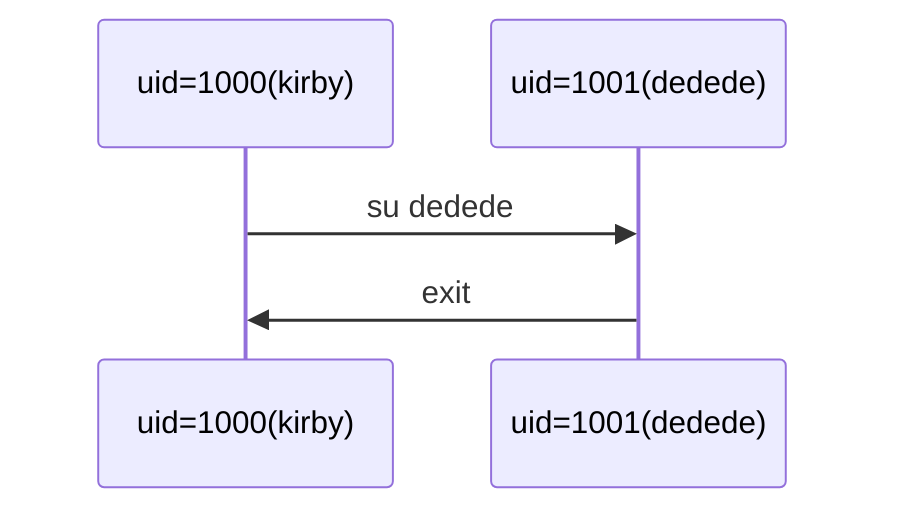

<div style='border-radius: 1em; border-style:solid; border-color:#D3D3D3; background-color:#F8F8F8'>

<p class="h4">&nbsp;&nbsp;Table of Contents</p>

<!-- START doctoc generated TOC please keep comment here to allow auto update -->
<!-- DON'T EDIT THIS SECTION, INSTEAD RE-RUN doctoc TO UPDATE -->

- [What is "root user"?](#what-is-root-user)
- [`sudo`コマンドとは？](#sudo%E3%82%B3%E3%83%9E%E3%83%B3%E3%83%89%E3%81%A8%E3%81%AF)
  - [`sudo`の設定](#sudo%E3%81%AE%E8%A8%AD%E5%AE%9A)
- [Appendix: Why `su - root` command cannot be used by defalut in Ubuntu?](#appendix-why-su---root-command-cannot-be-used-by-defalut-in-ubuntu)
  - [`su` コマンドの使い方](#su-%E3%82%B3%E3%83%9E%E3%83%B3%E3%83%89%E3%81%AE%E4%BD%BF%E3%81%84%E6%96%B9)
  - [root ユーザーのパスワード設定](#root-%E3%83%A6%E3%83%BC%E3%82%B6%E3%83%BC%E3%81%AE%E3%83%91%E3%82%B9%E3%83%AF%E3%83%BC%E3%83%89%E8%A8%AD%E5%AE%9A)
- [References](#references)

<!-- END doctoc generated TOC please keep comment here to allow auto update -->


</div>

## What is "root user"?

Linuxでは, アカウント情報を`/etc/passwd`というテキストファイルで管理しています. `cat /etc/passwd`とターミナルで実行してみると中身を確認することができます. 自分しか利用していないパソコンでも`cat /etc/passwd`で確認してみると,パソコン内部にたくさんのユーザーが存在することがわかります.

これはLinuxが管理者ユーザー, 一般ユーザー, システムユーザーの3種類にユーザーを分類して管理していることに起因します. 

---|---
root|システムに配置されたディレクトリやファイルのすべてを編集できるユーザー
システムユーザー|Webサーバー, メールサーバーといった, 各種サービスを実行するユーザー
一般ユーザー|Linuxシステムにログインしてファイルやディレクトリを編集/コマンドを実行するユーザー

このようにたくさんのユーザーがシステムの中に共存していますが, システムの安全性/安定性の観点から, 

- システムの一部を変更/修正
- 新規のユーザーを追加
- ユーザーを削除

というシステム作業は一部の限定したユーザーにすべきという思想にLinuxは基づいています.
このシステム面の編集権限を含むすべての権限を有しているユーザーが**root user**となります.

<div style='padding-left: 2em; padding-right: 2em; border-radius: 1em; border-style:solid; border-color:#e6e6fa; background-color:#e6e6fa'>
<p class="h4"><ins>システムユーザーの意義</ins></p>

システムユーザーはrpmやdebパッケージによりサービスがインストールされた際にユーザーとして作成されます. 
rootではなく,システムユーザーでサービスを起動するのはセキュリティ対策が理由の一つです. 
仮にとあるサービスに脆弱性が存在し, そのサービスのシステムユーザーの権限が乗っ取られたとします. 
このときサービスがシステムユーザーの権限で動作していれば, 攻撃された場合の影響はそのシステムユーザーの権限内に収めることができます.

</div>


## `sudo`コマンドとは？

<div style='padding-left: 2em; padding-right: 2em; border-radius: 1em; border-style:solid; border-color:#D3D3D3; background-color:#F8F8F8'>
<p class="h4"><ins>Def: sudo command</ins></p>

`sudo`コマンドは, 指定したユーザー権限で特定のコマンドを実行するコマンド

```zsh
sudo [option] [-u user-name] command
```

</div>


システム面の編集作業は, 一般ユーザーとしてログインしているときに必要になるケースが多々あります
(例：Pythonの分析環境を構築したいとき).
この場合, 管理者権限を手に入れる必要がありますが, その手法は大きく分けて２つあります.

1. `su`コマンドや`sudo -i`コマンドを用いて, 管理者へユーザーを切り替える
2. `sudo`コマンドを使って, 一時的に管理者権限を一般ユーザーが手に入れる

`su`コマンドはUbuntuのデフォルト設定ではdisabledされているので基本的には`sudo`コマンドを使います.
`sudo`コマンドが実行できるかどうかは, `/etc/sudoers`ファイルの設定に依存します.

### `sudo`の設定

`sudo`コマンドは`/etc/sudoers`ファイルを参照して, ユーザーがコマンドの実行権限があるかどうかを判定します.

```zsh
% cat/etc/sudoers
#
# This file MUST be edited with the 'visudo' command as root.
#
# Please consider adding local content in /etc/sudoers.d/ instead of
# directly modifying this file.
# (略)
```

上記を読むと, `visudo`コマンドを実行して編集しろという指示があるので編集する場合は`visudo`コマンドを使い
default editorで編集します.

<div style='padding-left: 2em; padding-right: 2em; border-radius: 1em; border-style:solid; border-color:#D3D3D3; background-color:#F8F8F8'>
<p class="h4"><ins>/etc/sudoersファイルの書式</ins></p>

```
username hostname=(effective username) [NOPASSWD:] command
```

---|---
username|コマンドの実行を許可するユーザー名 or グループ名, or ALL
hostname|実行を許可するホスト名 or IPアドレス, or ALL
effective username|コマンド実行時のユーザー(省略時はroot) or ALL
command| 実行を許可するコマンド, or ALL
NOPASSWD:|指定するとコマンド実行時にパスワードを問われない

</div>

エントリの追加例は以下となります

```zsh
# user kirbyにdhclient commandを実行できるようにする
kirby ALL=(ALL) /sbin/dhclient

# user kirbyに対し, 管理者権限が必要なすべてのコマンドを許可する
kirby ALL=(ALL) ALL

# adminグループに対しパスワードコマンド無しで管理者権限が必要なすべてのコマンドを許可する
%admin ALL=(ALL) NOPASSWD:ALL
```

<div style='padding-left: 2em; padding-right: 2em; border-radius: 1em; border-style:solid; border-color:#e6e6fa; background-color:#e6e6fa'>
<p class="h4"><ins>Column: /var/log/auth.log</ins></p>

`sudo`コマンドのメリットは, 上記のようにユーザーごとに実行できる権限を細かく指定できる点に加えて, 
ユーザーが何をしたのかというlogを残せる点もあります. 認証関係のログを格納する `/var/log/auth/log`ファイルを
対象に`grep sudo`を実行するといつどのユーザーが`sudo`コマンドを利用したかが確認できます.

</div>


## Appendix: Why `su - root` command cannot be used by defalut in Ubuntu?

<div style='padding-left: 2em; padding-right: 2em; border-radius: 1em; border-style:solid; border-color:#e6e6fa; background-color:#e6e6fa'>
<p class="h4"><ins>なぜ su コマンドがデフォルトで使用できないのか？</ins></p>

- Ubuntu のデフォルト設定では root ユーザーはパスワードが設定されていないため`su - root`コマンドは利用不可
- 基本は管理者として設定したユーザーで `sudo` コマンドを利用して root 特権を行使するべきという思想

</div>

---|---|---
`su - root`|rootユーザーのlogin shellが立ち上がる|`sudo -i`
`su root`|root userでシェルを起動|`sudo -s`

```zsh
user@localhost% sudo -i
localhost# echo $0
-zsh
localhost# pwd
/root
localhost# exit
```

### `su` コマンドの使い方



一時的にアカウントを別ユーザーのものに切り替えるコマンドとして, `su`コマンドがあります.
root ユーザーへ切り替える場合は以下のように入力します.

```zsh
## 現在の環境変数を引き継いだまま root userへ
% su root

## root userのログイン環境へ
% su - root

## ユーザー名省略はroot userになる
% su
% su -
```

`-` optionを用いることなくユーザーを切り替えた場合, 環境変数に設定した値などは, 
`su`コマンド実行前のユーザーが利用していた環境値がそのまま参照されます. 
上記では, `-` optionを使用しているので, 切り替えたユーザー(= 上記ではroot user)
のログイン環境になります. (例: ホームディレクトリが遷移したりしまう)

`su` コマンドが実行されると, 指定されたユーザーで新しいシェルが起動されます. そのため,
元のユーザーに戻る場合は `exit` コマンドを使用してシェルを終了させる形で戻ります.


### root ユーザーのパスワード設定

`passwd`コマンドを root userを対象に実行することでroot ユーザーのパスワード設定を設定することができます

```zsh
% sudo passwd root
[sudo] password for ubuntu:   # 自身のパスワード
New password:                 # root パスワード設定
Retype new password:          # 確認再入力
passwd: password updated successfully
```

References
---------------

- [Ubuntuサーバー徹底入門, 中島 能和著, ISBN-9784798155760](https://www.shoeisha.co.jp/book/detail/9784798155760)
