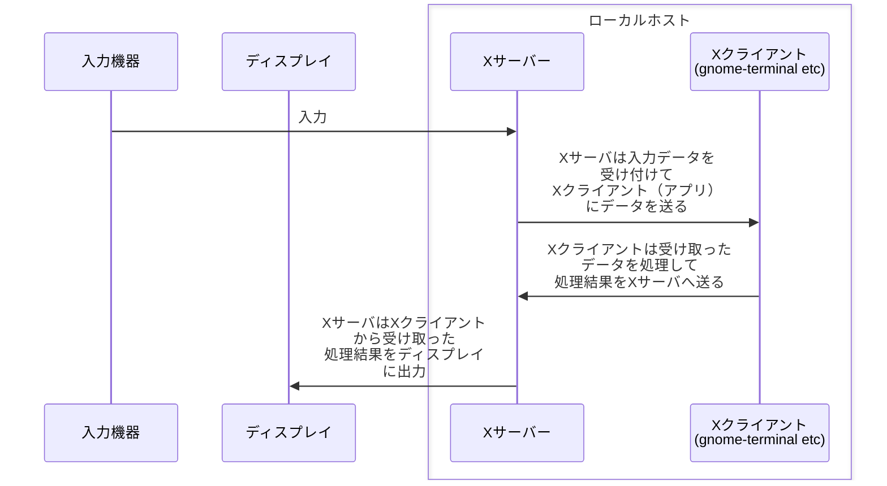
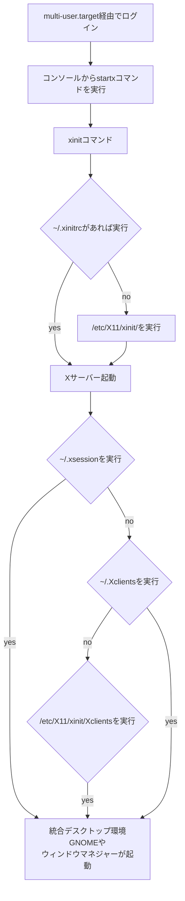

<div style='border-radius: 1em; border-style:solid; border-color:#D3D3D3; background-color:#F8F8F8'>

<p class="h4">&nbsp;&nbsp;Table of Contents</p>

<!-- START doctoc generated TOC please keep comment here to allow auto update -->
<!-- DON'T EDIT THIS SECTION, INSTEAD RE-RUN doctoc TO UPDATE -->

- [X Window Systemとは？](#x-window-system%E3%81%A8%E3%81%AF)
  - [X Window Systemの仕組み](#x-window-system%E3%81%AE%E4%BB%95%E7%B5%84%E3%81%BF)
- [X Window Systemが起動するまでの流れ](#x-window-system%E3%81%8C%E8%B5%B7%E5%8B%95%E3%81%99%E3%82%8B%E3%81%BE%E3%81%A7%E3%81%AE%E6%B5%81%E3%82%8C)
    - [テキストログインの場合](#%E3%83%86%E3%82%AD%E3%82%B9%E3%83%88%E3%83%AD%E3%82%B0%E3%82%A4%E3%83%B3%E3%81%AE%E5%A0%B4%E5%90%88)
    - [グラフィカルログインの場合](#%E3%82%B0%E3%83%A9%E3%83%95%E3%82%A3%E3%82%AB%E3%83%AB%E3%83%AD%E3%82%B0%E3%82%A4%E3%83%B3%E3%81%AE%E5%A0%B4%E5%90%88)
- [Appendix: ウィンドウマネージャと統合デスクトップ環境](#appendix-%E3%82%A6%E3%82%A3%E3%83%B3%E3%83%89%E3%82%A6%E3%83%9E%E3%83%8D%E3%83%BC%E3%82%B8%E3%83%A3%E3%81%A8%E7%B5%B1%E5%90%88%E3%83%87%E3%82%B9%E3%82%AF%E3%83%88%E3%83%83%E3%83%97%E7%92%B0%E5%A2%83)
- [References](#references)

<!-- END doctoc generated TOC please keep comment here to allow auto update -->


</div>

## X Window Systemとは？

LinuxのGUIは多くのディストリビューションでX Window Systemと呼ばれる仕組みで提供されています.
X Window SystemはX11(正確にはversion 11のXプロトコルを実装したX Window System)やXと呼ばれたりします.

```zsh
## X Window Systemを利用している場合
% echo $XDG_SESSION_TYPE
x11

## Waylandを利用している場合
% echo $XDG_SESSION_TYPE
wayland
```

X Window SystemはXサーバ, ディスプレイマネージャxdm, ウィンドウマネージャtwm, 基本的なXクライアント, Xライブラリ, フォントファイルなどから構成されていますが, 一義的には**クライアントサーバー方式を採用したネットワーク型のウィンドウシステム**です.

### X Window Systemの仕組み

X Window Systemにおいて,

---|---|---
Xサーバー|キーボードからの入力処理や, ディスプレイへの出力処理等のハードウェアの管理を行う|Xorg
Xクライアント|クライアント|Webブラウザオフィスのアプリケーションなど|xclockなど

XサーバーとXクライアントはXプロトコルで通神するので, XクライアントとXサーバーが異なったアーキテクチャをもつハードウェアやOS上にあっても動作することができます(=同一ホストである必要はない)



上記の処理がX Window Systemの処理の流れとなります. このようにXサーバーは, 各Xクライアント間の調整やユーザー側とXクライアントの仲介をするものと理解することができます.


## X Window Systemが起動するまでの流れ

X Window Systemが起動するまでの流れは

- テキストログイン（ランレベル3）の場合
- グラフィカルログイン（ランレベル５）の場合

の２種類があります. 基本的にはGUI環境でログインする機会が多いので, 日常的には後者がメインとなります.

#### テキストログインの場合

<div style='padding-left: 2em; padding-right: 2em; border-radius: 1em; border-style:solid; border-color:#D3D3D3; background-color:#F8F8F8'>
<p class="h4"><ins>テキストログインの流れ</ins></p>

1. ランレベル3で立ち上げ
2. テキストベースでログイン
3. `startx`コマンドを実行 → `xinit`コマンドでXサーバとクライアントアプリケーションを起動

</div>




- `startx`は`xinit`を起動するシェルスクリプト
- `xinit`はXサーバを起動するプログラム
- `/etc/X11/xinit/Xclients`: ウィンドウマネージャの起動
- `.xinitrc`: startxやxinitコマンドで読み込まれるスクリプト
- `.xsession`: 起動後の処理設定. ログイン後の起動プログラムの定義スクリプト


#### グラフィカルログインの場合


Xサーバー(`/usr/bin/Xorg`)をもつシステムについて, 起動シーケンスを介して`systemd`が`graphical.target`
を起動すると

1. ディスプレイマネージャ(`gdm`, `kdm`, `xdm`が有名)が起動
2. ディスプレイマネジャーがXサーバ(通常は`/usr/bin/Xorg`)を起動
3. グラフィカルログイン画面が表示

という流れになります. `/lib/systemd/system/graphical.target`を確認すると以下のように`display-manager.service`を呼んでいます. 

```zsh
% cat /lib/systemd/system/graphical.target       
#  SPDX-License-Identifier: LGPL-2.1-or-later
#
#  This file is part of systemd.
#
#  systemd is free software; you can redistribute it and/or modify it
#  under the terms of the GNU Lesser General Public License as published by
#  the Free Software Foundation; either version 2.1 of the License, or
#  (at your option) any later version.

[Unit]
Description=Graphical Interface
Documentation=man:systemd.special(7)
Requires=multi-user.target
Wants=display-manager.service
Conflicts=rescue.service rescue.target
After=multi-user.target rescue.service rescue.target display-manager.service
AllowIsolate=yes
```

ディスプレイマネージャからログインした後,セッションが開始してX Window画面を表示します. Xsession起動シーケンスはランレベル3の場合と同じになります.


## Appendix: ウィンドウマネージャと統合デスクトップ環境

<div style='padding-left: 2em; padding-right: 2em; border-radius: 1em; border-style:solid; border-color:#D3D3D3; background-color:#F8F8F8'>
<p class="h4"><ins>Def: ウィンドウマネージャ</ins></p>

ウィンドウマネージャはWindow System Xの外観を管理するシステム. ウィンドウの外観, アイコン, メニュー
などを提供しユーザが設定できるようになる. 


</div>

ウィンドウマネジャーの種類として, `Metacity`, `Kwin`, `twm`, `fvwm`, `enlightment`が有名です. ウィンドウマネジャーはあくまでもユーザーがログインした後に立ち上がります. 

ウィンドウヘッダのデザインが変更されてしまった/したい場合は, ウィンドウマネージャの設定を変更します.
ログイン画面の表示を変更したい場合は, `etc/X11/xdm/Xresources`(設定ファイル自体とは別)のようにディスプレイマネージャの方で表示変更を行います.


<div style='padding-left: 2em; padding-right: 2em; border-radius: 1em; border-style:solid; border-color:#D3D3D3; background-color:#F8F8F8'>
<p class="h4"><ins>Def: 統合デスクトップ環境</ins></p>

ウィンドウマネジャーにデスクトップ用のユーティリティを組み合わせたものを総合デスクトップ環境と呼ぶ.

</div>

GNOMEが有名ですが, Ubuntuインストール時にLibreOfficeやFirefoxなどのツールがついていますが, これは
UbuntuがGNOMEという総合デスクトップ環境を提供してくれているからです. また定義より, ウィンドウマネジャーも
統合デスクトップ環境が提供する機能の一部といえます. 


References
----------
- [Ryo's Tech Blog > reboot コマンド／poweroff コマンドの仕組み](https://ryonakagami.github.io/2021/04/28/ubuntu-reboot-systemd/)
- [Ryo's Tech Blog > Sys V initに基づくLinux Boot Sequence](https://ryonakagami.github.io/2023/07/15/linux-boot-sequence/)
- [Linux - Display Manager](https://www.infraexpert.com/infra/linux42.html#google_vignette)