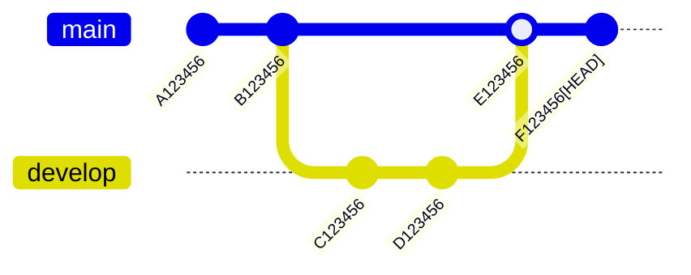

<div style='border-radius: 1em; border-style:solid; border-color:#D3D3D3; background-color:#F8F8F8'>

<p class="h4">&nbsp;&nbsp;Table of Contents</p>

<!-- START doctoc generated TOC please keep comment here to allow auto update -->
<!-- DON'T EDIT THIS SECTION, INSTEAD RE-RUN doctoc TO UPDATE -->

- [Repository全体を任意の過去commit-id地点に戻す](#repository%E5%85%A8%E4%BD%93%E3%82%92%E4%BB%BB%E6%84%8F%E3%81%AE%E9%81%8E%E5%8E%BBcommit-id%E5%9C%B0%E7%82%B9%E3%81%AB%E6%88%BB%E3%81%99)
  - [`git revert`: 任意の時点まで指定ブランチ環境を戻す](#git-revert-%E4%BB%BB%E6%84%8F%E3%81%AE%E6%99%82%E7%82%B9%E3%81%BE%E3%81%A7%E6%8C%87%E5%AE%9A%E3%83%96%E3%83%A9%E3%83%B3%E3%83%81%E7%92%B0%E5%A2%83%E3%82%92%E6%88%BB%E3%81%99)
    - [Option: `--no-commit`](#option---no-commit)
    - [`B123456`時点へ戻したい](#b123456%E6%99%82%E7%82%B9%E3%81%B8%E6%88%BB%E3%81%97%E3%81%9F%E3%81%84)
  - [`git switch`: 任意のcommit-id時点から新しくブランチを作成](#git-switch-%E4%BB%BB%E6%84%8F%E3%81%AEcommit-id%E6%99%82%E7%82%B9%E3%81%8B%E3%82%89%E6%96%B0%E3%81%97%E3%81%8F%E3%83%96%E3%83%A9%E3%83%B3%E3%83%81%E3%82%92%E4%BD%9C%E6%88%90)
    - [detached HEADの活用](#detached-head%E3%81%AE%E6%B4%BB%E7%94%A8)
- [References](#references)

<!-- END doctoc generated TOC please keep comment here to allow auto update -->


</div>

## Repository全体を任意の過去commit-id地点に戻す

下記のようなcommit historyが存在し, 現在 `main` ブランチの `F123456`地点にHEADが存在するとします.



<div style="display: inline-block; background: #D3D3D3;; border: 1px solid #D3D3D3; padding: 3px 10px;color:black"><span >想定シナリオ</span>
</div>

<div style="border: 1px solid #D3D3D3; font-size: 100%; padding: 20px;">

`develop` branchマージ後に, 重大なバグが見つかりチームで以下のような対処で合意した

1. `main`ブランチを `develop` branchマージ前, つまり `B123456`時点へ開発履歴を残したまま戻す
2. `develop`ブランチの `D123456` 時点でバグが混在してしまったことがわかってるので, `D123456`から新しく`HOTFIX`ブランチを作成し, バグ修正を実施する
3. `HOTFIX`ブランチでバグ修正が完了したら, `develop`ブランチの最新にマージし, 結合テストを実施
4. 結合テストが通った後, 再び`main`ブランチへマージ

</div>

上記手順(3), (4)は,作業実施後に `git merge` または Pull Requestを用いれば良いだけです. この記事では(1), (2)を git commandでどのように実行するかを紹介します.


### `git revert`: 任意の時点まで指定ブランチ環境を戻す

`git revert`は, 過去のcommit-idを打ち消す形で新しいcommitを実行するコマンドです. 
`git reset`は過去commitを取り消す(= 歴史から消し去る)形で過去時点の状態を復元しますが, `git revert`はあくまで, 過去のcommitを打ち消すcommitを実行するため, 歴史自体は残るという差分があります.

<div style="display: inline-block; background: #D3D3D3;; border: 1px solid #D3D3D3; padding: 3px 10px;color:black"><span >Syntax</span>
</div>

<div style="border: 1px solid #D3D3D3; font-size: 100%; padding: 20px;">

特定の１つ `commit-id` を打ち消したい場合

```zsh
% git revert commit-id
```

連続した `commit-id`を打ち消したい場合

```zsh
% git revert older-commit-id..newer-commit-id
```

- `older-commit-id`以降(`older-commit-id`は打ち消しに含まれない)から`newer-commit-id`まで(`newer-commit-id`は打ち消し対象)commitが打ち消される

`older-commit-id`を含む形でrevertしたい場合は

```zsh
% git revert older-commit-id^..newer-commit-id
```

</div>


#### Option: `--no-commit`

`git revert`は打ち消しcommitを実行するコマンドなので, デフォルトでは打ち消しのたびにcommit-messageの画面が立ち上がります. 単一のcommit-idを打ち消したい場合は問題ないですが, 複数を打ち消す場合はまとめてcommitをまとめたいニーズがあると思います.

```zsh
## longer option
% git revert --no-commit 

## short option
% git revert -n
```

と実行するとcommitの打ち消しをindexまでに留めてくれます(= 打ち消しのファイル修正 + `git add`までの状態). その後, `git commit`を実行する必要がありますが, 自分が意図した部分まで戻れているかcommitする前に確認できるメリットがあります.

間違った`revert`を実行してしまったと気づいたときは

```zsh
% git revert --abort
```

#### `B123456`時点へ戻したい


上記の状態のとき, `B123456`時点へ戻す方法として

```zsh
% git revert B123456..HEAD --no-commit
% git commit -m "REVERT: revert to B123456 because of bug detection, #ISSUE 123"
```

または

- `HEAD~1`: E123456
- `HEAD~2`: B123456


に対応するので `HEAD`を用いる場合だと

```zsh
% git revert HEAD~2..HEAD --no-commit
% git commit -m "REVERT: revert to B123456 because of bug detection, #ISSUE 123"
```

### `git switch`: 任意のcommit-id時点から新しくブランチを作成

<div style="display: inline-block; background: #6495ED;; border: 1px solid #6495ED; padding: 3px 10px;color:#FFFFFF"><span >commit-idを指定してbranch作成</span>
</div>

<div style="border: 1px solid #6495ED; font-size: 100%; padding: 20px;">

`D123456`から新しく`HOTFIX`ブランチを作成したいと明確な場合は

```zsh
% git switch -c HOTFIX D123456
```

</div>

#### detached HEADの活用

場合によってはブランチは作成したくないが, 任意のcommit-id時点での状態を確認したいケースがあります.
この場合, detached HEADな状態をあえて作り出して, その時の状態を確認するということが手法の１つとしてあります.

<div style="display: inline-block; background: #D3D3D3;; border: 1px solid #D3D3D3; padding: 3px 10px;color:black"><span >定義: detached HEAD</span>
</div>
<div style="border: 1px solid #D3D3D3; font-size: 100%; padding: 20px;">

通常は, 

- HEADはブランチを参照
- ブランチがcommit-idを参照

という順番になっていますが, detached HEADとはHEADがcommit-idを直接参照してしまっている状態を意味します.

detached HEAD状態のときに, `git branch`を叩くと

```zsh
% git branch
* (HEAD detached at dfe91d6)
  main
  develop
```

上記のように確認できます.

意図的にdetached HEAD状態を作り出したいときは


```zsh
% `git switch -d <commit-id>`
```

</div>

今回の場合は

```zsh
% git switch -d D123456
```


References
----------
- [git-revert](https://git-scm.com/docs/git-revert/2.23.0)
- [Ryo's Tech Blog > git HEAD: the difference between HEAD~ and HEAD^](https://ryonakagami.github.io/2021/01/10/git-and-HEAD-concept/)