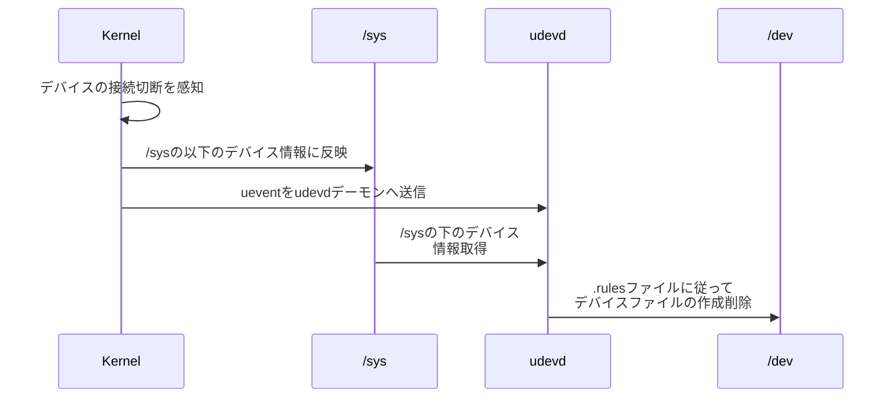

<div style='border-radius: 1em; border-style:solid; border-color:#D3D3D3; background-color:#F8F8F8'>

<p class="h4">&nbsp;&nbsp;Table of Contents</p>

<!-- START doctoc generated TOC please keep comment here to allow auto update -->
<!-- DON'T EDIT THIS SECTION, INSTEAD RE-RUN doctoc TO UPDATE -->

- [なぜパーティショニングは大事なのか？](#%E3%81%AA%E3%81%9C%E3%83%91%E3%83%BC%E3%83%86%E3%82%A3%E3%82%B7%E3%83%A7%E3%83%8B%E3%83%B3%E3%82%B0%E3%81%AF%E5%A4%A7%E4%BA%8B%E3%81%AA%E3%81%AE%E3%81%8B)
- [`lsblk`コマンド: ブロックデバイスの表示](#lsblk%E3%82%B3%E3%83%9E%E3%83%B3%E3%83%89-%E3%83%96%E3%83%AD%E3%83%83%E3%82%AF%E3%83%87%E3%83%90%E3%82%A4%E3%82%B9%E3%81%AE%E8%A1%A8%E7%A4%BA)
  - [デバイス命名規則(device naming scheme)](#%E3%83%87%E3%83%90%E3%82%A4%E3%82%B9%E5%91%BD%E5%90%8D%E8%A6%8F%E5%89%87device-naming-scheme)
  - [`udev`: デバイスファイルを動的に作成,削除する仕組み](#udev-%E3%83%87%E3%83%90%E3%82%A4%E3%82%B9%E3%83%95%E3%82%A1%E3%82%A4%E3%83%AB%E3%82%92%E5%8B%95%E7%9A%84%E3%81%AB%E4%BD%9C%E6%88%90%E5%89%8A%E9%99%A4%E3%81%99%E3%82%8B%E4%BB%95%E7%B5%84%E3%81%BF)
- [`fdisk`コマンド: パーティションの確認/作成](#fdisk%E3%82%B3%E3%83%9E%E3%83%B3%E3%83%89-%E3%83%91%E3%83%BC%E3%83%86%E3%82%A3%E3%82%B7%E3%83%A7%E3%83%B3%E3%81%AE%E7%A2%BA%E8%AA%8D%E4%BD%9C%E6%88%90)
  - [パーティショニングの形式：MBR形式とGPT形式](#%E3%83%91%E3%83%BC%E3%83%86%E3%82%A3%E3%82%B7%E3%83%A7%E3%83%8B%E3%83%B3%E3%82%B0%E3%81%AE%E5%BD%A2%E5%BC%8Fmbr%E5%BD%A2%E5%BC%8F%E3%81%A8gpt%E5%BD%A2%E5%BC%8F)
  - [`umount`コマンドによるパーティション書き換えの前準備](#umount%E3%82%B3%E3%83%9E%E3%83%B3%E3%83%89%E3%81%AB%E3%82%88%E3%82%8B%E3%83%91%E3%83%BC%E3%83%86%E3%82%A3%E3%82%B7%E3%83%A7%E3%83%B3%E6%9B%B8%E3%81%8D%E6%8F%9B%E3%81%88%E3%81%AE%E5%89%8D%E6%BA%96%E5%82%99)
  - [パーティションの作成](#%E3%83%91%E3%83%BC%E3%83%86%E3%82%A3%E3%82%B7%E3%83%A7%E3%83%B3%E3%81%AE%E4%BD%9C%E6%88%90)
- [Appendix: Flash Drive](#appendix-flash-drive)
- [References](#references)

<!-- END doctoc generated TOC please keep comment here to allow auto update -->


</div>


## なぜパーティショニングは大事なのか？

- ストレージを利用するまでの流れ
- パーティショニングによって, システム全体が堅牢に機能する
- そもそもパーティション設定は多くの場合不可逆なので慎重に実施する必要がある

という３つの理由が挙げられます


> ストレージを利用するまでの流れ

普段はあまり意識することないですが, 購入したHDD, SSD, Flash DriveをLinuxから使えるようにするには

- パーティションの作成
- フォーマット
- マウント

という手順を踏む必要があります. ストレージを利用することなくコンピューターを利用する方はあまりいないので, 
この意味でパーティショニングを理解することは重要です. 

> パーティショニングによって, システム全体が堅牢に機能する

また, 一つの物理ディスクをそのまま１つとして使うのではなく, パーティションに分けることで,
効率的なバックアップや, ファイルシステム単位での障害修復が可能となります. 例として, 

- システム領域とデータ領域を分けておけば, システム領域に何かのトラブルが起こっても, データを置いておく領域が別のパーティションになっていれば, データをトラブルから守ることもできる
- 再フォーマットが必要になった際, トラブルが起きたパーティションのみをフォーマットすることができ, 他のパーティションをフォーマットせずに済む

といったことが挙げられます.


## `lsblk`コマンド: ブロックデバイスの表示

パーティションを実行するにあたって, まずブロックデバイスを確認する必要があります. 
そこで利用するコマンドが`lsblk`コマンドです.


<div style='padding-left: 2em; padding-right: 2em; border-radius: 1em; border-style:solid; border-color:#D3D3D3; background-color:#F8F8F8'>
<p class="h4"><ins>Def: lsblk command</ins></p>

- `lsblk`（=list block devices）は, 現在利用できるブロックデバイスを一覧表示するコマンド. 
- 各ブロックデバイスをツリー状に表示する

</div>

各ブロックデバイスをツリー状に表示するのでパーティションの状態を視覚的に把握でき, ストレージの構成やデバイス番号を確認したいときに役立ちます.

```zsh
% lsblk
NAME        MAJ:MIN RM   SIZE RO TYPE MOUNTPOINTS
...(略)
sda           8:0    1  57.3G  0 disk 
├─sda1        8:1    1   4.6G  0 part /media/hogehoge/Ubuntu 20.04.2 LTS amd64
├─sda2        8:2    1   4.9M  0 part 
├─sda3        8:3    1   300K  0 part 
└─sda4        8:4    1  52.7G  0 part /media/hogehoge/writable
nvme0n1     259:0    0 931.5G  0 disk 
├─nvme0n1p1 259:1    0   512M  0 part /boot/efi
└─nvme0n1p2 259:2    0   931G  0 part /var/snap/firefox/common/host-hunspell
                                      /
nvme1n1     259:3    0 931.5G  0 disk 
├─nvme1n1p1 259:4    0   100M  0 part 
├─nvme1n1p2 259:5    0    16M  0 part 
├─nvme1n1p3 259:6    0 930.7G  0 part 
└─nvme1n1p4 259:7    0   674M  0 part 
```

|項目|意味|
|---|---|
|NAME|ブロックデバイス名|
|MAJ:MIN|メジャー番号とマイナー番号|
|RM|リムーバブルデバイス（1＝リムーバブル）|
|SIZE|サイズ（-bオプションでバイト数の表示になる）|
|RO|リードオンリーデバイス（1＝リードオンリー）|
|TYPE|ブロックデバイスの種類|
|MOUNTPOINT|マウントポイント|


### デバイス命名規則(device naming scheme)

「**In Linux, everything is a file"**」という言葉があるように, 起動中にハードディスクを新しく検出すると, 
`/dev`ディレクトリにデバイスファイルとして自動的に追加されます. 上の例では`sda`や`nvme0n1`といったデバイスファイルが確認できます.
これらはLinuxでよく見られるデバイスファイルネームで以下のような意味があります:

|デバイスファイル|説明|
|---|---|
|`/dev/sda`|1番目のSCSI/SATA/USBに接続したデバイス|
|`/dev/sdb`|2番目のSCSI/SATA/USBに接続したデバイス|
|`/dev/sdc`|3番目のSCSI/SATA/USBに接続したデバイス|
|`/dev/sdd`|4番目のSCSI/SATA/USBに接続したデバイス|
|`/dev/sr0`|1番目のDVD/BDドライブ|
|`/dev/sr1`|2番目のDVD/BDドライブ|
|`/dev/nvme0n1`|1番目のNVM Expressで接続されたデバイス|
|`/dev/nvme1n1`|2番目のNVM Expressで接続されたデバイス|

<div style='padding-left: 2em; padding-right: 2em; border-radius: 1em; border-style:solid; border-color:#D3D3D3; background-color:#F8F8F8'>
<p class="h4"><ins>Def: デバイスファイル</ins></p>

デバイスファイルとは, 各種ハードウェアの入出力を扱うための特殊ファイルのこと.

</div>

`sda`のツリーに着目すると, 複数のデバイスファイルが以下のように割り当てられていることが確認できます.

```zsh
% ls -l /dev/sda[0-9]
brw-rw---- 1 root disk 8, 1 Dec 23 01:45 /dev/sda1
brw-rw---- 1 root disk 8, 2 Dec 23 01:45 /dev/sda2
brw-rw---- 1 root disk 8, 3 Dec 23 01:45 /dev/sda3
brw-rw---- 1 root disk 8, 4 Dec 23 01:45 /dev/sda4
```

これらは個別のパーティションを表しています. `b`から始まるファイルとなっていますが, これはブロック型デバイスファイル
を表しています. これはハードディスクのように固定長のデータ（ブロック）単位に入出力するタイプのデバイスを表しています.

一方, シリアル回線や端末のようにデータを1 byteずつ入出力するタイプのデバイスは, `c`というキャラクター型デバイスファイルとして表されます.

### `udev`: デバイスファイルを動的に作成,削除する仕組み

<div style='padding-left: 2em; padding-right: 2em; border-radius: 1em; border-style:solid; border-color:#D3D3D3; background-color:#F8F8F8'>
<p class="h4"><ins>Def: udev</ins></p>

`udev`はデバイスにアクセスするための`/dev`以下のデバイスファイルを動的に作成, 削除する仕組みを提供するツールのこと.

- `libudev`: ライブラリ
- `udevd`: デーモン
- `udevadm`: udevイベントのモニタやカーネルへのudevイベントのリクエストなどの機能を持つ管理コマンド

といった要素によって構成されている. 

</div>



デバイスが接続されると`udevd`はカーネルからudevイベントを受取, `.rules`ファイルに記載されたルールに
従って, デバイスファイルを動的に作成削除します. `.rules`ファイルは`/etc/udev/rules.d`や`/lib/udev/rules.d`
で確認することができます.

udevdデーモンはSysV init環境では`/etc/rc.sysinit`から, systemd環境では`systemd-udevd.service`から起動されます. 
`systemctl`コマンドで起動状態を以下のように確認することができます.

```zsh
% systemctl --type=service | grep "udev"
  systemd-udev-trigger.service                          loaded active exited  Coldplug All udev Devices
  systemd-udevd.service                                 loaded active running Rule-based Manager for Device Events and Files
```

## `fdisk`コマンド: パーティションの確認/作成

<div style='padding-left: 2em; padding-right: 2em; border-radius: 1em; border-style:solid; border-color:#D3D3D3; background-color:#F8F8F8'>
<p class="h4"><ins>Def: fdiskコマンド</ins></p>

`fdisk`コマンドはパーティションの作成や削除など対話式に実行するコマンドのこと.

```zsh
fdisk [option] device-name
```

元来はMBR形式のパーティションニングのみしか対応していなかったので（現在は対応済み）, 基本的には`gdisk`コマンドを利用することが推奨とされている.

</div>

`fdisk`コマンドを実行するためには管理者権限が多くの場合で必要です. 例として, USB flash driveを対象に実行してみます.

```zsh
% sudo fdisk -l /dev/sda
Disk /dev/sda: 57.28 GiB, Disk /dev/sda: 57.28 GiB, 61505273856 bytes, 120127488 sectors
Disk model: Ultra USB Type C
Units: sectors of 1 * 512 = 512 bytes
Sector size (logical/physical): 512 bytes / 512 bytes
I/O size (minimum/optimal): 512 bytes / 512 bytes
Disklabel type: gpt
Disk identifier: A0891D7E-B930-4513-94D9-F629DBD637B2

Device       Start       End   Sectors  Size Type
/dev/sda1       64   9613459   9613396  4.6G Microsoft basic data
/dev/sda2  9613460   9623527     10068  4.9M EFI System
/dev/sda3  9623528   9624127       600  300K Microsoft basic data
/dev/sda4  9625600 120127424 110501825 52.7G Linux filesystem
61505273856 bytes, 120127488 sectors
Disk model: Ultra USB Type C
Units: sectors of 1 * 512 = 512 bytes
Sector size (logical/physical): 512 bytes / 512 bytes
I/O size (minimum/optimal): 512 bytes / 512 bytes
Disklabel type: gpt
Disk identifier: A0891D7E-B930-4513-94D9-F629DBD637B2

Device       Start       End   Sectors  Size Type
/dev/sda1       64   9613459   9613396  4.6G Microsoft basic data
/dev/sda2  9613460   9623527     10068  4.9M EFI System
/dev/sda3  9623528   9624127       600  300K Microsoft basic data
/dev/sda4  9625600 120127424 110501825 52.7G Linux filesystem
```

上記のように`-l`オプションを利用することで指定したデバイスのパーティションテーブルを一覧表示することができます.


<div style='padding-left: 2em; padding-right: 2em; border-radius: 1em; border-style:solid; border-color:#e6e6fa; background-color:#e6e6fa'>
<p class="h4"><ins>Column: パーティション</ins></p>

LinuxではHDDなどの記憶装置を論理的に分割して利用し, その論理的に分割された領域をパーティションと呼びます.
パーティションの位置や長さなどの管理情報（パーティションテーブル）を、パーティションとは別の領域に記録しています.

パーティションテーブルはハードディスクの先頭に位置に保存されており, bootloaderやkernelはこの先頭領域を
読み取ることでハードディスクのパーティションを認識しています.

</div>

### パーティショニングの形式：MBR形式とGPT形式

パーティションを管理する方式は大きく2つあり

- MBR: Master Boot Record
- GPT: Globally Unique IDentifier Partition Table

MBRは古くから使われており, 旧式のハードウェアやOSにも対応していますが, パーティションの作成数やサイズの制限があるので
あまり最近では使用されません.

<div style='padding-left: 2em; padding-right: 2em; border-radius: 1em; border-style:solid; border-color:#D3D3D3; background-color:#F8F8F8'>
<p class="h4"><ins>MBR形式パーティション</ins></p>

パーティションテーブルがMBR形式の場合, 以下の三種類のパーティションを区別して管理してます:

|種類|説明|
|---|---|
|基本パーティション|１代のディスクに必ず１つ以上存在するパーティション<br>1つの物理ディスクには最大で4つの基本パーティションに分割することが可能|
|拡張パーティション|基本パーティションのうち, 1つだけを拡張パーティションとして使用することが可能<br>直接ファイルシステムを作成するのではなく, 論理パーティションを格納するために使用される|
|論理パーティション|拡張パーティション内に作成されたパーティション. ハードディスクのタイプによっても異なるが, 基本パーティション番号は5以上が割り当てられる|

またMBR形式の特徴として, 

- 基本パーティションの開始と終了位置を`Cylinder/HEad/Sector`で管理
- MBRでは2TB(2^32×512バイト)を超えるパーティションは管理できない

が挙げられる.

</div>


```zsh
## パーティショニング
sda
├── sda1 # 基本パーティション
├── sda2 # 基本パーティション
├── sda3 # 基本パーティション
└── sda4 # 拡張パーティション
    ├── sda5 # 論理パーティション
    ├── sda6 # 論理パーティション
    ├── sda7 # 論理パーティション
    ├── sda8 # 論理パーティション
    └── sda9 # 論理パーティション
```

<div style='padding-left: 2em; padding-right: 2em; border-radius: 1em; border-style:solid; border-color:#D3D3D3; background-color:#F8F8F8'>
<p class="h4"><ins>GPT形式パーティション</ins></p>

- MBR形式と異なり, 基本/論理パーティションの区別なく, デフォルトで最大128個のパーティションが構成できる
- 基本的には最大8ZiBまでの領域を定義&管理できる
- GPT形式はEFI規格の中の１つの機能のため, UEFIを搭載したコンピューターが必要
- MBRではCHSによって位置を指定していた一方, GPTはLogical Block Addressing (LBA) を使ってディスク内の位置を示す
- 冗長性の確保の観点（バックアップ用）からGPTヘッダーとパーティションテーブルはディスクの2~3番目のセクタと最後部の両方に書き込まれている

</div>

なお, GPT形式は, GPTヘッダーにはディスクのGUID(Globally Unique Identifider)が格納されており, 
各Entryにはパーティションタイプと, パーティションを識別するためのGUIDが格納されている形式になっています.

GPT形式とMBR形式の構成の違いを図示したものが以下となりまこのままではまだディスクはす:


### `umount`コマンドによるパーティション書き換えの前準備

```zsh
% lsblk /dev/sda
NAME   MAJ:MIN RM  SIZE RO TYPE MOUNTPOINTS
sda      8:0    1 57.3G  0 disk 
├─sda1   8:1    1  4.6G  0 part /media/hoshinokirby/Ubuntu 20.04.2 LTS amd64
├─sda2   8:2    1  4.9M  0 part 
├─sda3   8:3    1  300K  0 part 
└─sda4   8:4    1 52.7G  0 part /media/hoshinokirby/writable
```

上記の状態で, `fdisk`コマンドを用いてパーティションを作成してみます.

```zsh
% sudo fdisk /dev/sda

Welcome to fdisk (util-linux 2.37.2).
Changes will remain in memory only, until you decide to write them.
Be careful before using the write command.

This disk is currently in use - repartitioning is probably a bad idea.
It's recommended to umount all file systems, and swapoff all swap
partitions on this disk.

The device contains 'iso9660' signature and it will be removed by a write command. See fdisk(8) man page and --wipe option for more details.

Command (m for help): 
```

すると, `mount`している状態だと`This disk is currently in use - repartitioning is probably a bad idea.`
と怒られるので, `umount`コマンドでunmountしておきます

```zsh
% umount /dev/sda1
% umount /dev/sda4
% lsblk /dev/sda  
NAME   MAJ:MIN RM  SIZE RO TYPE MOUNTPOINTS
sda      8:0    1 57.3G  0 disk 
├─sda1   8:1    1  4.6G  0 part 
├─sda2   8:2    1  4.9M  0 part 
├─sda3   8:3    1  300K  0 part 
└─sda4   8:4    1 52.7G  0 part 
```

すると, 以下のように怒られなくなります.

```zsh
% sudo fdisk /dev/sda

Welcome to fdisk (util-linux 2.37.2).
Changes will remain in memory only, until you decide to write them.
Be careful before using the write command.

The device contains 'iso9660' signature and it will be removed by a write command. See fdisk(8) man page and --wipe option for more details.

Command (m for help): 
```

### パーティションの作成

`fdisk`コマンドにて対話式にパーティションの操作をする場合, 次のコマンドを主に用います

|コマンド|説明|
|---|---|
|`d`|パーティションを削除する|
|`F`|パーティションが割り当てられていない領域を表示する|
|`g`|GPTテーブルの作成|
|`p`|現在のパーティションテーブルを表示|
|`m`|ヘルプメニューの表示|
|`n`|パーティションの作成|
|`q`|変更を保存せずに終了|
|`w`|変更を保存して終了|


> パーティションテーブルを表示

```zsh
% sudo fdisk /dev/sda

Welcome to fdisk (util-linux 2.37.2).
Changes will remain in memory only, until you decide to write them.
Be careful before using the write command.

The device contains 'iso9660' signature and it will be removed by a write command. See fdisk(8) man page and --wipe option for more details.

Command (m for help): p

Disk /dev/sda: 57.28 GiB, 61505273856 bytes, 120127488 sectors
Disk model: Ultra USB Type C
Units: sectors of 1 * 512 = 512 bytes
Sector size (logical/physical): 512 bytes / 512 bytes
I/O size (minimum/optimal): 512 bytes / 512 bytes
Disklabel type: gpt
Disk identifier: A0891D7E-B930-4513-94D9-F629DBD637B2

Device       Start       End   Sectors  Size Type
/dev/sda1       64   9613459   9613396  4.6G Microsoft basic data
/dev/sda2  9613460   9623527     10068  4.9M EFI System
/dev/sda3  9623528   9624127       600  300K Microsoft basic data
/dev/sda4  9625600 120127424 110501825 52.7G Linux filesystem
```

> パーティションの新規作成

新規に空のGPT partition tableを作成したい場合は対話式の流れの中で`g`を入力します

```zsh
sudo fdisk /dev/sda

Welcome to fdisk (util-linux 2.37.2).
Changes will remain in memory only, until you decide to write them.
Be careful before using the write command.

The device contains 'iso9660' signature and it will be removed by a write command. See fdisk(8) man page and --wipe option for more details.

Command (m for help): g
Created a new GPT disklabel (GUID: CD5ACE08-6954-254E-AACC-9207290B6C41).
```

パーティション割当されていない領域を`F`で確認してみます

```zsh
Command (m for help): F
Unpartitioned space /dev/sda: 57.28 GiB, 61504208384 bytes, 120125407 sectors
Units: sectors of 1 * 512 = 512 bytes
Sector size (logical/physical): 512 bytes / 512 bytes

Start       End   Sectors  Size
 2048 120127454 120125407 57.3G
```


次にパーティションを`n`コマンドで作成します

```zsh
Command (m for help): n
Partition number (1-128, default 1): 
First sector (2048-120127454, default 2048): 
Last sector, +/-sectors or +/-size{K,M,G,T,P} (2048-120127454, default 120127454): +10G

Created a new partition 1 of type 'Linux filesystem' and of size 10 GiB.
```

上の例では10Gでサイズを指定しましたが, デフォルトだとすべてのスペースを使用する形でpartitionが作成されます.

この編集結果を保存して終了するため, `w`コマンドを入力して作業を終了します.

```zsh
Command (m for help): w
The partition table has been altered.
Calling ioctl() to re-read partition table.
Syncing disks.
```

ただし, フォーマッティング（=ファイルシステムの設定）を実行していないのでこのままではまだディスクは使用できません. 

フォーマッティングについては, [Ryo's Tech Blog > ファイルシステムの作成]()で説明します. 


## Appendix: Flash Drive

<div style='padding-left: 2em; padding-right: 2em; border-radius: 1em; border-style:solid; border-color:#D3D3D3; background-color:#F8F8F8'>
<p class="h4"><ins>Def: Flash Drive</ins></p>

Flash DriveはUSB flash driveやUSBスティックとして知られている, 小型携帯可能なストレージデバイスのこと.

- データの保存
- データトランスファー
- Bootableドライブ

として利用されてたりします. Desktop版Linuxを利用している場合, 多くの場合flash driveを挿した瞬間に
システムは自動的に検知して, フォルダの作成やデータの移行といった操作がGUIベースで可能となります.

</div>


References
------------

- [LinuC > Linux豆知識 017 パーティション](https://linuc.org/study/knowledge/347/)
- [【 lsblk 】コマンド――ブロックデバイスを一覧表示する](https://atmarkit.itmedia.co.jp/ait/articles/1802/02/news021.html)
- [SUSE.com > udevによる動的カーネルデバイス管理](https://documentation.suse.com/ja-jp/sles/15-GA/html/SLES-all/cha-udev.html)
- [Ryo's Tech Blog > ファイルシステムの作成]()
