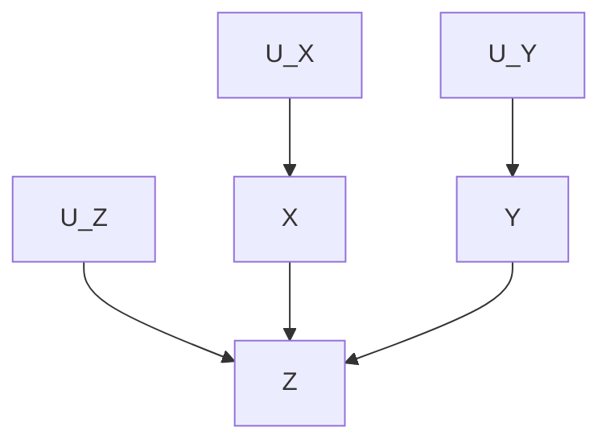

**Table of Contents**
<!-- START doctoc generated TOC please keep comment here to allow auto update -->
<!-- DON'T EDIT THIS SECTION, INSTEAD RE-RUN doctoc TO UPDATE -->

- [はじめに](#%E3%81%AF%E3%81%98%E3%82%81%E3%81%AB)
  - [参考: Inductive vs. Deductive Research Approach](#%E5%8F%82%E8%80%83-inductive-vs-deductive-research-approach)
- [リサーチの目的](#%E3%83%AA%E3%82%B5%E3%83%BC%E3%83%81%E3%81%AE%E7%9B%AE%E7%9A%84)
- [適切な研究課題の探し方](#%E9%81%A9%E5%88%87%E3%81%AA%E7%A0%94%E7%A9%B6%E8%AA%B2%E9%A1%8C%E3%81%AE%E6%8E%A2%E3%81%97%E6%96%B9)
  - [リサーチデザインにおける理論の選択](#%E3%83%AA%E3%82%B5%E3%83%BC%E3%83%81%E3%83%87%E3%82%B6%E3%82%A4%E3%83%B3%E3%81%AB%E3%81%8A%E3%81%91%E3%82%8B%E7%90%86%E8%AB%96%E3%81%AE%E9%81%B8%E6%8A%9E)
- [データの収集](#%E3%83%87%E3%83%BC%E3%82%BF%E3%81%AE%E5%8F%8E%E9%9B%86)
  - [データにおける分析単位の要件](#%E3%83%87%E3%83%BC%E3%82%BF%E3%81%AB%E3%81%8A%E3%81%91%E3%82%8B%E5%88%86%E6%9E%90%E5%8D%98%E4%BD%8D%E3%81%AE%E8%A6%81%E4%BB%B6)
  - [データの質の管理](#%E3%83%87%E3%83%BC%E3%82%BF%E3%81%AE%E8%B3%AA%E3%81%AE%E7%AE%A1%E7%90%86)
  - [分析単位の行為の記述](#%E5%88%86%E6%9E%90%E5%8D%98%E4%BD%8D%E3%81%AE%E8%A1%8C%E7%82%BA%E3%81%AE%E8%A8%98%E8%BF%B0)
  - [データの種類：Experimental data & Observational data](#%E3%83%87%E3%83%BC%E3%82%BF%E3%81%AE%E7%A8%AE%E9%A1%9Eexperimental-data--observational-data)
- [因果関係のコンセプト](#%E5%9B%A0%E6%9E%9C%E9%96%A2%E4%BF%82%E3%81%AE%E3%82%B3%E3%83%B3%E3%82%BB%E3%83%97%E3%83%88)
  - [Potential Outcome Framework](#potential-outcome-framework)
    - [SUTVA: Stable Unit Treatment Value Assumption](#sutva-stable-unit-treatment-value-assumption)
    - [The Assignment Mechanism](#the-assignment-mechanism)
  - [因果メカニズム](#%E5%9B%A0%E6%9E%9C%E3%83%A1%E3%82%AB%E3%83%8B%E3%82%BA%E3%83%A0)
  - [因果分析の進め方](#%E5%9B%A0%E6%9E%9C%E5%88%86%E6%9E%90%E3%81%AE%E9%80%B2%E3%82%81%E6%96%B9)
  - [因果グラフィカルモデル](#%E5%9B%A0%E6%9E%9C%E3%82%B0%E3%83%A9%E3%83%95%E3%82%A3%E3%82%AB%E3%83%AB%E3%83%A2%E3%83%87%E3%83%AB)
- [Action Plan提言への姿勢](#action-plan%E6%8F%90%E8%A8%80%E3%81%B8%E3%81%AE%E5%A7%BF%E5%8B%A2)
- [Appendix](#appendix)
  - [識別の定義（point identification）](#%E8%AD%98%E5%88%A5%E3%81%AE%E5%AE%9A%E7%BE%A9point-identification)
- [参考資料](#%E5%8F%82%E8%80%83%E8%B3%87%E6%96%99)
  - [関連Blogポスト](#%E9%96%A2%E9%80%A3blog%E3%83%9D%E3%82%B9%E3%83%88)
  - [オンラインマテリアル](#%E3%82%AA%E3%83%B3%E3%83%A9%E3%82%A4%E3%83%B3%E3%83%9E%E3%83%86%E3%83%AA%E3%82%A2%E3%83%AB)
  - [書籍](#%E6%9B%B8%E7%B1%8D)

<!-- END doctoc generated TOC please keep comment here to allow auto update -->

## はじめに

適切な（実証研究）リサーチデザインは以下の構成要素がwell-definedな分析計画のことを指します:

1. 適切な研究課題
2. 解き明かしたい事象を説明する理論モデル
3. 検証仮説はなにか？
3. データ
4. 推論モデル

このノートでは,これら構成要素の明確化のための指針を以下まとめます.

### 参考: Inductive vs. Deductive Research Approach

ここで紹介するリサーチデザインは主にdeductive approach(演繹的推論)に比重を置いたものを紹介しています.


上の図のように,Inductive approach(帰納的推論)とdeductive approach(演繹的推論)の大きな違いは,前者は理論を構築することを目的とし,後者は既存の理論を検証することを目的とする点にあります.

> Inductive approachの流れ

1. Observation
  - 格安航空会社の飛行機が遅れている
  - 犬Aと犬Bにノミがいる
  - ゾウは水に依存して生きている
2. Observe a pattern
  - 格安航空会社の別の20便が遅延している
  - 観察されたすべての犬はノミを持っている
  - 観察されたすべての動物は,水に依存している
3. Develop a theory or general (preliminary) conclusion
  - 格安航空会社には常に遅延がある
  - すべての犬にはノミがいる
  - すべての生物は,水に依存して存在する

> Deductive approachの流れ

1. Start with an existing theory (and create a problem statement)
  - 格安航空会社には必ず遅延がある
  - すべての犬にはノミがいる
  - すべての生物は,水に依存して存在する
2. Formulate a falsifiable hypothesis based on existing theory
  - もし乗客が格安航空会社を利用するならば,必ず遅延が発生する。
  - 私の住んでいるアパートのすべての犬はノミを持っている。
  - すべての陸生哺乳類は水に依存している
3. Collect data to test the hypothesis
  - 格安航空会社のフライトデータを収集する
  - マンションにいるすべての犬にノミがいるかどうか検査する
  - すべての陸生哺乳類が水に依存しているかどうかを調査する。
4. Analyze and test the data
  - 格安航空会社の100便のうち5便は遅延がない。
  - 20匹中10匹の犬にノミがいなかった。
  - すべての陸生哺乳類は水に依存している
5. Decide whether you can reject the null hypothesis
  - 格安航空会社の100便のうち5便は遅延していない＝帰無仮説を棄却する
  - 20匹中10匹の犬にはノミがいなかった = 帰無仮説を棄却する
  - すべての陸生哺乳類の種は水に依存している = 仮説を支持する

## リサーチの目的

リサーチは科学的知識取得を目的に実施される活動で,リサーチデザインはリサーチのための行動計画書に相当するものです.
科学的知識とは,「研究対象が何であるかについて事実を述べ,その説明としてその事実がなぜ生じるか,あるいは生じたかを原因と結果の関係から明らかにする」ものです.

そのため,リサーチデザインを考えるにあたって,そもそもリサーチとして成立するために以下の質問を自問することは有用です：

- どのような規則的な事実について注目しているのか？
- その事実を説明する仮説・推論はなにか？
- 仮説・推論のうち何がデータによって示せるのか？

> リサーチと科学的貢献

アカデミアでは,既存知識に照らして新らしい知識を提供するリサーチがユニークな研究として評価されます.
ユニークな研究をしようと思えば,既存文献の知識は必要不可欠です. その知識がなければ,手元のリサーチがユニークであるのかどうか位置づけができません. 従って,研究課題の特定後の最初のステップは戦況研究文献調査となります. なにが具体的な「ユニーク」として評価されるかは多々ありますが一例として,

- 先行研究で通説となっている重要仮説を反証する
- 重要だが十分に掘り下げられていない仮説を体系的に明らかにする
- 意見が割れている先行研究の論争を解決する

> 統計的手法を用いたリサーチ目的

統計的手法を用いたリサーチの目的は大きく２つの分けて考えることができます:

---|---
データの要約・縮小|興味のある変数の集合についての同時分布を数学的に簡潔に記述する
因果推論|理解したい因果のパラメータを定義し,検証仮定を明らかにした上で,パラメーター値を推定 & 因果メカニズムを解釈する

> 社会科学におけるリサーチ

基本的には,分析対象となる個人や企業などの経済主体が与えられた社会環境の中でどのように行動するかをモデル化して分析します.そして,モデルが導き出す経済主体の行動についての予測を,現実のデータを用いて検証し,データによって反証されない理論仮説を残す,というリサーチアプローチがよく取られます.

近年の実証研究の特徴は,与えられたデータが経済主体の行動の帰結として生まれてきているというデータ生成過程に注目し,Institutional knowledgeとidentification strategyを活用してモデルの妥当性の検証や因果メカニズムの発見するということが傾向として見られます.

## 適切な研究課題の探し方

基本的には「この課題が解けるとなぜ嬉しいのか」という質問に答えられるかどうかにかかってきます.
この質問に答えるために分析者が考える必要がある項目例として以下があります:

- 解きたいResearch Questionはなにか？
- そのResearch Questionはなぜ重要か? (Why important)
- 現実にどのような問題や出来事が発生しているのか？Research Questionはそれらとどのように関連しているのか？
- Research Questionを解くことでどのようなActionにつながるのか？
- すでに解かれている課題ではないのか？
- Research Questionを解くための基本方針はなにか？

最後の項目の「Research Questionを解くための基本方針はなにか？」をこの段階で考える理由は,「解けない問題を定義しても時間の無駄」であり,そのようなものは研究課題として選択すべきではないからです.

> 実証論文の構成要素

- 分析計画について
  - Question:答えられるなにか
  - Motivation(why important):Questionはなぜ重要か?についての少なくとも１つの理由
  - Background: QuestioとMotivationを理解可能にするための必要十分な情報
  - Method&Data: 何を使ってどう答えるか?

- 分析結果の解釈について
  - Novelty: やったことのうち先行研究と違う点（事実ベース）
  - Contribution: Novelなてんについてそれが重要であることの理由
  - policy implication: 分析結果が意思決定をどう変えるか？なにができるようになったか？

### リサーチデザインにおける理論の選択

理論とは,研究課題に照らして,分析単位の行動パターンを説明する記述のことです. そのため,理論の選択の際には,

- リサーチにおける分析単位はなにか？
- 分析単位のどのような行動パターンを説明したいのか？

を事前に考える必要があります. 適切な理論を見つけることができた場合,research questionと照らし合わせ,理論に基づいたtestable predictionの言語化をします.

適切なモデルの選択によって得られるメリットをまとめると以下です:

- 分析対象となる行動パターンの定式化
- 分析結果の解釈指針
- Dataによって検証する検証仮説の定式化


## データの収集

データ収集のデザインに際しては次の項目を確認する必要があります:

- 母集団はなにか？
- サンプルはどのように抽出するのか？
- 観察単位(a unit of observation)はなにか？

### データにおける分析単位の要件

実証研究における分析用途のデータにおいて,その分析単位は母集団の代表的標本である必要があります.
母集団とは,分析者が示したい命題の対象集団のことです. データにおける分析単位の理想は,母集団からのランダムサンプリングですが,それが叶わない場合は,Institutional backgroundにて手元の分析データが母集団をどのように代表しているかの説明が必要となります.

### データの質の管理

自分以外の分析者が研究内容を理解する,実証結果を再現するという観点から,「データが作られた過程を記録し報告する」ことを遵守する必要があります.

- 標本抽出計画：どのように母集団から標本を抽出したのか？
- 標本数
- データ取得時点
- 分析データ加工手続き

以上の項目をドキュメントに落とし込む習慣を身につけることは有用です. また,データに属する変数（属性空間, attribute space）の関係性の言語化も推奨されます.
attribute spaceの言語化にあたって,単にデータを説明するだけでなく,変数関連図(attributeをノードとするDAG)を記述することで,自分が考えている仮説や理論から導き出される変数の関係性を可視化することで,institutional backgroundの説明がより「readable」になります.

### 分析単位の行為の記述

分析データを準備する際に,過去の分析対象の行為をテーブルデータとして格納する作業が発生するケースは多く見られます. その際のレコード記録のための基本文法の１つとして以下の文法があります:

```
X Prfm A, O, Y, P, t1, t2, g
```

- X: 行為主体
- A: 行為種類（例:クーポン発行など）
- O: 行為対象（例:発行種類クーポンなど）
- Y: 行為相手
- P: 行為の場所
- t1: 行為のタイムスタンプ
- t2: 行為の期間
- g: 行為目標


### データの種類：Experimental data & Observational data

大雑把に言うと,データはExperimental data と Observational dataの２つに分類されます.

---|---
Experimental data|分析者がデータ生成プロセスに介入し,その結果得た観測値の集合を分析データとしてまとめたデータのこと
Observational data|分析者がデータ生成プロセスに介入することなく,確率変数の実現値を事後的に記録し分析データとしてまとめたデータのこと


## 因果関係のコンセプト

ビジネスの場面では何らかのアクションがKGI/KPIに与えた影響のことを効果と考えますが,その効果を分析フレームワークにどのように落とし込むかを考えます.

### Potential Outcome Framework

「とあるEC小売会社において,とある期間にクーポンをそのEC顧客に付与した場合,今年度のEC顧客あたり購買率は上昇するか？」という問題を解きたいとします. 単純化のため,付与できるクーポンの種類はお買い上げ金額500円割引クーポンの一種類だけとします. 

このクーポンを付与による今年度EC顧客あたりの購買率への因果効果（クーポン付与による処置効果）を記述する方法として,Potential Outcome Framework(the Rubin Causal Model, PO approach)があります.

PO approachは３つの要素から構成されます:

1. 各分析ユニット, $i$, に対して,クーポンの付与ステータスに応じて値が定まる確率変数, $D_i=\{0,1\}$ が定義される
2. 各分析ユニットに対して,クーポンが付与された/されなかった時のPotential Outcome変数 $(Y_{1i}, Y_{0i})$が定義される
3. Treatmentステータス,$D_i=\{0,1\}$,のアサイメントメカニズムが存在する

Potential Outcome変数がすべての分析にユニットについて両方観測される際は,クーポン付与効果は

$$
\tau = \mathbb{E}[Y_{1i} - Y_{0i}]
$$

と表現されますが,分析者が観測できるのはあくまでクーポンを付与された時/されなかった時のどちらか一方のみとなります. つまり,iについてのobserved outcomeを$Y_i$としたとき,

$$
\text{observed outcome } Y_i = \begin{cases}Y_{1i} & \text{if } D_i=1\\ Y_{0i} & \text{if } D_i=0\end{cases}
$$

このような状況の中,$\tau$をどのように識別するのか？(=直接は観測されないPotential outcomeをどのように推定するのか？, Causal Inference as Missing Data Problem)が実証分析において考える基本的な問題となります.
(see [識別の定義（point identification）](#%E8%AD%98%E5%88%A5%E3%81%AE%E5%AE%9A%E7%BE%A9point-identification))


#### SUTVA: Stable Unit Treatment Value Assumption

SUTVAは２つのパートから構成されます:

1. 各 unit of observationについて,treatmentは１種類のみ (ただし,この仮定はmultivaluedやcontinuous treatmentへ緩めることができる)
2. 各 unit of observationについてのTreatment effectは,他のunit of observationのtreatment status/effectと独立, $\tau_i \perp (\tau_j, D_j) \  \ \forall j \neq i$


#### The Assignment Mechanism

The Assignment Mechanismはどのunit of observationがどのtreatment statusを付与されるかを決定するプロセスのことです.

観測できるPOはTreatment variableに依存するという状況のもとで,Treatment variableの値がどのようにユニットごとで選択されたかは因果パラメーターの識別を考える上で重要なこととなります. Assignment Mechanismを考えることなくTreated/Controlled間で単純比較してしまうと以下のような Selection bias が発生するリスクがあります:

<div class="math display" style="overflow: auto">
$$
\begin{align*}
\mathbb{E}[Y_i|D_i=1] - \mathbb{E}[Y_i|D_i=0] =& \mathbb{E}[Y_{1i} - Y_{0i}|D_i=1] \\
&+ \mathbb{E}[Y_{0i}|D_i=1] - \mathbb{E}[Y_{0i}|D_i=0]
\end{align*}
$$
</div>

このように単純比較ではATT項とSelection bias項に分解することができ,Assignment mechanismがPotential outcomeに依存しているケースではバイアスを含んだパラメータを推定してしまうことなります.

この問題の解決方法として,Conditional Independence Assumptionを満たしているかどうかの確認があります.

> Case 1: RCT

<div class="math display" style="overflow: auto">
$$
\begin{align*}
D_i \perp (Y_{i0}, Y_{i1})
\end{align*}
$$
</div>

このとき,omitted variable biasは存在しません. ATE = target parameter $\theta$の推定値を$\hat\theta$とすると

<div class="math display" style="overflow: auto">
$$
\begin{align*}
\hat\theta &= \frac{1}{N_t}\sum_{i:D_i=1}Y_i - \frac{1}{N_c}\sum_{i:D_i=0}Y_i\\
Var(\hat\theta) &= \frac{1}{N_t(N_t-1)}\sum_{i:D_i=1}(Y_i - \bar Y_t)^2 - \frac{1}{N_c(N_c-1)}\sum_{i:D_i=0}(Y_i-\bar Y_c)^2
\end{align*}
$$
</div>

- ただし,regressionを実行時は不均一分散の設定はわすれないこと
- `regress y d, robust`

> Case 2: Conditional Independence Assumption

RCT下で得られる $D_i \perp (Y_{i0}, Y_{i1})$という仮定はRCTが実施できない環境下では満たすことの難しい仮定となりますが,この仮定はunconfoundednessの仮定のみをケースまで緩めることができます.

unconfoundednessの仮定を言葉で説明すると,treatment valueは,pre-treatment変数によって依存しているが,それらをコントロールするとtreatment valueはpotential outcomeと独立しているような状況のことを意味します. 数式的に表現すると,

$$
D_i|X_i \perp (Y_{i0}, Y_{i1})
$$

この仮定が満たされる場合,target parameterは以下のような形で識別できます:

<div class="math display" style="overflow: auto">
$$
\begin{align*}
\tau = \mathbb{E}[Y_{i1} - Y_{i0}] = \mathbb{E}[\mathbb{E}[Y_{i}|D_i=1,X_i] - \mathbb{E}[Y_{i}|D_i=0,X_i]]
\end{align*}
$$
</div>


### 因果メカニズム

因果メカニズムとは,原因が結果に影響を及ぼす過程のことです. 因果効果を表すパラメータを識別する際に,単に推定するだけではなくRobustness checkなどの作業を通して,原因と結果の間に介在する一連のメカニズムの分析・解釈を実証研究で付与することは命題の説得力を増す上で重要です. 

ただし,因果効果の識別・因果メカニズムの解釈の際に,その理論モデル, 推定モデル, 推定したパラメータの妥当範囲は,母集団と分析期間の制約を受けることを忘れてはなりません. 

### 因果分析の進め方

1. 因果の実践的な定義（理論的な変数の定義）
2. 因果関係を記述したDAGモデルの定義
3. 因果モデルのノードと観測可能な変数の対応表の作成
4. ノード間（または全体の）ターゲットパラメーターの推定
5. 推定値に基づき因果関係をモデルと照らし合わせて解釈する

### 因果グラフィカルモデル

原因と結果の間に介在する一連のメカニズムを記述する方法としてグラフィカル因果モデル(DAGモデル)があります.
DAGモデルの構成要素はa

- 外生変数集合: U
- 内生変数集合: V
- 変数間同時分布関数: f

によって一般的には説明されます. DAGモデルは,分析者が仮説としてもっている因果メカニズムの記述を可能にするだけでなく,データの生成メカニズムの理解も記述することができるというメリットがあります.

> 例: Monty Hall Problem

Uを外生変数（Monty Hall問題ではunobservableな変数）とし,Xをプレイヤーが選択するドア,Yを正解のドア,Zを司会者が当てるドアとすると

- $U = \{U_X, U_Y, U_Z\}$
- $V = \{X, Y, Z\}$
- $X = U_X$
- $Y = U_Y$
- $Z = f(X, Y) + U_Z$



> REMARKS

- ただし,DAGモデルはあくまで変数感の関係について他者とコミュニケーションするために用いるツールとして使うべき
- または,robustness checkとして確認すべき変数の候補のリストアップとして用いるべき
- 基本的には,データ生成メカニズムの記述は社会科学の領域では不可能

## Action Plan提言への姿勢

企業におけるリサーチはリサーチするために実行するものではなく,現実の意思決定を改善するために実行するものです.しかし,適切なリサーチデザインを用いて得られた分析結果からのAction Plan提言と実際の企業の意思決定プロセスには相当の乖離があります.

分析者が分析対象としていない問題が意思決定ポイントである場合や,そもそも分析結果を適切なコミュニケーションプロトコルで意思決定者に伝えられてないという要因があります.
このような問題は現実の場面場面で要因が異なるので一概に解決策は示すことはできないですが,自分が日々大事にしたいと思っている方針を以下箇条書きで列挙します.

1. リサーチで取り扱う内容はあくまで意思決定プロセスの論点の一部分にすぎない限界を認識する
2. 過去の意思決定を変更の提言をするときは,かつての意思決定の非を問うのではなく,環境の変化に原因をもとめるなど過去現在の意思決定者をリスペクトする
3. 意思決定の場で使われるコミュニケーション様式を守る(例: 分析結果をPLの数字に変換する)


## Appendix
### 識別の定義（point identification）

母集団を特徴づける $\theta\in\Theta$というパラメーターに興味があるとします. このとき,観測されるデータの分布が既知ならば,$\theta$の値が一意に定まることを識別といいます. また，パラメータ空間 $\Theta$ を制限することは,回帰係数や誤差項の分布に対する様々な制約を課すことに対応します．

> 定義: ターゲットパラメーター

多くの場合,分析者はパラメータ $\theta$ のすべてに興味があるわけでなく，その一部にのみ興味があります．そこで,$\Theta$ を定義域とするある写像 $\Psi$ が存在し,$\psi=\Psi(\theta)$ に興味があるという状況を考えます．興味の対象であるパラメータ$\psi=\Psi(\theta)$のことをターゲットパラメーターと呼びます.

> 定義: 観測的同値

パラメーター$\theta$によって特徴づけられる観測変数 $W$ の分布を$P_\theta$としたとき,以下のような形で分布の集合を定義します:

$$
\Gamma (\psi,\Theta) \equiv \{ P_{\theta} : \theta \in \Theta, \ \Psi(\theta) = \psi \}
$$

$\Gamma (\psi,\Theta)$はターゲットパラメーターの値が$\psi$であることと整合的な $W$ の分布の集合と解釈することできます. 
このとき,ある $\psi, \ \psi' \in \Psi(\Theta)$ に対して,

$$
\Gamma (\psi,\Theta) \cap \Gamma (\psi',\Theta) \neq  \varnothing
$$

となるとき,$\psi, \ \psi'$は観測的同値（observationally equivalent）であると言います．つまり,ターゲットパラメータの値は違うにも関わらず,観測される変数の分布は同じになってしまうパラメータのペア $\theta$ と $\theta'$ が存在するということです(=観測される変数の分布以外の情報をデータから知ることはできないので2つのターゲットパラメータのどちらが正しいかデータから判別できないことを意味します).

> 定義：識別

任意のターゲットパラメータ $\psi, \ \psi' \in \Psi(\Theta)$ に対して,

$$
\psi \neq \psi' \ \ \Rightarrow \ \ \Gamma (\psi,\Theta) \cap \Gamma (\psi',\Theta) =  \varnothing
$$

が成り立つなら，ターゲットパラメータは識別される（identified）と言います．ターゲットパラメータが識別できないということは,$W$ の分布が既知であるという理想的な状況でもターゲットパラメータを一意に復元できないということを意味します(=ターゲットパラメータが識別できない場合，どのような推定量を考えてもターゲットパラメータを一致推定することができない). 

なお,識別の議論では観測できる変数 $W$ の分布が既知であるという状況を考えていますが,これは，i.i.d. サンプル $\{W_i\}_{i=1}^n$ があれば，経験分布を用いて $W$ の分布を一致推定することができるからです．


## 参考資料
### 関連Blogポスト

- [Ryo’s Tech Blog > いかにして問題を解くか](https://ryonakagami.github.io/2021/03/09/How-to-Solve-It/)

### オンラインマテリアル

- [Writing in Economics::Components of a Research Paper](https://www.csus.edu/indiv/v/vangaasbeckk/resources/writing/comp.htm)
- [計量経済学における識別問題について](https://qiita.com/ishihara_nospare/items/c07e09f681fe1562a937)

### 書籍

- [リサーチ・デザイン - 経営知識創造の基本技術, 田村正紀著](https://www.hakutou.co.jp/book/b113255.html)
- [入門統計的因果推論, J. Pearl (著)／落海 浩(訳)](https://www.asakura.co.jp/detail.php?book_code=12241)