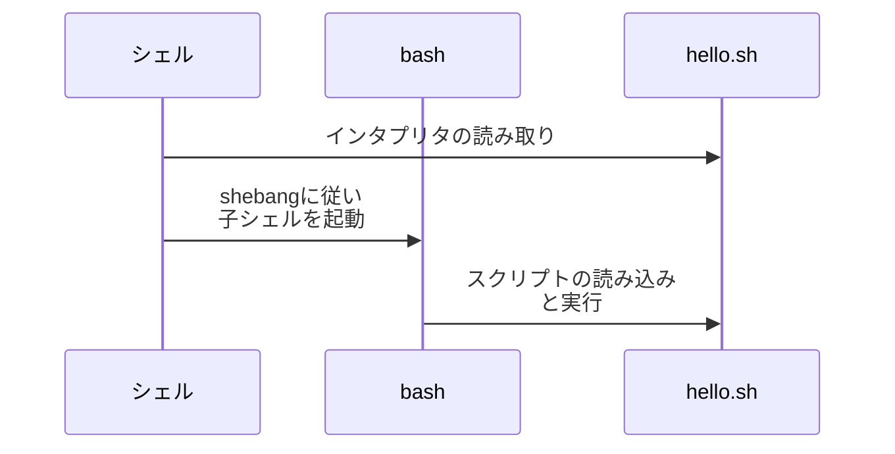
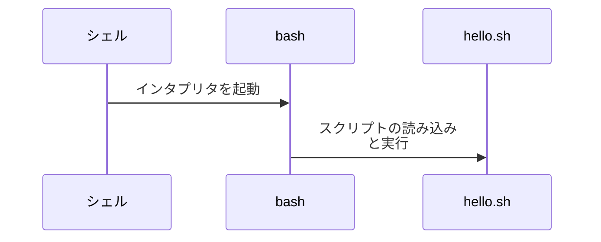
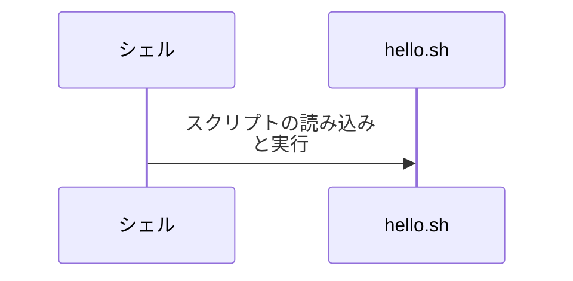

<div style='border-radius: 1em; border-style:solid; border-color:#D3D3D3; background-color:#F8F8F8'>

<p class="h4">&nbsp;&nbsp;Table of Contents</p>

<!-- START doctoc generated TOC please keep comment here to allow auto update -->
<!-- DON'T EDIT THIS SECTION, INSTEAD RE-RUN doctoc TO UPDATE -->

- [Shebang](#shebang)
  - [インタプリタの種類](#%E3%82%A4%E3%83%B3%E3%82%BF%E3%83%97%E3%83%AA%E3%82%BF%E3%81%AE%E7%A8%AE%E9%A1%9E)
- [shebangにおける`/bin/bash`と`/usr/bin/bash`の違い](#shebang%E3%81%AB%E3%81%8A%E3%81%91%E3%82%8Bbinbash%E3%81%A8usrbinbash%E3%81%AE%E9%81%95%E3%81%84)
  - [`/bin/`は`/usr/bin`のシンボリックリンク](#bin%E3%81%AFusrbin%E3%81%AE%E3%82%B7%E3%83%B3%E3%83%9C%E3%83%AA%E3%83%83%E3%82%AF%E3%83%AA%E3%83%B3%E3%82%AF)
  - [安定実行という観点では`#!/bin/bash`のほうが好ましい](#%E5%AE%89%E5%AE%9A%E5%AE%9F%E8%A1%8C%E3%81%A8%E3%81%84%E3%81%86%E8%A6%B3%E7%82%B9%E3%81%A7%E3%81%AFbinbash%E3%81%AE%E3%81%BB%E3%81%86%E3%81%8C%E5%A5%BD%E3%81%BE%E3%81%97%E3%81%84)

<!-- END doctoc generated TOC please keep comment here to allow auto update -->


</div>

## Shebang

<div style='padding-left: 2em; padding-right: 2em; border-radius: 1em; border-style:solid; border-color:#D3D3D3; background-color:#F8F8F8'>
<p class="h4"><ins>Def: Shebang</ins></p>

シェルスクリプトの１行目は`#!`で始まり, その後にプログラムを解釈実行するインタプリタのパスを書く.
これをshebangと呼ぶ.

</div>

|インタプリタ|記法|
|---|---|
|Bourne shell|`#!/bin/sh`|
|bash|`#!/bin/bash`|
|perl|`#!/usr/bin/perl`|
|python|`#!/usr/bin/python`|

<div style='padding-left: 2em; padding-right: 2em; border-radius: 1em; border-style:solid; border-color:#e6e6fa; background-color:#e6e6fa'>
<p class="h4"><ins>REMARKS</ins></p>

- バイナリ形式のファイルは実行権限のみで実行できるが, シェルスクリプトの場合は実行権限 + 読み込み権限が必要
- `bash <script>`とすれば読み込み権限のみで実行可能

</div>


### インタプリタの種類

カレントディレクトリに`hello.sh`という以下のファイルを作成したとします.

```bash
#!/bin/bash

echo 'Hello World!'
date
```

この`hello.sh`の実行方法として以下の３つがあります:

```bash
## (1) shebangのインタプリタを利用
$ ./hello.sh

## (2) ユーザー指定でbash インタプリタを使用（shebangは読まない）
$ bash ./hello.sh

## (3) 自身のシェルをインタプリタとして使用（shebangは読まない）
$ source ./hello.sh
```

> (1) `./hello.sh`



> (2) `bash ./hello.sh`



> (3) `source ./hello.sh`



## shebangにおける`/bin/bash`と`/usr/bin/bash`の違い

shebangでインタプリタを設定する方法は色々ありますが, 

- `#!/bin/bash`
- `#!/usr/bin/bash`

というパターンをみることがあります (前者のほうがメジャーですが).

```bash
$ which bash
/usr/bin/bash
```

なので, terminal上で実行するシェルと起動を合わせようと思うと後者のほうが良さそうですが, 
どちらも実行可能な場合, Linuxにおいては２つの間に挙動上の差はありません. 

### `/bin/`は`/usr/bin`のシンボリックリンク

```zsh
% ls -lid /usr/bin /bin          
      13 lrwxrwxrwx 1 root root     7 Jul 15 18:02 /bin -> usr/bin/
32768002 drwxr-xr-x 2 root root 69632 Sep 29 14:43 /usr/bin/
```

`ls -lid`で確認すると, 上記のようにシンボリックリンクであることがわかります.
そのため, 以下のように`/bin/bash`と`/usr/bin/bash`を比較してみると同じi-node番号なので挙動上差がない事がわかります

```zsh
% ls -li /usr/bin/bash /bin/bash
32768095 -rwxr-xr-x 1 root root 1396520 Jan  7  2022 /bin/bash*
32768095 -rwxr-xr-x 1 root root 1396520 Jan  7  2022 /usr/bin/bash*
```

### 安定実行という観点では`#!/bin/bash`のほうが好ましい

Linux環境ならば`/bin/bash`と`/usr/bin/bash`どちらもbashをインタプレタとして利用できますが,
Macとかだと

```zsh
% which bash
bin/bash
```

で`/usr/bin/bash`が存在しないケースがあるので`#!/bin/bash`のほうが好ましいといえます.

<div style='padding-left: 2em; padding-right: 2em; border-radius: 1em; border-style:solid; border-color:#e6e6fa; background-color:#e6e6fa'>
<p class="h4"><ins>REMARKS</ins></p>

`/sbin/bash` or `/usr/sbin/bash`もshebangに指定しても大丈夫だが, 上記と同じ理由で
`#!/bin/bash`のほうが好ましい

</div>
