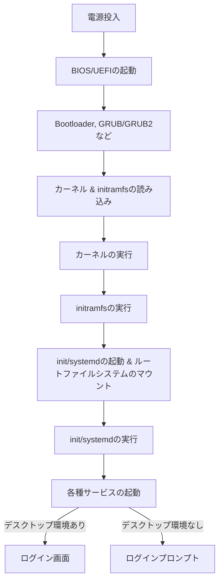
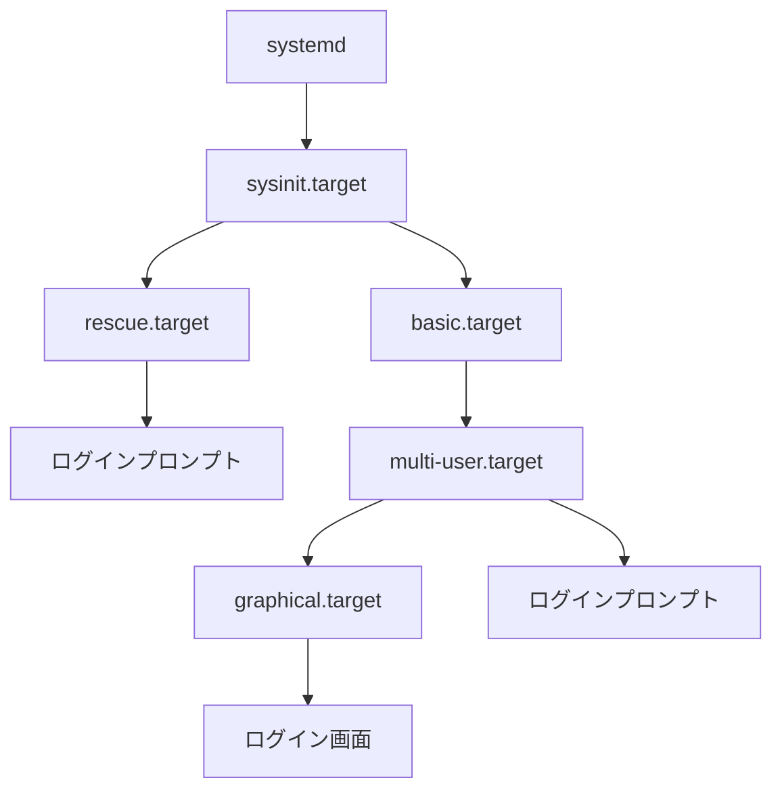

<div style='border-radius: 1em; border-style:solid; border-color:#D3D3D3; background-color:#F8F8F8'>

<p class="h4">&nbsp;&nbsp;Table of Contents</p>

<!-- START doctoc generated TOC please keep comment here to allow auto update -->
<!-- DON'T EDIT THIS SECTION, INSTEAD RE-RUN doctoc TO UPDATE -->

- [Linuxのシステム起動の流れ](#linux%E3%81%AE%E3%82%B7%E3%82%B9%E3%83%86%E3%83%A0%E8%B5%B7%E5%8B%95%E3%81%AE%E6%B5%81%E3%82%8C)
  - [initプロセスの起動](#init%E3%83%97%E3%83%AD%E3%82%BB%E3%82%B9%E3%81%AE%E8%B5%B7%E5%8B%95)
  - [ランレベル](#%E3%83%A9%E3%83%B3%E3%83%AC%E3%83%99%E3%83%AB)
- [`systemd`](#systemd)
  - [`systemd`の特徴](#systemd%E3%81%AE%E7%89%B9%E5%BE%B4)
  - [`systemd`が最初に実行するターゲット: `sysinit.target`](#systemd%E3%81%8C%E6%9C%80%E5%88%9D%E3%81%AB%E5%AE%9F%E8%A1%8C%E3%81%99%E3%82%8B%E3%82%BF%E3%83%BC%E3%82%B2%E3%83%83%E3%83%88-sysinittarget)
- [Appendix: BIOS vs UEFI](#appendix-bios-vs-uefi)
  - [BIOSとbootloader](#bios%E3%81%A8bootloader)
  - [UEFI](#uefi)
  - [LinuxカーネルのBios/UEFI起動経由の確認](#linux%E3%82%AB%E3%83%BC%E3%83%8D%E3%83%AB%E3%81%AEbiosuefi%E8%B5%B7%E5%8B%95%E7%B5%8C%E7%94%B1%E3%81%AE%E7%A2%BA%E8%AA%8D)
- [References](#references)

<!-- END doctoc generated TOC please keep comment here to allow auto update -->


</div>

## Linuxのシステム起動の流れ

<div style='padding-left: 2em; padding-right: 2em; border-radius: 1em; border-style:solid; border-color:#D3D3D3; background-color:#F8F8F8'>
<p class="h4"><ins>Def: ブートシーケンス</ins></p>

- システムを立ち上げるまでの処理をブートという
- ブートシーケンスとは, 電源を入れてからログインまでに行われる, カーネル初期設定, ファイルシステムのマウント, デーモンの起動, ネットワーク設定というOSが稼働するまでの必要な設定の一連の流れのこと指す

</div>

以下はLinuxのシステムが起動するまでの大まかな流れです:



なお最新のシステムでは

- PCファームウェアはUEFI
- bootloaderはGRUB2
- 最初のユーザープロセスはsystemd

という構成が一般的です.

### initプロセスの起動

`SysVinit`に基づくブートシークエンスを用いたシステムでは, 
カーネルが起動するとinitプロセス(`/sbin/init`)というシステム環境を設定するプログラムがprocess id 1として起動します.
initは, `/etc/inittab`ファイルに従いシステムランレベルの設定と初期化設定など**逐次処理的に実行していきます**.

<div style='padding-left: 2em; padding-right: 2em; border-radius: 1em; border-style:solid; border-color:#e6e6fa; background-color:#e6e6fa'>
<p class="h4"><ins>initが行うこと</ins></p>

initが行うことの代表的なタスクとして以下のものが例としてあります:

- ランレベルの設定
- `/etc/rc.sysinit`スクリプトの実行
- `/etc/rc`スクリプトの実行

`/etc/rc.sysinit`スクリプトはシステムを初期化するためのシェルスクリプトです.
ネットワークの設定, ホストネームの設定, カーネルの設定, クロックの設定, システムフォントの設定, ファイルシステムの設定などを行います.

</div>

### ランレベル

ランレベルとは, Linuxが動作状態を表す数字のことで, 0~6までの7種類があります.

|ランレベル|意味|
|---|---|
|0|シャットダウン（システムの停止）|
|1|シングルユーザーモード（rootのみ）|
|2|ネットワークなしのマルチユーザーモード|
|3|通常のマルチユーザーモード（テキストログイン）|
|4|未使用|
|5|グラフィカルログインによるマルチユーザーモード|
|6|システムの再起動|

定義されたランレベルに応じてLinuxは起動するプログラムを区別/管理しています.
ランレベル別のディレクトリは `/etc/rc.d/rc[0-6].d`で, その中のファイルで各ランレベルで実行するプログラムを指定しています.

ランレベルを変更するためには, rootユーザで`init`コマンド, or `telinit`コマンドを使用します.

```zsh
~# init 6
```

と入力するとランレベルが6に移行 = システムの再起動となります.

<div style='padding-left: 2em; padding-right: 2em; border-radius: 1em; border-style:solid; border-color:#e6e6fa; background-color:#e6e6fa'>
<p class="h4"><ins>Column: デフォルトのランレベルの設定</ins></p>

Linux起動時には, 最初のプロセスとして`init`が実行され, defaultとして指定されたランレベルで起動します. 
Sys V initでは, defaultのランレベルは `/etc/inittab` に記述されています.
ランレベルのdefault値を0や6に設定すると, システム起動ができなくなるので注意が必要です.

</div>


## `systemd`

現在の主要なディストリビューションでは, サービス管理は `SysVinit` に代わって `systemd` が採用されています.
`systemd`の中核となるデーモン `/usr/lib/systemd/systemd`は以下に見るように`/sbin/init`にシンボリックされたプログラムで,

- 「**カーネルが起動するとinitプロセス(`/sbin/init`)というシステム環境を設定するプログラムがprocess id 1として起動します**」

というルールは変わりません. 

```zsh
% ps -e | head -2    
    PID TTY          TIME CMD
      1 ?        00:00:01 systemd

% ls -l /sbin/init
lrwxrwxrwx 1 root root 20 Aug 22 06:11 /sbin/init -> /lib/systemd/systemd*
```

### `systemd`の特徴

`systemd`の特徴として代表的なものは以下が挙げられます:

- 依存関係の定義によるサービス起動の並列処理
- UnixソケットとD-busを使用したプロセス間通信
- `cgroups`によるプロセス管理
- ユニット単位での管理

> 依存関係の定義によるサービス起動の並列処理

- SysV init後くじ処理によるサービス起動とは異なり, 依存関係の定義によるサービス起動の並列処理を行うことでシステムの起動時間を短縮している
- SysV initがサービス起動をシェルスクリプトを使用していているのに対して, `systemd`では設定ファイルの参照によりサービスを起動することでシェルへのオーバーヘッドをなくし, 処理の高速化を実現

> UnixソケットとD-busを使用したプロセス間通信

- D-busはlibdbusライブラリとdbus-daemonによって提供されるメッセージバス
- D-busを利用することで複数のプロセス間通信を並列処理することができる
- `systemd`はUnixソケットを介してD-busを利用している

> `cgroups`によるプロセス管理

- プロセスをPIDではなく, Linuxカーネルの`cgroups`機能を利用してプロセスを管理
- プロセスは生成時に親プロセスと同じ`cgroups`に所属

> ユニット単位での管理

- ユニットにはハードウェア, mount, service, targetなどの12のタイプがある
- ユニットの設定ファイルは `/usr/lib/systemd/system/`や`/etc/systemd/system/`に置かれている


### `systemd`が最初に実行するターゲット: `sysinit.target`

`systemd`は設定ファイルを参照して以下のような起動シーケンスを介してシステムを立ち上げます



<div style='padding-left: 2em; padding-right: 2em; border-radius: 1em; border-style:solid; border-color:#D3D3D3; background-color:#F8F8F8'>
<p class="h4"><ins>Def: ターゲット</ins></p>

ターゲットは, どのようなサービスを提供するかなどのシステムの状態を定義するもの.
SysV initのランレベルに相当する. 主なターゲットは以下の通り:

|ターゲット|SysVランレベル|説明|
|---|---|---|
|`default.target`|-|システム起動時のデフォルトのターゲット<br>システムはこのターゲットまで立ち上がる. 通常は`graphical.target`や`multi-user.target`へのシンボリックリンク|
|`sysinit.target`|-|システム起動時の初期段階のセットアップを行うターゲット|
|`rescue.target`|1|障害発生時やメンテナンス時に利用するターゲット|
|`multi-user.target`|3|テキストベースでのマルチユーザーのセットアップを行うターゲット|
|`graphical.target`|5|グラフィカルログインをセットアップするターゲット|

</div>


なお, ターゲットの取得と変更は`systemctl`コマンドで実現できます:

```zsh
## デフォルトターゲットの表示
% systemctl get-default
graphical.target

## デフォルトターゲットの変更
% systemctl set-default multi-user.target
Created symlink /etc/systemd/system/default.target → /lib/systemd/system/multi-user.target.

## デフォルトターゲットを元に戻す
% systemctl set-default graphical.target 
Removed /etc/systemd/system/default.target.
Created symlink /etc/systemd/system/default.target → /lib/systemd/system/graphical.target.

## システム稼働状態のままターゲットを変更する場合
% systemctl isolate multi-user
```


## Appendix: BIOS vs UEFI
### BIOSとbootloader

ハードウェアに近いところでのプログラムの動作環境にBIOS(Basic Input/Output System)があります.
BIOSはハードウェアに組み込まれている不揮発性メモリ(NVRAM, Non Volatile RAM)に格納された
ファームウェアです. BIOSが持っていう機能の代表的なものは２つあります:

- キーボード, ディスク, グラボなどの基本制御プログラム
- bootloaderを起動する機能

bootloaderは簡単に言うとOSを起動するプログラムのことです. アプリケーションを起動するのはOSの役割ですが, 
OS自身の起動はOSの仕事ではなくbootloaderの仕事です.

PCの電源を投入すると, BIOSは設定されたデバイスの優先順位に従ってディスクの先頭部分にあるMBR(Master Boot Record)内のbootloaderを検索し, 
**最初に検知したデバイスのローダーを起動**します. なお, bootloaderの優先順位はBIOS設定画面で変更可能です.

### UEFI

BIOSに変わるファームウェア企画としてUEFIがあります, BIOSと異なり

- GUID Partition Tableといった大容量ディスクへの対応
- Secure boot
- ネットワークを介したリモート診断
- NVRAMに設定された優先順位に従って, ディスクのEFIパーティションに格納されているbootloaderを起動


### LinuxカーネルのBios/UEFI起動経由の確認

root userでloginした後, 

- `/sys/firmware/efi`が存在 → UEFI経由
- `/etc/grub2.cfg`が存在 → BIOS経由

で判定することができます.

```zsh
## UEFI経由の場合
hostname# ls -ld /sys/firmware/efi
drwxr-xr-x 6 root root 0 Aug 21 11:10 /sys/firmware/efi
hostname# ls -lrt /etc/grub2.cfg
ls: cannot access '/etc/grub2.cfg': No such file or directory

## BIOS経由の場合
hostname# ls -ld /sys/firmware/efi
ls: cannot access /sys/firmware/efi: No such file or directory
hostname# ls -lrt /etc/grub2.cfg
lrwxrwxrwx. 1 root root 22 May  5 05:06 /etc/grub2.cfg -> ../boot/grub2/grub.cfg
```


References
--------------

- [プログラムはなぜ動くのか 第３版　知っておきたいプログラミングの基礎知識](https://www.kinokuniya.co.jp/f/dsg-08-EK-0994992)
- [Linux - system boot](https://www.infraexpert.com/infra/linux03.html)
- [UnixArena > How to find Linux is under BIOS or UEFI mode ?](https://www.unixarena.com/2018/05/how-to-find-linux-is-under-bios-or-uefi-mode.html/)
- [Ryo's Tech Blog > Linux: マルチタスクとプロセス制御](https://ryonakagami.github.io/2023/08/10/ps-command-linux/)
