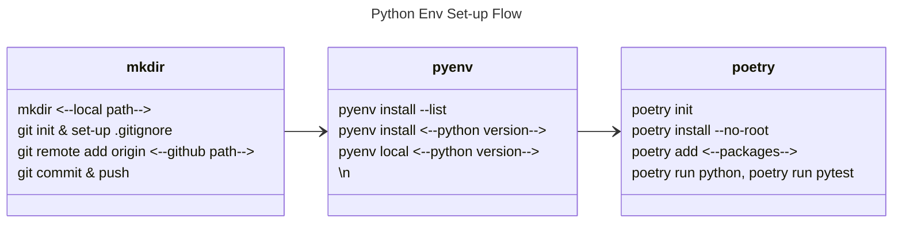

<div style='border-radius: 1em; border-style:solid; border-color:#D3D3D3; background-color:#F8F8F8'>

<p class="h4">&nbsp;&nbsp;Table of Contents</p>

<!-- START doctoc generated TOC please keep comment here to allow auto update -->
<!-- DON'T EDIT THIS SECTION, INSTEAD RE-RUN doctoc TO UPDATE -->

- [Overview](#overview)
- [Usage](#usage)
- [Set-up](#set-up)
  - [Preprocess for Ubuntu](#preprocess-for-ubuntu)
  - [Install pyenv](#install-pyenv)
  - [Install the plugins: pyenv-update/pyenv-virtualenv](#install-the-plugins-pyenv-updatepyenv-virtualenv)
  - [Install Poetry](#install-poetry)
  - [Poetry config setup](#poetry-config-setup)
- [Maintenance](#maintenance)
- [How to use `poetry` in your project](#how-to-use-poetry-in-your-project)
  - [Package install: `poetry add`](#package-install-poetry-add)
    - [`poetry add` with version constraints](#poetry-add-with-version-constraints)
    - [`poetry add` directly from GitHub Repository](#poetry-add-directly-from-github-repository)
    - [editable mode でのインストール](#editable-mode-%E3%81%A7%E3%81%AE%E3%82%A4%E3%83%B3%E3%82%B9%E3%83%88%E3%83%BC%E3%83%AB)
- [Tips](#tips)
  - [List up pyenv-based python version](#list-up-pyenv-based-python-version)
  - [poetry install when there is no project module](#poetry-install-when-there-is-no-project-module)
- [References](#references)

<!-- END doctoc generated TOC please keep comment here to allow auto update -->


</div>

## Overview
**想定環境**

|OS|	CPU|
|---|---|
|Ubuntu 20.04 LTS| 	Intel Core i7-9700 CPU 3.00 GHz|
|Ubuntu 22.04.2 LTS| 	AMD Ryzen 9 7950X 16-Core Processor|

**Version**

```zsh
% pyenv --version
pyenv 2.3.23-2-gac5efed3

% poetry --version
Poetry (version 1.5.1)
```

**実行内容**

Ubuntu 22.04.2 LTSにて分析用Python環境を以下の方針で構築

- pyenv: Python version管理
- poetry: 分析用仮想環境の作成

## Usage

パッケージ開発で`Poetry`は用いられますが, ここでは分析用Python環境の構築の際に用いる `Poetry + pyenv`の組み合わせを想定しています. 

基本的には, 分析で用いたいPython Versionを`pyenv`でインストールし, 分析環境, パッケージ依存関係, プロジェクトのパッケージ化を`Poetry`で管理しています.




## Set-up
### Preprocess for Ubuntu

Ubuntu環境でpyenvをインストール場合, Python関連パッケージのBuildに必要なツールを事前にインストールしておくことが推奨されます. 

```zsh
ModuleNotFoundError: No module named '_ctypes'
```

インストールは成功したが, いざ使用しようと思った際に`pip`関係で上記のエラーが発生する場合があります. 上記の場合は, Cで書かれたライブラリを Pythonから利用するための使用する`ctypes `モジュールが存在しないエラーですが, `libffi`がインストールされていない状態でPythonをインストールしてしまったことが原因となります.

ですので, 以下のパッケージを事前にインストールしときましょう.

```zsh
% sudo apt-get install -y make build-essential libssl-dev zlib1g-dev libbz2-dev \
libreadline-dev libsqlite3-dev wget curl llvm libncurses5-dev libncursesw5-dev \
xz-utils tk-dev libffi-dev liblzma-dev
```


### Install pyenv

今回は, `$HOME`直下に`.pyenv`というdirectoryを作り, そこに`pyenv`を`git`経由でインストールしています. 

```zsh
% tree -L 1   
.
├── Desktop
├── Documents
├── Downloads
├── ...
└── .pyenv
```

インストール手順は簡単で

- pyenv repository を`git clone`する
- `pyenv`のpathを通す
- `pyenv init --path`をシェル立ち上げ時に実行する設定をする

```zsh
## pyenv install
% mkdir ~/.pyenv
% git clone https://github.com/pyenv/pyenv.git ~/.pyenv
```

次に, `.zshenv`(`.zshrc`でもbashを使っているならば`.bashrc`など)の設定を行う:

```zsh
export PYENV_ROOT="$HOME/.pyenv"
command -v pyenv >/dev/null || export PATH="$PYENV_ROOT/bin:$PATH"
eval "$(pyenv init -)"
```

### Install the plugins: pyenv-update/pyenv-virtualenv

pyenvにはpluginがあり今回は２つの`pyenv-update`, `pyenv-virtualenv`をインストールします.

---|---
`pyenv-update`|pyenvとそのpluginsのupdateツール
`pyenv-virtualenv`|仮想環境作成ツール

後者は基本的には`Poetry`を利用する予定なのであまり必要ないですが, 様々な環境で簡易的に使いまわしたいという場合を想定してインストールしておきます. 前者は, python-listの更新など絶対に必要です.


**pyenv-update**

```zsh
% git clone https://github.com/pyenv/pyenv-update.git $(pyenv root)/plugins/pyenv-update
```

**pyenv-virtualenv**

```zsh
% git clone https://github.com/pyenv/pyenv-virtualenv.git $(pyenv root)/plugins/pyenv-virtualenv
% echo 'eval "$(pyenv virtualenv-init -)"' >> ~/.zshenv
```

### Install Poetry

Installコマンドは公式ドキュメントに従い以下. なお, `pip`経由でインストールする方法がたまに紹介されていますがそれは非推奨です.

```zsh
% curl -sSL https://install.python-poetry.org | python3 -
```

Poetryをupdateしたい場合は

```zsh
% poetry self update
```

また, poetryコマンドの補完機能を利用したい場合は `poetry completions zsh` で出力されるスクリプトをシェルの仕様に従ったファイル保存し, Pathを通すなりをするだけで十分です. 自分の場合は, `zsh`を使用しているので

```zsh
poetry completions zsh > ~/.zsh.d/.zfunc/_poetry
```

その後, `.zshrc`に以下のラインを追記しています

```zsh
# zsh completion
fpath+=~/.zsh.d/.zfunc
```

### Poetry config setup

Poetryのconfig directoryはデフォルトでは以下で管理されてます

- Linux: `~/.config/pypoetry`
- MacOS: `~/Library/Application Support/pypoetry`
- Windows: `%APPDATA%\pypoetry`

config file自体は上記のディレクトリの`config.toml`に記載されます.
config setup内容は以下のコマンドで確認できます

```zsh
% poetry config --list
cache-dir = "/home/hoshino_kirby/.cache/pypoetry"
experimental.system-git-client = false
installer.max-workers = null
installer.modern-installation = true
installer.no-binary = null
installer.parallel = true
virtualenvs.create = true
virtualenvs.in-project = true
virtualenvs.options.always-copy = false
virtualenvs.options.no-pip = false
virtualenvs.options.no-setuptools = false
virtualenvs.options.system-site-packages = false
virtualenvs.path = "{cache-dir}/virtualenvs"  # /home/hoshino_kirby/.cache/pypoetry/virtualenvs
virtualenvs.prefer-active-python = true
virtualenvs.prompt = "{project_name}-py{python_version}"
```

設定項目のうち明示的に今回指定しているのは以下です:

|項目|設定値|説明|
|---|---|---|
|`virtualenvs.create`|true|Create a new virtual environment if one doesn’t already exist.|
|`virtualenvs.in-project`|true|Create the virtualenv inside the project’s root directory.|
|`virtualenvs.prefer-active-python`|true|Use currently activated Python version to create a new virtual environment.|


**設定方法**

```zsh
## setting
% poetry config virtualenvs.in-project true
% poetry config virtualenvs.create true
% poetry config virtualenvs.prefer-active-python true

## use --unset option if you want to unset
% poetry config virtualenvs.path --unset
```

**Local specificに設定する場合**

とあるレポジトリ特有の設定をしたい場合は `--local` オプションを付与してconfig設定をします. 例として,

```zsh
% poetry config virtualenvs.create false --local
```

local configurationは`poetry.toml`というファイルの中に記載されます. `.gitignore`で
gitの管理から外しておくことが推奨です.


## Maintenance

poetryとpyenvのupdateは定期的に実行したいので, shell scriptに僕の場合はまとめました.

```bash
#!/bin/bash
## name: python_update
## Update the python env
## Author: RyoNak
## Revised: 2023-07-28
## REQUIREMENT: pyenv, virtualenv, poetry

set -e

# Functions
function usage {
  cat <<EOM
NAME
    $(basename "$0") - update pyenv and its plugins, and poetry. 

        pyenv update;
        poetry self update;

DESCRIPTION
    <pyenv and its plugins>
    pyenv
        https://github.com/pyenv/pyenv

    pyenv-update
        https://github.com/pyenv/pyenv-update

    pyenv-virtualenv
        https://github.com/pyenv/pyenv-virtualenv

    <poetry>
    poetry
        https://python-poetry.org/docs/
    
OPTIONS
  -h, --help
    Display help

EOM

  exit 0
}


# Main
if [[ $1 == '-h' || $1 == '--help' ]]; then
    usage
else
    pyenv update;
    poetry self update;
fi
```

## How to use `poetry` in your project
### Package install: `poetry add`

パッケージをインストールするときは, `poetry add` commandを用います. 
以下のようにバージョン制約を指定いない場合, poetryは利用可能なパッケージバージョンに基づいて適したものを選びます.

```
poetry add requests pendulum
```

#### `poetry add` with version constraints

Version成約をつける場合は以下のように指定します:

```zsh
# Allow >=2.0.5, <3.0.0 versions
poetry add pendulum@^2.0.5

# Allow >=2.0.5, <2.1.0 versions
poetry add pendulum@~2.0.5

# Allow >=2.0.5 versions, without upper bound
poetry add "pendulum>=2.0.5"

# Allow only 2.0.5 version
poetry add pendulum==2.0.5

# get the latest version
poetry add pendulum@latest
```

#### `poetry add` directly from GitHub Repository

GitHubのレポジトリからpackageをインストールしたい場合は以下のようなコマンドを用います

```zsh
## via https protocol
% poetry add git+https://github.com/sdispater/pendulum.git

# install a package from the develop branch
% poetry add git+https://github.com/sdispater/pendulum.git#develop

# install a package based on a specific tag(2.0.5)
poetry add git+ssh://github.com/sdispater/pendulum.git#2.0.5
```

#### editable mode でのインストール

<div style='padding-left: 2em; padding-right: 2em; border-radius: 1em; border-style:solid; border-color:#D3D3D3; background-color:#F8F8F8'>
<p class="h4"><ins>Def: editable mode</ins></p>

- `editable mode`とはコードが編集可能な状態でパッケージをインストールするオプションのこと
- `editable mode`` でインストールされたパッケージのコードに変更を加えると, 再インストールをしなくてもそのまま実行環境に反映される

</div>


```zsh
% poetry add --editable <package>
```

で`editable mode`でのインストールがpoetryではできます. 
ローカルにファイルのあるパッケージをpluginとして利用するが, バグの可能性も考えて編集モードでインストールしたい場合に便利です.


## Tips
### List up pyenv-based python version

```zsh
% pyenv install --list | grep -P "^\s{1,}\d{1,}\.\d{1,}\.\d{1,}"
```

- `grep -P`: Pearl regular expressionを用いて検索
- `pyenv-list`などシェルスクリプト定義しておくと便利

### poetry install when there is no project module

**Probelm**

```zsh
% poetry install
...
<path-to-working-directory>/ <project-name> does not contain any element
```

**How does it happen?**


`poetry new`, or `poetry init` コマンドで生成される`pyproject.toml`には以下のラインがデフォルトで記載されます:

```toml
[tool.poetry]
packages = [{include = "<project-name>"}]
```

package開発用のderectoryの場合ならば`<project-name>`の名前を持つdirectoryが存在するケースが多いと思いますが, 単に分析用に仮想環境を作成した場合はない場合があります.

このような状況のときに, `poetry install`コマンドを実行すると, 存在しない`<project-name>`directoryをpoetryが探してしまい以下のようなwarning messageがでてきます:

```zsh
% poetry install
...
<path-to-working-directory>/ <project-name> does not contain any element
```

**Solution**

`pyporject.toml`から`packages = [{include = "<project-name>"}]`を削除することでWarning messageの対応は可能ですが, 以下のコマンドでroot projectをinstallしないことをpoetryに伝えることでもwarningを回避することができます:

```zsh
% poetry install --no-root
```


References
------

- [GitHub > pyenv: pyenv source code respository](https://github.com/pyenv/pyenv)
- [GitHub > pyenv-virtualenv: pyenv-virtualenv plugin source code respository](https://github.com/pyenv/pyenv-virtualenv)
- [Poetry](https://python-poetry.org/)
- [stackoverflow > Poetry install on an existing project Error "does not contain any element"](https://stackoverflow.com/questions/75397736/poetry-install-on-an-existing-project-error-does-not-contain-any-element)
- [poetryを使ってpythonパッケージを作成する](https://zenn.dev/shotakaha/scraps/9416c30cd7745a)