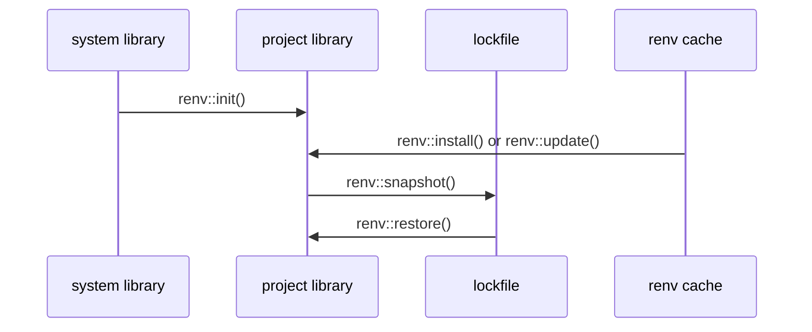

<div style='border-radius: 1em; border-style:solid; border-color:#D3D3D3; background-color:#F8F8F8'>

<p class="h4">&nbsp;&nbsp;Table of Contents</p>

<!-- START doctoc generated TOC please keep comment here to allow auto update -->
<!-- DON'T EDIT THIS SECTION, INSTEAD RE-RUN doctoc TO UPDATE -->

- [はじめに](#%E3%81%AF%E3%81%98%E3%82%81%E3%81%AB)
- [Install R into Ubuntu 22.04 LTS](#install-r-into-ubuntu-2204-lts)
  - [Rのinstall](#r%E3%81%AEinstall)
  - [R Quickstart: install packages](#r-quickstart-install-packages)
    - [Packages in CRAN Repository](#packages-in-cran-repository)
    - [Packages in GitHub Repository](#packages-in-github-repository)
    - [Localのzip fileからインストールする場合](#local%E3%81%AEzip-file%E3%81%8B%E3%82%89%E3%82%A4%E3%83%B3%E3%82%B9%E3%83%88%E3%83%BC%E3%83%AB%E3%81%99%E3%82%8B%E5%A0%B4%E5%90%88)
- [renvの導入](#renv%E3%81%AE%E5%B0%8E%E5%85%A5)
  - [Renvのインストール](#renv%E3%81%AE%E3%82%A4%E3%83%B3%E3%82%B9%E3%83%88%E3%83%BC%E3%83%AB)
  - [Renv basic syntax](#renv-basic-syntax)
- [RStudioのインストール](#rstudio%E3%81%AE%E3%82%A4%E3%83%B3%E3%82%B9%E3%83%88%E3%83%BC%E3%83%AB)
  - [Existing GPU process due to erros during initializationへの対処](#existing-gpu-process-due-to-erros-during-initialization%E3%81%B8%E3%81%AE%E5%AF%BE%E5%87%A6)
- [References](#references)

<!-- END doctoc generated TOC please keep comment here to allow auto update -->


</div>

## はじめに

Ubuntu 22.04 LTSを対象に

- Rのインストール
- Renvのインストール
- RStudioのインストール

をまとめた記事となります. CPU infoは以下となります

```zsh
% sudo lshw -class processor 
[sudo] password for ryo_billiken: 
  *-cpu                     
       description: CPU
       product: AMD Ryzen 9 7950X 16-Core Processor
       vendor: Advanced Micro Devices [AMD]
       ...
```

## Install R into Ubuntu 22.04 LTS

<div style="display: inline-block; background: #D3D3D3;; border: 1px solid #D3D3D3; padding: 3px 10px;color:black"><span >Prerequisites</span>
</div>

<div style="border: 1px solid #D3D3D3; font-size: 100%; padding: 20px;">

- user account with `sudo` privileges
- Terminalへのアクセス

</div>

UbuntuへのRのインストールの方法として, 

1. Ubuntu RepositoryからのInstall
2. CRAN repositoryからのInstall

の２つがあります. 前者は, `apt` commandのみで完結しますが, Ubuntu Repositoryが常に最新版のRを
反映しているとは限らないので, 今回は少しめんどくさいですが後者の「**CRAN repositoryからのInstall**」をベースに紹介します.

### Rのinstall

<div style="display: inline-block; background: #D3D3D3;; border: 1px solid #D3D3D3; padding: 3px 10px;color:black"><span >Prerequisites</span>
</div>

<div style="border: 1px solid #D3D3D3; font-size: 100%; padding: 20px;">

---|---
`software-properties-common`|manage the repositories that you install software from (common)
`dirmngr`|GNU privacy guard - network certificate management service


```zsh
% sudo apt install software-properties-common dirmngr -y
```

</div>

<br>


<div style='padding-left: 2em; padding-right: 2em; border-radius: 0em; border-style:solid; border-color:#D3D3D3; background-color:#F8F8F8'>
<p class="h4"><ins>手順</ins></p>

1. CRAN repositoryの署名キーの取得
2. Ubuntu systemへのCRAN repositoryの登録
3. R packageのインストール

</div>


> (1) CRAN repositoryの署名キーの取得

```zsh
% wget -qO- https://cloud.r-project.org/bin/linux/ubuntu/marutter_pubkey.asc | sudo tee -a /etc/apt/trusted.gpg.d/cran_ubuntu_key.asc
```

- `/etc/apt/trusted.gpg.d/`はパッケージの署名に使っている公開鍵を格納するディレクトリ
- 登録された署名キーは`apt-key list`コマンドで確認することが可能

公開鍵fingerprintを以下のコマンドで確認し, `E298A3A825C0D65DFD57CBB651716619E084DAB9`と一致することを確認します

```zsh
% gpg --show-keys /etc/apt/trusted.gpg.d/cran_ubuntu_key.asc
pub   rsa2048 2010-10-19 [SCA] [expires: 2027-09-30]
      E298A3A825C0D65DFD57CBB651716619E084DAB9
uid                      Michael Rutter <marutter@gmail.com>
sub   rsa2048 2010-10-19 [E] [expires: 2027-09-30]
```

> (2) Ubuntu systemにCRAN repositoryを登録

```zsh
% sudo add-apt-repository "deb https://cloud.r-project.org/bin/linux/ubuntu $(lsb_release -cs)-cran40/"
```

登録することで, `r-base`, `r-base-dev`のpackage priorityがUbuntu softwareからCRAN packageへ更新されます.
その確認は`apt-cache policy`コマンドで確認できます

```zsh
% apt-cache policy r-base    
r-base:
  Installed: 4.3.1-4.2204.0
  Candidate: 4.3.1-4.2204.0
  Version table:
 *** 4.3.1-4.2204.0 500
        500 https://cloud.r-project.org/bin/linux/ubuntu jammy-cran40/ Packages
        100 /var/lib/dpkg/status
     4.3.1-3.2204.0 500
        500 https://cloud.r-project.org/bin/linux/ubuntu jammy-cran40/ Packages
     ....(略)
     4.1.2-1ubuntu2 500
        500 http://jp.archive.ubuntu.com/ubuntu jammy/universe amd64 Packages
        500 http://jp.archive.ubuntu.com/ubuntu jammy/universe i386 Packages
```

＞ (3) R packageのインストール

```zsh
% sudo apt install r-base r-base-dev -y
```

install後, R commandの動作を確認します

```zsh
## R consoleの立ち上げ
% R

## Rのterminate
> q()
```

### R Quickstart: install packages
#### Packages in CRAN Repository
CRAN RepositoryからR packageをインストールする場合は以下が基本コマンドです

```R
install.packages('readr')
```

複数のpackageを同時にインストールする場合は

```R
install.packages(c('readr', 'ggplot2', 'tidyr'))
```

#### Packages in GitHub Repository

- `devtools` library経由でインストールするのが基本です
- `devtools::install_github(username/repo_name[/subdir])`が基本構文

```R
## devtoolsのインストール
install.packages('devtools')

## GitHub Repositoryからのインストール
devtools::install_github('rstudio/shiny')
```


#### Localのzip fileからインストールする場合

```R
install.packages('~/Downloads/abc_2.1.zip', repos=NULL, type='source')
```

## renvの導入

renvは現時点での分析環境(パッケージのバージョン)を保存&再現してくれるツールです.
`renv`を用いて分析環境を管理すると, プロジェクトごとに

- `renv.lock` file: R packageのバージョンおよび依存関係の情報を記載
- `renv` directory: R packageの格納場所(prokect libaryに該当)

が生成され, 異なる分析環境が現在の分析環境に与える影響を低減することが出来ます.
あくまでR package管理のための仕組みであって, `pyenv`のようなR自体のversion管理ツールではないことに留意してください.

**Renvの基本的考え方**



あくまで`renv cache`というグローバル環境にパッケージを保有しており, `renv` directoryの中身はそれらの
R packageを参照しているのみなので, projectが乱立してもそこまでpackageスペースは取りません.

### Renvのインストール

1. R packageとしてinstallする場合
2. apt経由でインストールする場合

の２つのパターンがあります.

> (1) R packageとしてinstallする場合

```R
install.packages("renv")
```

> (2) apt経由でインストールする場合

- `software-properties-common`: manage the repositories that you install software from (common)
- `dirmngr`: GNU privacy guard - network certificate management service

がインストールに必要ですが, Rのインストール時点で入っているはずです. なかった場合は`apt`経由でインストールしてください. 

次に, repositoryを登録し, 更新します.

```zsh
% sudo add-apt-repository ppa:c2d4u.team/c2d4u4.0+
% sudo apt update
```

最後にapt installを実行します.

```zsh
% sudo apt install r-cran-renv r-cran-devtools
```

### Renv basic syntax

```R
# disable automatic snapshots
auto.snapshot <- getOption("renv.config.auto.snapshot")
options(renv.config.auto.snapshot = FALSE)

# initialize a new project (with an empty R library)
renv::init(bare = TRUE)

# install digest 0.6.19
renv::install("digest@0.6.19")

# install 'digest' from GitHub (latest dev. version)
renv::install("eddelbuettel/digest")

# save library state to lockfile
renv::snapshot()

# remove digest from library
renv::remove("digest")

# check library status
renv::status()

# restore lockfile, thereby reinstalling digest 0.6.19
renv::restore()

# restore automatic snapshots
options(renv.config.auto.snapshot = auto.snapshot)
```

## RStudioのインストール

<div style='padding-left: 2em; padding-right: 2em; border-radius: 0em; border-style:solid; border-color:#D3D3D3; background-color:#F8F8F8'>
<p class="h4"><ins>手順</ins></p>

1. 公式サイトよりdeb packageをダウンロード
2. `dpkg`コマンドでインストール(`apt`だと警告が出る場合がある)

</div>

実行コマンドは以下となります:

```zsh
## deb packageのdownload
% cd ./workingdirectory
% wget https://download1.rstudio.org/electron/jammy/amd64/rstudio-2023.12.1-402-amd64.deb

## install
% sudo dpkg -i ./rstudio-2023.12.1-402-amd64.deb
## uninstallの場合はsudo dpkg -r rstudio
```

### Existing GPU process due to erros during initializationへの対処

以下のような警告メッセージが発生する場合が時折あります.

```zsh
% rstudio
[3058:0526/090351.054091:ERROR:gl_factory.cc(128)] Requested GL implementation (gl=none,angle=none) not found in allowed implementations: [(gl=egl-angle,angle=default),(gl=desktop-gl,angle=none),(gl=egl-gles2,angle=none),(gl=egl-angle,angle=swiftshader)].
[3058:0526/090351.100145:ERROR:viz_main_impl.cc(186)] Exiting GPU process due to errors during initialization
[3090:0526/090351.600756:ERROR:gl_factory.cc(128)] Requested GL implementation (gl=none,angle=none) not found in allowed implementations: [(gl=egl-angle,angle=default),(gl=desktop-gl,angle=none),(gl=egl-gles2,angle=none),(gl=egl-angle,angle=swiftshader)].
[3090:0526/090351.651796:ERROR:viz_main_impl.cc(186)] Exiting GPU process due to errors during initialization
[3104:0526/090351.944697:ERROR:gpu_memory_buffer_support_x11.cc(44)] dri3 extension not supported.
```

これはRstudioがChromiumと同じようにhardware accelerated renderingを試みることに起因します.
driverなどがうまい具合に対応しないと, rendering issueが発生してしまうことがしばしばあります.
ですので対策としてはGPU renderingを停止させてしまえばよいということなります.

```zsh
% export RSTUDIO_CHROMIUM_ARGUMENTS="--disable-gpu"
```

を`.zshrc`や`.zshenv`に記載すれば解決できます. または`~/.config/RStudio/desktop.info`の設定ファイルに対して

```
[General]
desktop.renderingEngine=software
```

と記載する形でも対処できます.


References
-----

> Ubuntu package

- [dirmngr](https://packages.ubuntu.com/focal-updates/dirmngr)
- [ask Ubuntu > When a PPA has a package of the same name in the Ubuntu Software Center](https://askubuntu.com/questions/89862/when-a-ppa-has-a-package-of-the-same-name-in-the-ubuntu-software-center)


> Renv

- [The R Project for Statistical Computing](https://www.r-project.org/)
- [GitHub > rstudio/renv](https://github.com/rstudio/renv)
- [Use renv in a project](https://rstudio.github.io/renv/reference/init.html)
- [GitHub RyoNakagami > Renv_setup](https://github.com/RyoNakagami/Renv_setup)

> Rstudio

- [Troubleshooting RStudio Rendering Errors](https://support.posit.co/hc/en-us/articles/360017886674-Troubleshooting-RStudio-Rendering-Errors?_gl=1*g4r83k*_ga*MjA4OTgzMjQwNC4xNzA4NDUxMDY5*_ga_2C0WZ1JHG0*MTcwODQ1MTA2OC4xLjEuMTcwODQ1MzY3MS4wLjAuMA..)