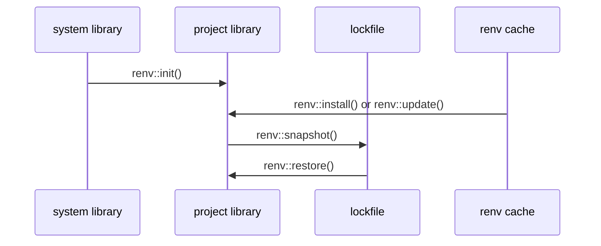

<div style='border-radius: 1em; border-style:solid; border-color:#D3D3D3; background-color:#F8F8F8'>

<p class="h4">&nbsp;&nbsp;Table of Contents</p>

<!-- START doctoc generated TOC please keep comment here to allow auto update -->
<!-- DON'T EDIT THIS SECTION, INSTEAD RE-RUN doctoc TO UPDATE -->

- [Install R into Ubuntu 22.04 LTS](#install-r-into-ubuntu-2204-lts)
  - [Rのinstall](#r%E3%81%AEinstall)
  - [R packages install](#r-packages-install)
    - [Packages in CRAN Repository](#packages-in-cran-repository)
    - [Packages in GitHub Repository](#packages-in-github-repository)
    - [Localのzip fileからインストールする場合](#local%E3%81%AEzip-file%E3%81%8B%E3%82%89%E3%82%A4%E3%83%B3%E3%82%B9%E3%83%88%E3%83%BC%E3%83%AB%E3%81%99%E3%82%8B%E5%A0%B4%E5%90%88)
- [How to use Renv](#how-to-use-renv)
  - [Renvのインストール](#renv%E3%81%AE%E3%82%A4%E3%83%B3%E3%82%B9%E3%83%88%E3%83%BC%E3%83%AB)
  - [Renvの基本的考え方](#renv%E3%81%AE%E5%9F%BA%E6%9C%AC%E7%9A%84%E8%80%83%E3%81%88%E6%96%B9)
  - [Renv basic syntax](#renv-basic-syntax)
- [References](#references)

<!-- END doctoc generated TOC please keep comment here to allow auto update -->


</div>

## Install R into Ubuntu 22.04 LTS

<div style='padding-left: 2em; padding-right: 2em; border-radius: 1em; border-style:solid; border-color:#e6e6fa; background-color:#e6e6fa'>
<p class="h4"><ins>Prequisites</ins></p>

- Ubuntu 22.04 or Ubuntu 22.04のインストール
- user account with sudo privileges
- 端末へのアクセス

</div>

UbuntuへのRのインストールの方法として, 

1. Ubuntu RepositoryからのInstall
2. CRAN repositoryからのInstall

の２つがあります. 前者は, `apt` commandのみで完結しますが, Ubuntu Repositoryが常に最新版のRを
反映しているとは限らないので, 今回は少しめんどくさいですが後者の「**CRAN repositoryからのInstall**」をベースに紹介します

### Rのinstall

> Prequisites

---|---
`software-properties-common`|manage the repositories that you install software from (common)
`dirmngr`|GNU privacy guard - network certificate management service


```zsh
% sudo apt install software-properties-common dirmngr -y
```

> CRAN repositoryの署名キーの取得

```zsh
% wget -qO- https://cloud.r-project.org/bin/linux/ubuntu/marutter_pubkey.asc | sudo tee -a /etc/apt/trusted.gpg.d/cran_ubuntu_key.asc
```

- `/etc/apt/trusted.gpg.d/`はパッケージの署名に使っている公開鍵を格納するディレクトリ
- 登録された署名キーは`apt-key list`コマンドで確認することが可能

公開鍵fingerprintを以下のコマンドで確認し, `E298A3A825C0D65DFD57CBB651716619E084DAB9`と一致することを確認します

```zsh
% gpg --show-keys /etc/apt/trusted.gpg.d/cran_ubuntu_key.asc
pub   rsa2048 2010-10-19 [SCA] [expires: 2027-09-30]
      E298A3A825C0D65DFD57CBB651716619E084DAB9
uid                      Michael Rutter <marutter@gmail.com>
sub   rsa2048 2010-10-19 [E] [expires: 2027-09-30]
```

> Ubuntu systemにCRAN repositoryを登録

```zsh
% sudo add-apt-repository "deb https://cloud.r-project.org/bin/linux/ubuntu $(lsb_release -cs)-cran40/"
```

登録することで, `r-base`, `r-base-dev`のpackage priorityがUbuntu softwareからCRAN packageへ更新されます.
その確認は`apt-cache policy`コマンドで確認できます

```zsh
% apt-cache policy r-base    
r-base:
  Installed: 4.3.1-4.2204.0
  Candidate: 4.3.1-4.2204.0
  Version table:
 *** 4.3.1-4.2204.0 500
        500 https://cloud.r-project.org/bin/linux/ubuntu jammy-cran40/ Packages
        100 /var/lib/dpkg/status
     4.3.1-3.2204.0 500
        500 https://cloud.r-project.org/bin/linux/ubuntu jammy-cran40/ Packages
     ....(略)
     4.1.2-1ubuntu2 500
        500 http://jp.archive.ubuntu.com/ubuntu jammy/universe amd64 Packages
        500 http://jp.archive.ubuntu.com/ubuntu jammy/universe i386 Packages
```

＞ R packageのインストール

```zsh
% sudo apt install r-base r-base-dev -y
```

install後, R commandの動作を確認します

```zsh
## R consoleの立ち上げ
% R

## Rのterminate
> q()
```

### R packages install
#### Packages in CRAN Repository
CRAN RepositoryからR packageをインストールする場合は以下が基本コマンドです

```R
install.packages('readr')
```

複数のpackageを同時にインストールする場合は

```R
install.packages(c('readr', 'ggplot2', 'tidyr'))
```

#### Packages in GitHub Repository

- `devtools` library経由でインストールするのが基本です
- `devtools::install_github(username/repo_name[/subdir])`が基本構文

```R
## devtoolsのインストール
install.packages('devtools')

## GitHub Repositoryからのインストール
devtools::install_github('rstudio/shiny')
```


#### Localのzip fileからインストールする場合

```R
install.packages('~/Downloads/abc_2.1.zip', repos=NULL, type='source')
```

## How to use Renv
### Renvのインストール


```zsh
% sudo apt update -qq
# install two helper packages we need
% sudo apt install --no-install-recommends software-properties-common dirmngr
```

```zsh
% sudo add-apt-repository ppa:c2d4u.team/c2d4u4.0+
```

```zsh
% sudo apt install r-cran-renv r-cran-devtools
```


### Renvの基本的考え方



### Renv basic syntax

```R
# disable automatic snapshots
auto.snapshot <- getOption("renv.config.auto.snapshot")
options(renv.config.auto.snapshot = FALSE)

# initialize a new project (with an empty R library)
renv::init(bare = TRUE)

# install digest 0.6.19
renv::install("digest@0.6.19")

# install 'digest' from GitHub (latest dev. version)
renv::install("eddelbuettel/digest")

# save library state to lockfile
renv::snapshot()

# remove digest from library
renv::remove("digest")

# check library status
renv::status()

# restore lockfile, thereby reinstalling digest 0.6.19
renv::restore()

# restore automatic snapshots
options(renv.config.auto.snapshot = auto.snapshot)
```


References
-----

> Ubuntu package

- [dirmngr](https://packages.ubuntu.com/focal-updates/dirmngr)
- [ask Ubuntu > When a PPA has a package of the same name in the Ubuntu Software Center](https://askubuntu.com/questions/89862/when-a-ppa-has-a-package-of-the-same-name-in-the-ubuntu-software-center)


> Renv

- [The R Project for Statistical Computing](https://www.r-project.org/)
- [GitHub > rstudio/renv](https://github.com/rstudio/renv)
- [Use renv in a project](https://rstudio.github.io/renv/reference/init.html)
- [GitHub RyoNakagami > Renv_setup](https://github.com/RyoNakagami/Renv_setup)