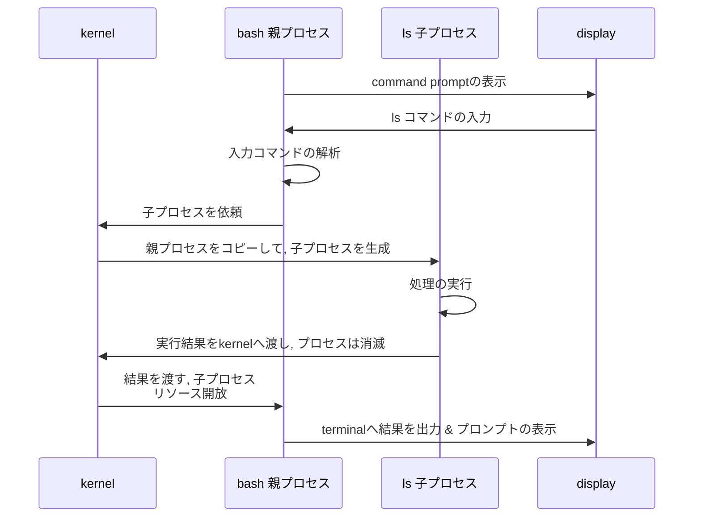

<div style='border-radius: 1em; border-style:solid; border-color:#D3D3D3; background-color:#F8F8F8'>

<p class="h4">&nbsp;&nbsp;Table of Contents</p>

<!-- START doctoc generated TOC please keep comment here to allow auto update -->
<!-- DON'T EDIT THIS SECTION, INSTEAD RE-RUN doctoc TO UPDATE -->

- [Linuxのタスク処理](#linux%E3%81%AE%E3%82%BF%E3%82%B9%E3%82%AF%E5%87%A6%E7%90%86)
- [プロセスの親子関係](#%E3%83%97%E3%83%AD%E3%82%BB%E3%82%B9%E3%81%AE%E8%A6%AA%E5%AD%90%E9%96%A2%E4%BF%82)
- [プロセスの監視](#%E3%83%97%E3%83%AD%E3%82%BB%E3%82%B9%E3%81%AE%E7%9B%A3%E8%A6%96)
  - [`ps` command](#ps-command)
  - [`ps` commandのオプション](#ps-command%E3%81%AE%E3%82%AA%E3%83%97%E3%82%B7%E3%83%A7%E3%83%B3)
    - [`ps u` command: 実行ユーザ名や実行ユーザIDのプロセスの表示](#ps-u-command-%E5%AE%9F%E8%A1%8C%E3%83%A6%E3%83%BC%E3%82%B6%E5%90%8D%E3%82%84%E5%AE%9F%E8%A1%8C%E3%83%A6%E3%83%BC%E3%82%B6id%E3%81%AE%E3%83%97%E3%83%AD%E3%82%BB%E3%82%B9%E3%81%AE%E8%A1%A8%E7%A4%BA)
    - [PID 1となるプロセス](#pid-1%E3%81%A8%E3%81%AA%E3%82%8B%E3%83%97%E3%83%AD%E3%82%BB%E3%82%B9)
- [プロセスの制御](#%E3%83%97%E3%83%AD%E3%82%BB%E3%82%B9%E3%81%AE%E5%88%B6%E5%BE%A1)
  - [`kill` command](#kill-command)
  - [強制終了(SIGKILL)と通常終了(SIGTERM)の違い](#%E5%BC%B7%E5%88%B6%E7%B5%82%E4%BA%86sigkill%E3%81%A8%E9%80%9A%E5%B8%B8%E7%B5%82%E4%BA%86sigterm%E3%81%AE%E9%81%95%E3%81%84)
- [Appendix: ジョブのsuspendと`fg`](#appendix-%E3%82%B8%E3%83%A7%E3%83%96%E3%81%AEsuspend%E3%81%A8fg)
- [References](#references)

<!-- END doctoc generated TOC please keep comment here to allow auto update -->


</div>

## Linuxのタスク処理

- 複数のタスクを同時に行うことができるマルチタスクシステム
- 複数のユーザーが同時に使用することを許容するマルチユーザーシステム

という特徴をLinuxは持っています. タスクとはシステムが行う作業のことですが, これを「プロセス」とLinuxでは呼び, 
OSが管理するタスクの単位として用いられています.

<div style='padding-left: 2em; padding-right: 2em; border-radius: 1em; border-style:solid; border-color:#D3D3D3; background-color:#F8F8F8'>
<p class="h4"><ins>Def: ジョブとプロセス</ins></p>

**ジョブ**とは, パイプでコマンド同士をつないだ場合など, 一つ以上のプロセスの集まりのことを言います. 
ジョブやプロセスは, それぞれ「ジョブ番号」と「プロセスID, PID」という固有の番号を持っている

</div>

## プロセスの親子関係

あるプロセスが実行中に他のプロセスを起動した場合, 

- 元のプロセスのことを親プロセス
- 親プロセスから起動されたプロセスのことを子プロセス

と言います. 親子プロセスの発生と消滅をシェルから`ls` commandを呼び出す例で見てみると,




## プロセスの監視

実行中のプロセスを表示するコマンドの代表例は以下があります

---|---
`ps`|プロセス情報を表示
`pstree`|プロセスの階層構造を表示
`top`|プロセス情報を周期的にリアルタイムに表示

この中でも, `ps` commandは頻繁にプロセス監視で使用します.

### `ps` command

<div style='padding-left: 2em; padding-right: 2em; border-radius: 1em; border-style:solid; border-color:#D3D3D3; background-color:#F8F8F8'>
<p class="h4"><ins>Def: ps command</ins></p>

`ps` commandはprocess statusを表示するコマンドで, デフォルトでは現在の端末で自分が起動したコマンドのプロセスが表示されます.
syntaxは

```zsh
% ps [option]
```

</div>

実際にデフォルトでの挙動を確認してみると

```zsh
% ps
    PID TTY          TIME CMD
   9883 pts/0    00:00:00 zsh
  24316 pts/0    00:00:00 ps
```

---|---
PID|プロセス識別番号
TTY|端末デバイスID
TIME|プロセスが使用した現在までの合計 CPU 時間
CMD|processを起動したコマンド名

<div style='padding-left: 2em; padding-right: 2em; border-radius: 1em; border-style:solid; border-color:#e6e6fa; background-color:#e6e6fa'>
<p class="h4"><ins>REMARKS</ins></p>

TTYについて, X上で動作するxtermなどの端末アプリケーションや, 
telnetやsshによるログインは「仮想端末（pseudo terminal）」として「pts/番号」で表示される

</div>

### `ps` commandのオプション

|オプション 	|説明|
|---|---|
|`a`|端末を使用するすべてのプロセスに関する情報を表示
|`f`|プロセスの親子関係を表示|
|`u`|プロセスのユーザー情報を表示|
|`x`|端末を利用していない全てのプロセスを表示|
|`-e`|全てのプロセスを表示|
|`-A`|全てのプロセスを表示, `-e`と同じ|
|`-l`|プロセスの詳細情報の表示|
|`-p PID`|指定したプロセスID（PID）の情報のみ表示|
|`-C プロセス名`|指定した名前のプロセスのみ表示|
|`-w`|長い行を折り返して表示|

システムでアクティブなプロセスをすべて表示するコマンドとして以下の２つが考えられます

```zsh
## ユーザーの全てのプロセス + 端末を利用していない全てのプロセス = 全部
% ps ax
    PID TTY      STAT   TIME COMMAND
      1 ?        Ss     0:01 /sbin/init splash
      2 ?        S      0:00 [kthreadd]
      3 ?        I<     0:00 [rcu_gp]
      4 ?        I<     0:00 [rcu_par_gp]

## 全てのプロセスを表示
% ps -e
    PID TTY          TIME CMD
      1 ?        00:00:01 systemd
      2 ?        00:00:00 kthreadd
      3 ?        00:00:00 rcu_gp
      4 ?        00:00:00 rcu_par_gp
```

前者は「**STAT**」という新たな情報が付与されています. 

<div style='padding-left: 2em; padding-right: 2em; border-radius: 1em; border-style:solid; border-color:#D3D3D3; background-color:#F8F8F8'>
<p class="h4"><ins>Def: `ps` commandのSTAT</ins></p>

STATはプロセスの状態を表示するカラムで, １文字で表示される場合と２文字で表示される場合がある

|STATの１文字目|説明|
|---|---|
|`0`|CPU上で実行中|
|`D`|スリープ ( CPU放棄 ), 割り込み不可の状態 ： I/O待ち|
|`I`|アイドル状態. プロセスは現在作成中|
|`R`|実行可能 ( CPU使用中, 使用可能 )|
|`S`|スリープ ( CPU放棄 ), 割り込み可能な状態 ： キー入力待ち|
|`T`|停止状態|
|`Z`|プロセス終了済み状態 ： 但し、親プロセスの処理待ち|

２文字目以降の付加情報の代表例は

|付加情報|説明|
|---|---|
|`<`|優先順位の高いプロセス|
|`N`|優先順位が低いプロセス|
|`s`|セッションリーダー|
|`l`|マルチスレッド化されたプロセス|
|`+`|フォアグラウンドのプロセスグループに含まれる|

</div>

#### `ps u` command: 実行ユーザ名や実行ユーザIDのプロセスの表示

ユーザーを基本単位としてCPU使用率やメモリ使用率などのprocess情報を表示するためのオプションとして `ps u` があります.

```zsh
% ps u
USER         PID %CPU %MEM    VSZ   RSS TTY      STAT START   TIME COMMAND
kirby       2746  0.0  0.0 163476  5888 tty2     Ssl+ Sep28   0:00 /usr/libexec/gdm-x-session --run-script env GNOME_SHELL_SESSION_MODE=ubuntu /usr/bin/gnome-session --session=ubuntu
kirby       2748  1.0  0.1 25426924 87764 tty2   Sl+  Sep28   3:01 /usr/lib/xorg/Xorg vt2 -displayfd 3 -auth /run/user/1000/gdm/Xauthority -nolisten tcp -background none -noreset -keeptty -novtswitch -verbose 3
kirby       2760  0.0  0.0 224088 15360 tty2     Sl+  Sep28   0:00 /usr/libexec/gnome-session-binary --session=ubuntu
kirby       9883  0.0  0.0  18936  7440 pts/0    Ss+  Sep28   0:00 /usr/bin/zsh
kirby      10494  0.0  0.0  18676  8068 pts/1    Ss   Sep28   0:00 /usr/bin/zsh -i
kirby      39964  0.0  0.0  13720  3328 pts/1    R+   01:38   0:00 ps u
```

---|---
USER|プロセスを実行しているユーザ名
%CPU|CPU使用率
%MEM|メモリ使用率
VSZ|割り当て済みの仮想アドレス空間サイズ
RSS|物理メモリ使用量 ( %MEMに比例 )
START|プロセスの起動時刻

すべてのユーザーについて同じく情報を取得したい場合は

```zsh
% ps aux
```

#### PID 1となるプロセス

Linuxでは最初のプロセスはPID 1が割り当てられます,
PID 1を確認するためには`-p`, `p`オプションを用います

```zsh
% ps p 1
    PID TTY      STAT   TIME COMMAND
      1 ?        Ss     0:01 /sbin/init splash

% ps -p 1
    PID TTY          TIME CMD
      1 ?        00:00:01 systemd
```

CMDカラムの出力結果が異なりますが, `sbin/init`はシンボリックリンクであり, 実体は`systemd`です.

```zsh
% ls -l /sbin/init
lrwxrwxrwx 1 root root 20 Aug 22 06:11 /sbin/init -> /lib/systemd/systemd*
```

なお, Linuxでは常に`systemd`の実行から始まります. 

<div style='padding-left: 2em; padding-right: 2em; border-radius: 1em; border-style:solid; border-color:#e6e6fa; background-color:#e6e6fa'>
<p class="h4"><ins>REMARKS</ins></p>

PIDの設定最大値は以下のコマンドによって確認できます

```zsh
% cat /proc/sys/kernel/pid_max
4194304
```

最大値に達すると, 再び1から順番に, その時点で使用されていないPIDが割り振られます.

</div>


## プロセスの制御

プロセスを制御する信号はシグナルと言います. 

<div style='padding-left: 2em; padding-right: 2em; border-radius: 1em; border-style:solid; border-color:#D3D3D3; background-color:#F8F8F8'>
<p class="h4"><ins>Def: シグナル</ins></p>

シグナルとは, 割り込みによってプロセスに得敵の動作をするように通知するための仕組み.
通常, プロセスは処理を終えると自動的に消滅するが, プロセスに対してシグナルを送信することで外部からプロセスを終了することができる.

Linuxでは`kill`コマンドや`killall`コマンドを使用し, プロセスに対してシグナルを送ります. 送信可能なシグナルの代表例は以下, 

|シグナル名|シグナルID|説明|
|---|---|---|
|HUP|1|ハングアップ（端末との接続が切断）|
|INT|2|キーボードからの割り込み, `Ctrl + c`|
|QUIT|3|キーボードからのプロセスの中止|
|KILL|9|強制終了|
|TERM|15|通常終了|
|CONT|18|一時停止中のプロセスを再開|
|STOP|19|一時停止, `Ctrl + z`|

</div>

### `kill` command

```zsh
% kill PID
```

上記のコマンドによってプロセスを通常終了させることができます.
`kill` commandが送るシグナルのデフォルトは `SIGTERM (15)` です. 
そのため下記のコマンドはすべて同じ挙動となります

```zsh
## optionなし
% kill 300

## シグナル名指定
% kill -TERM 300
% kill -s SIGTERM 300
% kill -s TERM 300

## シグナルID指定
% kill -15 300
% kill -s 15 300
```

### 強制終了(SIGKILL)と通常終了(SIGTERM)の違い

`kill` commandが使用するデフォルトのシグナルである`SIGTERM (15)`は, プロセスを終了する前に
アプリケーションごとに必要なクリーンアップ（終了処理）を行ってから, 自分自身でプロセスを終了します.

クリーンアップでは以下のような処理を通常行います

- リソースの開放
- ロックファイルの削除

プログラムの動作に異常が発生して正常終了できない場合, `SIGKILL (9)`を使用して強制終了させますが, 
**ファイルの破損などシステム障害が発生する可能性があるので最終手段**ということに留意が必要です.

<div style='padding-left: 2em; padding-right: 2em; border-radius: 1em; border-style:solid; border-color:#e6e6fa; background-color:#e6e6fa'>
<p class="h4"><ins>Column: キーボードからの割り込み</ins></p>

`Ctrl + c`で送信されるシグナルは, キーボード操作の割り込みによるプロセス終了となります.
シグナル自体は`SIGINT (2)`が送信されます. 

プロセスを一時的に中止する`Ctrl + z`は`SIGTSTP (20)`が送信されます.

</div>


## Appendix: ジョブのsuspendと`fg`

Linuxでは実行中のジョブを`ctrl + z`コマンドで, suspenedすることができます.
例えば, vim実行中にそのvimをsuspendしてみると, 

```zsh
% vim
# ctrl zをvim画面で入力
% % jobs
[1]  + suspended  vim
```

読み方として

- `[1]`は端末内部で稼働中のジョブに対する固有番号
- `+`は１番目に新しいジョブ番号, `-`の場合は２番目に新しいジョブ番号
- `suspended`はジョブの状態
- `vim`はジョブの内容

を指しています. このジョブを再開をする方法としてバックグラウンド実行とフォアグランド実行があります.

```zsh
## fg commandとjob番号を指定
% fg %1
```

を端末に入力するとsuspendされていたjobをフォアグランド実行で再開することができます.


References
------------

- [UNIXの絵本, 株式会社アンク著](https://www.shoeisha.co.jp/book/detail/4798109339)
- [kazmax Linuxで自宅サーバー > 実行中のプログラムをバックグラウンドにもっていく。フォアグラウンドにもってくる（bg、fg）](https://kazmax.zpp.jp/linux_beginner/jobs_fg_bg.html)
- [Linux技術入門 > Linux - Process](https://www.infraexpert.com/infra/linux20.html)
