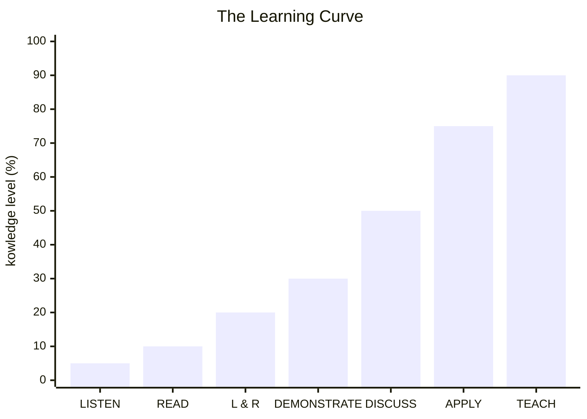

&nbsp;&nbsp;Table of Contents

<!-- START doctoc generated TOC please keep comment here to allow auto update -->
<!-- DON'T EDIT THIS SECTION, INSTEAD RE-RUN doctoc TO UPDATE -->

- [The Learning Pyramid](#the-learning-pyramid)
- [Appendix: Write a bar chart with mermaid](#appendix-write-a-bar-chart-with-mermaid)
- [References](#references)

<!-- END doctoc generated TOC please keep comment here to allow auto update -->

## The Learning Pyramid

- If you just listen to something, you will retain 5% of it 
- If you read it, you double what you get by listening, so you will retain 10% of it 
- If you listen and read it, you will retain 20%
- If you demonstrate it like podcasting or makeing a lead speach, you will retain 30%
- If you disscuss how you learned, you will retain 50%
- If you practice by doing and apply the knowledge, you will retain 75%
- If you take that skill-set and then you go and teach somebody, you will retain 90%

## Appendix: Write a bar chart with mermaid

`Mermaid 10.6.1` ではこれが今では精一...

References
------------

- [[CSS] ピラミッド型の階層図をCSSだけで描きたい](https://migi.me/css/pyramid-hierarchy-chart/)
