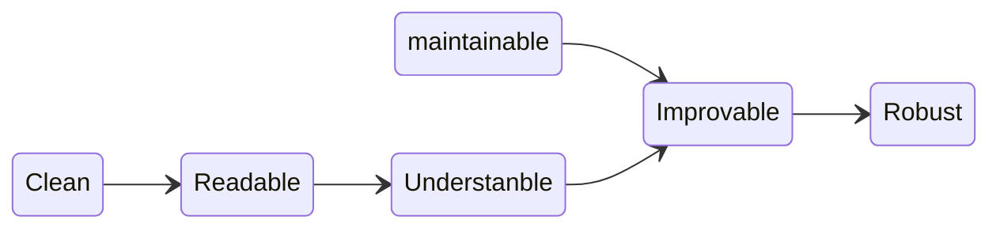

<div style='border-radius: 1em; border-style:solid; border-color:#D3D3D3; background-color:#F8F8F8'>

<p class="h4">&nbsp;&nbsp;Table of Contents</p>

<!-- START doctoc generated TOC please keep comment here to allow auto update -->
<!-- DON'T EDIT THIS SECTION, INSTEAD RE-RUN doctoc TO UPDATE -->

- [この記事のスコープ](#%E3%81%93%E3%81%AE%E8%A8%98%E4%BA%8B%E3%81%AE%E3%82%B9%E3%82%B3%E3%83%BC%E3%83%97)
- [Python ProgrammingにおけるRobustness](#python-programming%E3%81%AB%E3%81%8A%E3%81%91%E3%82%8Brobustness)
  - [Clean and maintainable Codeの重要性](#clean-and-maintainable-code%E3%81%AE%E9%87%8D%E8%A6%81%E6%80%A7)
- [What’s Your Intent?: Understanble Code](#whats-your-intent-understanble-code)
  - [同期コミュニケーションと非同期コミュニケーション](#%E5%90%8C%E6%9C%9F%E3%82%B3%E3%83%9F%E3%83%A5%E3%83%8B%E3%82%B1%E3%83%BC%E3%82%B7%E3%83%A7%E3%83%B3%E3%81%A8%E9%9D%9E%E5%90%8C%E6%9C%9F%E3%82%B3%E3%83%9F%E3%83%A5%E3%83%8B%E3%82%B1%E3%83%BC%E3%82%B7%E3%83%A7%E3%83%B3)
  - [Codeで理解するunderstanble code](#code%E3%81%A7%E7%90%86%E8%A7%A3%E3%81%99%E3%82%8Bunderstanble-code)
  - [necessary complexity vs accidental cimplexity](#necessary-complexity-vs-accidental-cimplexity)
- [Appendix: Dynamic Versus Static Indexing](#appendix-dynamic-versus-static-indexing)
- [References](#references)

<!-- END doctoc generated TOC please keep comment here to allow auto update -->


</div>

## この記事のスコープ

- [ロバストPython ― クリーンで保守しやすいコードを書く, Patrick Viafore　著、鈴木 駿　監訳、長尾 高弘　訳](https://www.oreilly.co.jp/books/9784814400171/)を教材にPythonによるシステム開発におけるcodingのあるべき姿を Robustness という観点から勉強するノートのシリーズ.

## Python ProgrammingにおけるRobustness

システム開発を行うにあたって望ましい姿は, **capable of performing without failure**なシステム = robustなシステムです.

しかし現実の開発は

- バグの修正
- ユーザーインターフェースの改善
- featuresの追加, 削除, 再追加
- フレームワークの変更
- 古くなり更新が必要なcomponentsの発生
- セキュリティー関係のバグの発生 

といった出来事が頻繁に発生し, ソフトウェアの変更が合わせて頻繁に発生するものです. 
このような現実の中で, **bugに対してrobustであることを含むrobustなシステムをどのように構築すること**が求められます.
その完成品をRobust codeと呼ぶとするならば, 

```
A robust codebase is resilient and error-free in spite of constant change.
```

このようなコードをどのように書くかが開発者にとって問題となります.
多くの場合, 幾通りの試行錯誤や検証と他人からのレビューに揉まれて(PDCAを何回も回して)Robust Codeは生まれて来ます. そのため, Robust Codeは他の人が「**意図がわかりやすく, バグをみつけたり, 修正しやすい**」コード = improvableであることが必要条件であると言えます.

improvableなコードを書くにあたっての姿勢として以下のことを挙げています.

<div style="display: inline-block; background: #6495ED;; border: 1px solid #6495ED; padding: 3px 10px;color:#FFFFFF"><span >Improvableなコードを書くにあたっての姿勢</span>
</div>

<div style="border: 1px solid #6495ED; font-size: 100%; padding: 20px;">

下記の意味を踏まえて, **clean and maintainable code**を書くこと

1. 変更は不可避なので, 変更を受け入れること
    - 自分のコードが修正されるだけでなく, 状況に応じて削除や再作成されることを覚悟する
    - 将来のrewrite processを意識して, 将来の誰かがrewriteしやすいコードを書く
    - 将来のmaintainersが自分のコードを見たとき, 自分の意図を推察することができるコードを書く
    - thoughts, reasoning, and cautionsを伝える
2. 柔軟性をもって開発に当たること
    - 作業時には想定してなかった状況に対応しなくてはいけないのが開発
3. Law of Least Surpriseの遵守
    - Surpriseは混乱の元
    - 後の開発者がバグなのか仕様書通りの挙動なのか判別できるようにすること

</div>

### Clean and maintainable Codeの重要性

Robust Codeがシステム開発で達成すべき結果です. そして, Clean and maintainable CodeはそのRobust Codeを実現するにあたって重要なアクションです. ではClean and maintainable Codeの具体的なアクションとはなんでしょうか？

<div style="display: inline-block; background: #6495ED;; border: 1px solid #6495ED; padding: 3px 10px;color:#FFFFFF"><span >Clean and maintainable Codeのアクション</span>
</div>

<div style="border: 1px solid #6495ED; font-size: 100%; padding: 20px;">

- コードを適切な粒度で整理する(Organizing your code in an appropriately granular fashion)
- 良いDocumentを整備する
- 変数/関数/Typesに適切な名前をつける
- 関数やクラスを短く & シンプルにする

</div>

## What’s Your Intent?: Understanble Code

自分がメインの開発者でもmaintainersでもClean and maintainable Codeを書くことで



というパスを実現することができるからこそ, Clean and maintainable Codeを書く意義があります. 
この流れの中で `Understanble Code`とは具体的には何を指すのか問題を通して考えてみます.

<div style='padding-left: 2em; padding-right: 2em; border-radius: 0em; border-style:solid; border-color:#D3D3D3; background-color:#F8F8F8'>
<p class="h4"><ins>Question 1</ins></p>

以下のコードの意図を読み取り改善例を示せ:

```python
# Take a meal recipe and change the number of servings
# by adjusting each ingredient
# A recipe's first element is the number of servings, and the remainder
# of elements is (name, amount, unit), such as ("flour", 1.5, "cup")
def adjust_recipe(recipe, servings):
    new_recipe = [servings]
    old_servings = recipe[0]
    factor = servings / old_servings
    recipe.pop(0)
    while recipe:
        ingredient, amount, unit = recipe.pop(0)
        # please only use numbers that will be easily measurable
        new_recipe.append((ingredient, amount * factor, unit))
    return new_recipe
```

</div>

<br>

<div style="display: inline-block; background: #6495ED;; border: 1px solid #6495ED; padding: 3px 10px;color:#FFFFFF"><span >解説</span>
</div>

<div style="border: 1px solid #6495ED; font-size: 100%; padding: 20px;">

問題分のコードを見ると以下のような疑問が出てきます

- `recipe[0]`を呼んだ後に`while`の外で`recipe.pop(0)`を実行する意図はなにか？
- `# please only use numbers that will be easily measurable`の意図はなにか？

よくわからないまま次のような改善コードを提案したとします

```python
def adjust_recipe(recipe, servings):
    old_servings = recipe.pop(0)
    factor = servings / old_servings
    new_recipe = {ingredient: (amount*factor, unit)
                  for ingredient, amount, unit in recipe}
    new_recipe["servings"] = servings
    return new_recipe
```

- 返り値についてもともとのコードでは`List`型であったところをレシピのデータ型としてよりふさわしいと缶がられる`dict`型へ変換

という形で改善しています. 一見良さそうに思えますが, 次のようなバグをもたらすリスクがあります

- `recipe`の中に`ingredient`の重複がある場合, もともとのコードではどちらの`new_recipe`に格納されるが, 改善コードの方では上書き処理されてしまう(=改善版では重複がない仮定をおいている)
- `servings`という名前の`ingredient`が存在する場合, name collisionが発生してしまう

これらがバグかどうかは, もともとのオリジナルコードの意図によります. もともとの開発者がこれらの問題についてわかってた上で, もともとのコードを書いたのかどうかがわからないと改善コードとして提案することは難しく, したとしても結合テストのときにどでかいバグを引いてしまうことを覚悟しながら作業しなくてはなりません.

</div>

<br>

<div style='padding-left: 2em; padding-right: 2em; border-radius: 0em; border-style:solid; border-color:#D3D3D3; background-color:#F8F8F8'>
<p class="h4"><ins>Question 2</ins></p>

Question 1の元と比較して, 以下のコードはどのような意図が読み取れるか解説せよ.

```python
def adjust_recipe(recipe, servings):
    """
    Take a meal recipe and change the number of servings
    :param recipe: a `Recipe` indicating what needs to be adusted
    :param servings: the number of servings
    :return Recipe: a recipe with serving size and ingredients adjusted
                    for the new servings
    """
    # create a copy of the ingredients
    new_ingredients = list(recipe.get_ingredients())
    recipe.clear_ingredients()

    for ingredient in new_ingredients:
            ingredient.adjust_proportion(Fraction(servings, recipe.servings))
    return Recipe(servings, new_ingredients)
```

</div>

<br>

<div style="display: inline-block; background: #6495ED;; border: 1px solid #6495ED; padding: 3px 10px;color:#FFFFFF"><span >解説</span>
</div>

<div style="border: 1px solid #6495ED; font-size: 100%; padding: 20px;">

- `Recipe` classを用いているので挙動をmethodを通じて抽象的に理解することができる
- `Recipe` classの定義に`servings`が重要であることがわかる
- `recipe.clear_ingredients()`より初期化(Q1における`pop(0)`)が重要であることがわかる
- `ingredients`が別のclassで定義されており, fractionの計算が`adjust_proportion`や`Fraction`介して行われている
    - Error handlingのロジックが書いてあると推察できる

コードからそれぞれのラインの意図が明確なので, もともとの開発者がなにを考えていたのか？想定inputはなにか？修正したい場合はどこを見ればいいのか？をもともとの開発者に直接聞かなくても推察することができる(=ちゃんと機能している非同期コミュニケーションが実現できている).

</div>

### 同期コミュニケーションと非同期コミュニケーション

自分の意図を他人に伝えるにあたってコミュニケーションをどのように行うか？も重要なトピックです.
コミュニケーションの発生という観点で「同期コミュニケーション」と「非同期コミュニケーション」と分けて考えることができます.

- 同期コミュニケーション: リアルタイムで情報の交換をするコミュニケーション
- 非同期コミュニケーション: 情報の発生とその活用がそれぞれ独立に発生するコミュニケーション

他人が書いたコードから意図を推察するには「非同期コミュニケーション」の一例と考えることができます.
一見, 同期コミュニケーションの方が良さそうに見えますが, 同期コミュニケーションは

- スケールしない
- 質問があるときにその場にいるとは限らない

というウィークポイントがあります. 「同期コミュニケーション」と「非同期コミュニケーション」どちらが適切かを判断するにあたって,
コミュニーケーションのproximityとcostの２軸による分類を書籍では紹介しています:

- proximity: 近くにいるか？
- cost: コミュニケーションのための労力, 機会費用
    - 情報の探索時間
    - メンテナンスコスト
    - コミュニケーション設定時間



|Cost|Proximity|説明|
|----|---------|----|
|Low|High|簡単に行えるがスケールしないコミュニケーション|
|High|High|どちらも高いのでvalueが確実に存在する場合のみ実施すれば良い(実行計画のアラインメントやIdea共有など)|
|High|Low|snapshotsを保存するためのコミュニケーション<br>スケールはするが, 頻繁にupdatesがあるトピックには向かない|
|Low|Low|いつでもみられるし, 記録も残しやすい|


### Codeで理解するunderstanble code

<div style='padding-left: 2em; padding-right: 2em; border-radius: 0em; border-style:solid; border-color:#D3D3D3; background-color:#F8F8F8'>
<p class="h4"><ins>Question: Collections</ins></p>

以下のコードの意図を読み取れ

```python
def create_author_count_mapping(cookbooks: list[Cookbook]):
    counter = {}
    for cookbook in cookbooks:
        if cookbook.author not in counter:
            counter[cookbook.author] = 0
        counter[cookbook.author] += 1
    return counter
```

</div>

<br>

<div style="display: inline-block; background: #6495ED;; border: 1px solid #6495ED; padding: 3px 10px;color:#FFFFFF"><span >解説</span>
</div>

<div style="border: 1px solid #6495ED; font-size: 100%; padding: 20px;">

上のコードからは以下のことが読み取れる

- cookbooksの`List`をinputにしていることから, cookbooksには`cookbook`の重複が考えられる
- `dict`を戻り値としていることから, 別の箇所で`author`の登場回数を調べたり, `author`のsetでiterationすることを予定していると考えられる

</div>

一般的にcollectionの選び方は以下のような情報を読み手に伝える傾向がある

|Collection Type|説明|
|---|---|
|`List`|`iterable`, `mutable`, static indexを用いたを値の抽出は基本的にない, 要素に重複があり得る|
|`Generator`|`iterable`, ただしすべてのiteration実行には時間がかかる, 最初の10件のみ抽出したい場合などに用いる|
|`Tuple`|`iterable`, `immutable`, static indexを用いたを値の抽出することが予定されている可能性が高い|
|`Set`|`iterable`, no dupulicates. 要素の格納順番は信用できない|
|`frozenset`|`imuutable` set|
|`dict`|key-value mappingを予定している. keysはunique and iterable. |
|`OrderedDict`|keyの順番に意味がある場合|
|`defaultdict`|keyがmissingのときはdefault値を返す`dict`|
|`Counter`|出現回数を記録するための`dict`|


```python
## defaultdict
from collections import defaultdict
def create_author_count_mapping(cookbooks: list[Cookbook]):
    counter = defaultdict(lambda: 0)
    for cookbook in cookbooks:
        counter[cookbook.author] += 1
    return counter

## Counter
from collections import Counter
def create_author_count_mapping(cookbooks: list[Cookbook]):
    return Counter(book.author for book in cookbooks)
```

### necessary complexity vs accidental cimplexity

Understandable codeを書くにあたって, the law of least surpriseは重要ですが, そのsurpriseはどこからやってくるのかを感がてみます. 多くの場合, surpriseはcomplexityから発生します. ではcomplexityが一概に悪か？と考えると, 必要に迫られて発生したnecessary complexityと不必要にも関わらず発生したaccidental complexityの２つがあります. 前者は開発上仕方ない存在ですが, 後者は悪の存在です. 

たとえば, MLや統計モデルの実装コードはinherentlyにcomplexになる傾向があり, 基本的には回避することは難しい = necesarry complexityとなります. 

逆にaccidental complexityは

- 過度な抽象化
- Excessive Configuration
- 不必要な前処理の実施

というような現れ方をします.

```python
# 過度な抽象化: a + bで十分
class MathOperations:
    def add(self, a, b):
        return a + b

result = MathOperations().add(3, 4)


# Excessive Configuration: 普通にpackageを使おう
class DatabaseConnector:
    def __init__(self, host, port, username, password):
        # ... complex configuration code ...

    def connect(self):
        # ... complex connection logic ...

# Using the complex database connector
db = DatabaseConnector(host='localhost', port=5432, username='user', password='pass')
db.connect()


# 不必要な前処理の実施: 統計処理に不必要な前処理を担当したクラスの実装
class AdvancedDataProcessor:
    def __init__(self, data):
        # ... complex initialization ...

    def process_data(self):
        # ... complex data processing ...

# Using an overly complex data processor
data_processor = AdvancedDataProcessor(data)
data_processor.process_data()
```


## Appendix: Dynamic Versus Static Indexing

static indexとはcollectionのindexを参照するためのconstant literalのことで
`my_List[4]` や `my_dict['Python']`のことです. `List`や`dict`は基本的に, dynamicに要素が変わっていくので
static indexを用いた処理の用いられるdata typeとしては適していないとされています.

使用したとしても

- sequenceの最初や最後に意味がある場合
- 長さが一定のデータを扱う場合
- Performance上の理由

という例外的なケースに留めるべき(=何かしら明確な意図を持ち & それをコメントなどで伝える)となります.


References
----------
- [Robust Python > Chapter 1. Introduction to Robust Python](https://learning.oreilly.com/library/view/robust-python/9781098100650/ch01.html#idm44996902834672)
- [Ryo's Tech Blog > Coding Style Guide Part 1](https://ryonakagami.github.io/2021/05/02/Coding-Guide/#%E8%89%AF%E3%81%84%E3%82%B3%E3%83%BC%E3%83%89%E3%81%A8%E3%81%AF)