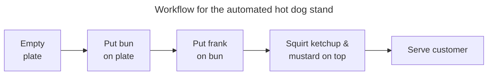

<div style='border-radius: 1em; border-style:solid; border-color:#D3D3D3; background-color:#F8F8F8'>

<p class="h4">&nbsp;&nbsp;Table of Contents</p>

<!-- START doctoc generated TOC please keep comment here to allow auto update -->
<!-- DON'T EDIT THIS SECTION, INSTEAD RE-RUN doctoc TO UPDATE -->

- [Type Annotationsの書き方](#type-annotations%E3%81%AE%E6%9B%B8%E3%81%8D%E6%96%B9)
- [Optional Type](#optional-type)
  - [Tedious None in your program](#tedious-none-in-your-program)
  - [`Optional` Typeの登場](#optional-type%E3%81%AE%E7%99%BB%E5%A0%B4)
- [Union Types](#union-types)
  - [データ型の直積からデータ型の直和へ](#%E3%83%87%E3%83%BC%E3%82%BF%E5%9E%8B%E3%81%AE%E7%9B%B4%E7%A9%8D%E3%81%8B%E3%82%89%E3%83%87%E3%83%BC%E3%82%BF%E5%9E%8B%E3%81%AE%E7%9B%B4%E5%92%8C%E3%81%B8)
- [Literal Types](#literal-types)
- [Annotated Types](#annotated-types)
- [NewType](#newtype)
  - [Type Alias](#type-alias)
- [Final Types](#final-types)
- [References](#references)

<!-- END doctoc generated TOC please keep comment here to allow auto update -->


</div>


## Type Annotationsの書き方

[Ryo's Tech Blog > Type Annotationsのすすめ](https://ryonakagami.github.io/2024/03/14/robust-python-type-annotations/)にて,
Type Annotationsがなぜ必要なのかを解説しました.

ここでは, 実際にType Annotationsを書くにあたって知っておくべき, Data type及びsyntaxを以下を対象に解説します:

- `Optional`
- `Union`
- `Literal`
- `Annotated`
- `NewType`
- `Final`

## Optional Type

`Optional`の便利さを理解するためには, 

- プログラムにおいて `None` をどのように取り扱うべきか?
- `None`はどのような問題をreadable codeの観点で引き起こすのか?

を知る必要があります. 

### Tedious None in your program

`None`がもたらすバグを理解するために, 自動ホットドッグスタンドを運営するプログラムを考えてみます.



上記のようなワークフローを前提にコードに落とし込んでみると

```python
def create_hot_dog():
    bun = dispense_bun()
    frank = dispense_frank()
    hot_dog = bun.add_frank(frank)
    ketchup = dispense_ketchup()
    mustard = dispense_mustard()
    hot_dog.add_condiments(ketchup, mustard)
    dispense_hot_dog_to_customer(hot_dog)
```

このコードはすべてが上手く行っているときは問題はなさそうですが, バンがなくなった場合を考えたとき本当にRobustなのか疑問が残ります. 例として以下の場合がバグ発生の状況として考えられます:

- バン, ホットドッグ, ケチャップなどの材料がなくなった場合
- 注文が途中でキャンセルされた場合
- 処理途中に電源が落ちた場合
- お客さんがケチャップいらないって要求した場合

ここで上述のエラーを見つけた場合, `None`を必ず返すようにプログラムを修正したとします.
バンがなくなった場合(`dispense_bun()`が`None`を返す場合)を例にプログラムを実行すると以下のようなエラーがターミナル上に表示されるはずです

```
Traceback (most recent call last):
 File "<stdin>", line 4, in <module>
AttributeError: 'NoneType' object has no attribute 'add_frank'

Traceback (most recent call last):
 File "<stdin>", line 7, in <module>
AttributeError: 'NoneType' object has no attribute 'add_condiments'
```

`bun`変数が`None`を格納しているので

- `bun.add_frank(frank)`
- `hot_dog.add_condiments(ketchup, mustard)`

の箇所でそれぞれエラーが発生し, それらが積み重なったものがターミナル上に表示されてしまっています. 
これだと, エラーコードを読み解いてどこで問題が発生したのか理解するのに時間がかかってしまいます.

かといって次のようなコードに修正するのも行がたくさん増えて大変です.

```python
def create_hot_dog():
    bun = dispense_bun()
    if bun is None:
        print_error_code("Bun unavailable. Check for bun")
        return

    frank = dispense_frank()
    if frank is None:
        print_error_code("Frank was not properly dispensed")
        return

    hot_dog = bun.add_frank(frank)
    if hot_dog is None:
        print_error_code("Hot Dog unavailable. Check for Hot Dog")
        return

    ketchup = dispense_ketchup()
    mustard = dispense_mustard()
    if ketchup is None or mustard is None:
        print_error_code("Check for invalid catsup")
        return

    hot_dog.add_condiments(ketchup, mustard)
    dispense_hot_dog_to_customer(hot_dog)
```

また次のような問題点があります

- 毎回, `if bun is None:`とチェックするのは書き損じリスクがある
- ` dispense_ketchup()`とかが`None`を返すことはないという前提のもとではいいかもだが, その前提が崩れたときの対処範囲が膨大になる(ケチャップいらないと言われたら, `None`を返すように修正した場合など)

かといって, `Exception`で対処するのが良いかと考えると, 

- リストを参照したとき探したいオブジェクトが見つからなかった
- バンが売り切れちゃって, `None`を返したい

などの通常挙動に対して`Exception`は使用すべきではない, あくまで処理中で発生する例外事象に対して使用すべきです.

### `Optional` Typeの登場

`Optional`データ型は, `None`または指定したデータ型を強制する機能を持っています.

```python
from typing import Optional
maybe_a_string: Optional[str] = "abcdef" # This has a value
maybe_a_string: Optional[str] = None     # This is the absence of a value
```

`Optional`データ型を用いることで以下のような点を明確にすることができます:

- `None`は引数/返り値のデータ型として予定されているものなのかどうか？
- valueの不存在とempty valueという状況を区別できる
- Typecheckerに, `Optional[]`起因の`None`を区別させることができる


<div style="display: inline-block; background: #D3D3D3;; border: 1px solid #D3D3D3; padding: 3px 10px;color:black"><span >Noneは関数の引数/返り値として予定されているものなのかどうか？</span>
</div>

<div style="border: 1px solid #D3D3D3; font-size: 100%; padding: 20px;">

```python
def dispense_bun() -> Optional[Bun]:
    ...
```

と記載れている場合, `None`が返ってくるのは通常動作の範囲内ということが分かります.

</div>

<br>

<div style="display: inline-block; background: #D3D3D3;; border: 1px solid #D3D3D3; padding: 3px 10px;color:black"><span >valueの不存在とempty valueという状況を区別する</span>
</div>

<div style="border: 1px solid #D3D3D3; font-size: 100%; padding: 20px;">

`List`型を返すとき次のパターンが考えられます

- A list with elements: 正常パターン
- Empty list: データ型としてはエラーではないが, バグ発生のリスクあり
- `None`

```python
from typing import Optional


def capitalize_str(y: Optional[list[str]]):
    for idx, string in enumerate(y):
        y[idx] = string.capitalize()
    return y
```

このとき, 以下のようなメッセージが確認できます

```
Argument of type "list[str] | None" cannot be assigned to parameter "iterable" of type "Iterable[_T@enumerate]" in function "__new__"
  Type "list[str] | None" cannot be assigned to type "Iterable[str]"
    "None" is incompatible with protocol "Iterable[str]"
      "__iter__" is not present

Object of type "None" is not subscriptable
```


</div>

<br>

<div style="display: inline-block; background: #D3D3D3;; border: 1px solid #D3D3D3; padding: 3px 10px;color:black"><span >Typecheckerに Optional[]起因の Noneを区別させることができる</span>
</div>

<div style="border: 1px solid #D3D3D3; font-size: 100%; padding: 20px;">

```python
def func(x: int, y = 5):
    return x * y
```

という関数を定義したとします. `y`の引数として`None`を予定したかったので, `y: int`という書き方をしなかったですがこの場合, `func(x=10, y=None)`としてから初めて`None`が`*`をサポートしていないエラーの存在に気づきます.

次に

```python
from typing import Optional


def func(x: int, y: Optional[int] = 5):
    return x * y
```

とすると

```
Operator "*" not supported for types "int" and "int | None"
  Operator "*" not supported for types "int" and "None"
```

引数として, `None`は予定されているとコミュニケーションできる一方, `None`起因のエラーの発生をTypechekerに判別させることができます.

</div>

## Union Types

`Union` Typeは１つのエンティティに対して複数のデータ型を指定したい際に使用します.

```
Union[int,str]
```

ならば, `int`と`str`の２つが利用可能を意味しています. 定義より`Optional[str]`は`Union[str,None]`と同値であることが分かります.

以下の`disppense_snack()`関数を見てみます. 

```python
from typing import Union
def dispense_snack(user_input: str) -> Union[HotDog, Pretzel]:
    if user_input == "Hot Dog":
        return dispense_hot_dog()
    elif user_input == "Pretzel":
        return dispense_pretzel()
    raise RuntimeError("Should never reach this code,"
                       "as an invalid input has been entered")
```

`user_input`で指定されたオーダー内容に従って, `HotDog` or `Pretzel`を返すことを示しています.

<div style='padding-left: 2em; padding-right: 2em; border-radius: 0em; border-style:solid; border-color:#e6e6fa; background-color:#e6e6fa'>
<p class="h4"><ins>Union Typeの利用シチュエーション例</ins></p>

以下のケースで`Union` typeはよく利用されます

- ユーザーの入力に基づいて返される異なるタイプの処理をする場合
- 文字列やエラーコードなどの追加情報を付与した形のエラーハンドリングを実施したい場合
- ユーザー入力について異なるデータ型を許容したいとき
- 互換性のために異なるタイプを返す場合(とくに後方互換性が要求されるとき)
- 複数のデータ型が返り値として予定されていることを示したいとき

</div>

### データ型の直積からデータ型の直和へ

`Union`を用いることで, オブジェクトが取れる有効な属性の組み合わせ全体の集合(**Representable state space**)を限定することができるメリットもあります. Representable state spaceが大きすぎるとテスト/修正影響の範囲も広がるのでできるだけ狭めることが望ましいです.


```python
from dataclasses import dataclass
# If you aren't familiar with data classes, you'll learn more in chapter 10
# but for now, treat this as four fields grouped together and what types they are
@dataclass
class Snack:
    name: str
    condiments: set[str]
    error_code: int
    disposed_of: bool


Snack("Hotdog", {"Mustard", "Ketchup"}, 5, False)
```

というデータクラスを考えるとする. 話を単純化するために, 以下のような制約をさらに加えます

- name: `"hotdog"`, `"pretzel"`, or `"veggie burger"`の3種類のみ予定
- condiments: empty, mustard, ketchup, or bothの4種類
- error_code: 0-5のint; 0 indicates successの6種類
- disposed_of: `True` or `False`の2種類, error_codeが0以外の場合だけ`True`になる

のときのRepresentable state spaceは以下のように144種類となります.

$$
144 = 3 \times 4 \times 6 \times 2
$$

この種の演算をデータ型の直積と呼びます. disposed_ofはerror_codeが0以外の場合だけ`True`になるという制約があるので144種類のうち, 

- `error_code`: 0
- `disposed_off`: `True`

となっている組み合わせをを除外した形でRepresentable state spaceが表現されるべきとなります.
`Union`を用いたRepresentable state spaceの削減例として以下です:

```python
from dataclasses import dataclass
from typing import Union
@dataclass
class Error:
    error_code: int
    disposed_of: bool

@dataclass
class Snack:
    name: str
    condiments: set[str]

snack: Union[Snack, Error] = Snack("Hotdog", {"Mustard", "Ketchup"})

snack = Error(5, True)
```

ここでは`snack`インスタンスの取りうる範囲は, 以下のように24種類になっています:

```
24 = 3 \times 4 + 6 \times 2
```

この演算を型の直和とよんだりします. Representable state spaceは当初の144種類と比較して約15%のサイズまで削減することができています. 

## Literal Types

Python 3.8以降で導入された `Literal` Typeはエンティティについて予定しているデータの範囲を制限する際に用いられます. 次のコードではinputは`4`のみを許容しており, 俺以外ではエラーを吐くようにしています:

```python
from typing import Literal

def accepts_only_four(x: Literal[4]) -> None:
    pass

accepts_only_four(4)   # OK
```

一方, `accepts_only_four(19)`と記載すると

```
Argument of type "Literal[19]" cannot be assigned to parameter "x" of type "Literal[4]" in function "accepts_only_four"
  "Literal[19]" cannot be assigned to type "Literal[4]"
```

## Annotated Types

`Literal`型はvalueのリストアップ範囲が狭い場合には有効ですが,

- 文字列を特定のサイズに制限
- 特定の正規表現に一致させる

というロジックに即した形でデータ型を制限したい場合には使えません. この意図を非同期的にコミュニケーションしたい場合に`Annotated`を用いたりします.

```python
from typing import Annotated
from dataclasses import dataclass

@dataclass
class ValueRange:
    min: int
    max: int


x: Annotated[int, ValueRange(3,5)]
```

ただし, Typecheckerによるエラー検知には対応していないので個人的にはあまり使わないかな？と感じてます(As of 2024-03-15).

## NewType

新しいデータ型を作成する場合は, `NewType`を使用します.


```python
from typing import NewType, NamedTuple

BusinessID = NewType("BusinessID", str)


class Business(NamedTuple):
    id: int
    business_id: BusinessID
    name: str

# Errorなし
def lookup_business_by_name(name: str) -> BusinessID:
    business = Business(id=4, business_id=BusinessID("AC00004"), name=name)
    return business.business_id

# Errorあり
def lookup_id_by_name(name: str) -> BusinessID:
    business = Business(id=4, business_id=BusinessID("AC00004"), name=name)
    return str(business.id)
```

以下のようなエラーメッセージが出力されます

```
Expression of type "str" cannot be assigned to return type "BusinessID"
  "str" is incompatible with "BusinessID"
```

このように, `BusinessID`データ型は実質的には`str`同じはずなのに交換不可能となっています.

- `str`が使えるところでは`BusinessID`が使えない(vice versa)

という挙動を期待していることを非同期的に他の開発者に伝えられるところに`NewType`のメリットがあります. 他の例として

- SQLインジェクション脆弱性のようなバグを検知するために, `str`と`NewType`で作成した`SanitizedString`を区別する
- `User`と`LoggedInUser`を区別し, `LoggedInUser`だけに適用される関数を作る場合

前者の例は特に重要で,  サニタイズテストをクリアした`SanitizedString`を用意することで他の場所でのチェックの工数を削減するなどにつながります.


### Type Alias

`NewType`と似た機能で, データ型に他の名前を与えるType Aliasがある.

```python
TypeAlias = Union[str, int]
TypeMyType = NewType("TypeMyType", int)
```

とType Aliasを定義したとき,

```python
@dataclass
class Cls:
    x: TypeAlias
    y: TypeMyType


cls = Cls(x=int(1), y=int(1)) # Errorあり
cls = Cls(x=int(1), y=TypeMyType(1)) # Errorなし
```

とプログラムを書くと`cls = Cls(x=int(1), y=int(1))`について静的解析で以下のようなエラーが出現します.

```
Argument of type "int" cannot be assigned to parameter "y" of type "TypeMyType" in function "__init__"
  "int" is incompatible with "TypeMyType"
```

Type Aliasはあくまでエイリアスであることを覚えときましょう. Use caseとしては, `Union[dict[int, User], list[dict[str, User]]]`のように
複雑な形のネストを使う際に, `IDOrNameLookup`のような概念を示す名前で扱いやすくするのが１例です.


## Final Types

`Final`型はエンティティが新しいobjectを参照することを防止する機能があります.

```python
from typing import Final


test: Final[str] = "Viafore's Auto-Dog"
test = list(range(len(test)))
print(test)
```

という`test.py`という名前のプログラムを準備したとします. このとき, 静的解析をかけると

```
"test" is declared as Final and cannot be reassigned
```

というwarningが確認できます. ただし, 実行自体はできてしまい

```python
% poetry run python ./test.py
1
```

一方, `Final`型はエンティティが新しいobjectを参照することを防止する機能があるだけなので, 
`id`の変更が走らない要素の変更についてはエラーが返ってきません

```python
# エラーが出力されない
test: Final[list] = list("Viafore's Auto-Dog")
for n in range(len(test)):
    test[n] = n
print(test)
```


References
----------
- [Robust Python > Chapter 4. Constraining Types](https://learning.oreilly.com/library/view/robust-python/9781098100650/ch04.html)
- [PEP 586 – Literal Types](https://peps.python.org/pep-0586/)
- [Ryo's Tech Blog > Coding Style Guide Part 1](https://ryonakagami.github.io/2021/05/02/Coding-Guide/#%E8%89%AF%E3%81%84%E3%82%B3%E3%83%BC%E3%83%89%E3%81%A8%E3%81%AF)
- [Ryo's Tech Blog > Robust Codeを書くためのプログラミング姿勢について](https://ryonakagami.github.io/2024/03/12/robust-python-what-is-robustness/)
- [Ryo's Tech Blog > Python Typesのすすめ](https://ryonakagami.github.io/2024/03/13/robust-python-python-types/)
- [Ryo's Tech Blog > Type Annotationsのすすめ](https://ryonakagami.github.io/2024/03/14/robust-python-type-annotations/)
