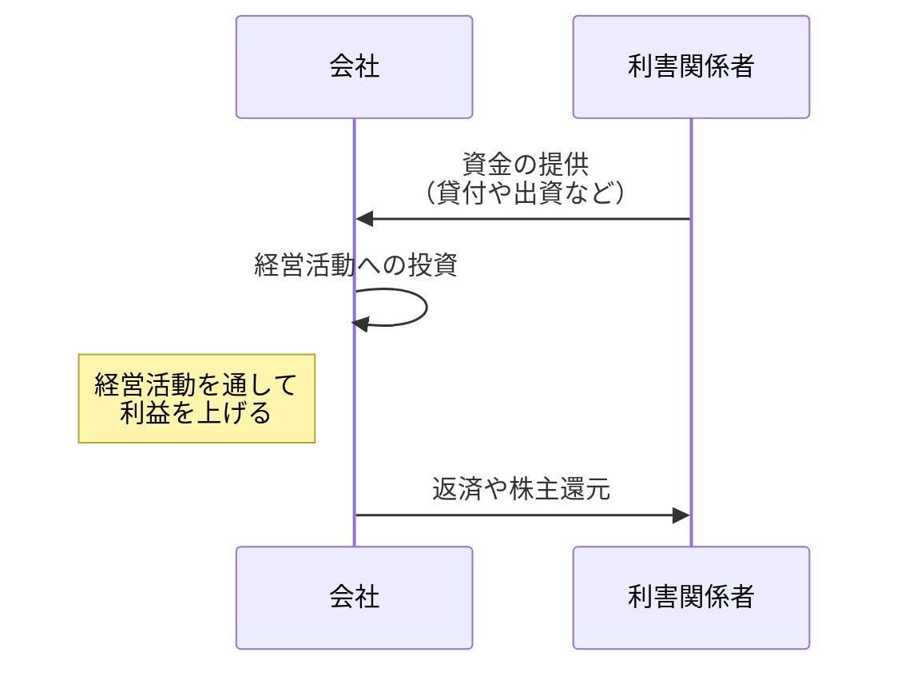

&nbsp;&nbsp;Table of Contents

<!-- START doctoc generated TOC please keep comment here to allow auto update -->
<!-- DON'T EDIT THIS SECTION, INSTEAD RE-RUN doctoc TO UPDATE -->

- [簿記とは](#%E7%B0%BF%E8%A8%98%E3%81%A8%E3%81%AF)
  - [簿記上の取引](#%E7%B0%BF%E8%A8%98%E4%B8%8A%E3%81%AE%E5%8F%96%E5%BC%95)
- [貸借対照表と損益計算表](#%E8%B2%B8%E5%80%9F%E5%AF%BE%E7%85%A7%E8%A1%A8%E3%81%A8%E6%90%8D%E7%9B%8A%E8%A8%88%E7%AE%97%E8%A1%A8)
  - [貸借対照表](#%E8%B2%B8%E5%80%9F%E5%AF%BE%E7%85%A7%E8%A1%A8)
  - [貸借対照表と会計期間](#%E8%B2%B8%E5%80%9F%E5%AF%BE%E7%85%A7%E8%A1%A8%E3%81%A8%E4%BC%9A%E8%A8%88%E6%9C%9F%E9%96%93)
    - [仕訳と勘定](#%E4%BB%95%E8%A8%B3%E3%81%A8%E5%8B%98%E5%AE%9A)
  - [損益計算書](#%E6%90%8D%E7%9B%8A%E8%A8%88%E7%AE%97%E6%9B%B8)

<!-- END doctoc generated TOC please keep comment here to allow auto update -->

## 簿記とは

<ins>Def: 簿記</ins>

- 財務諸表を作成するためのルール

 

世の中の経済活動において代表的なプレーヤーは会社という形態を取っています．会社と上場企業から非常上場企業，コンサル会社，自動車会社など様々ありますが会社の活動を抽象的に表すと以下のようになります．

上記において「**利害関係者**」というものは株主，銀行を想定しています．企業は利害関係者からのファイナンスを通じて運転資金を獲得し，
それを経営活動へ投資し，結果として利益を上げることが期待されています．

ここでいう経営活動は「会社が行う日々の取引」を想定しており，例として

- 商品の仕入れ
- 商品の販売 = 売上を立てる
- 従業員給料の支払い
- 利息の支払い

などがあります．上記の利害関係者は経営活動を通して利益が上がることを期待しているからこそ，資金の提供を会社に対して行いますがその判断を行うためには

- そもそも経営活動は健全になされているのか？
- 直近の経営状態はどうだったのか？
- 倒産の可能性はあるのか？

という情報が必要になります．簡単に行ってしまえば，資金提供をしようと思っている会社の経営活動の成績表を利害関係者たちは確認したいということになります．

この「**会社の経営活動の成績表**」こそが財務諸表であり，その財務諸表を作成するルールが簿記となります．

- 簿記のルールに従って帳簿を作成し，財務諸表を作成
- 作成した財務諸表を定められたルールに従って開示

することが一般論として会社には求められています．

### 簿記上の取引

<ins>Def: 簿記上の取引</ins>

- 簿記上の取引とは，資産，負債，資本，収益，費用に増減変化が生じるもの

 

<strong > &#9654;&nbsp; 簿記上の取引例</strong>

|取引内容|簿記上の取引判定|
|---|:---:|
|店舗の建物を１年間借りる契約をした|`False`|
|販売用商品10,000円分が倉庫から盗まれた|`True`|
|商品70,000円分の購入をインターネット経由で注文した|`False`|
|商品70,000円分を購入し，代金を現金で支払った|`True`|
|金庫で保管していた現金10,000円が，実際は9,000円であったことが発覚した|`True`|
|従業員として一人を月給100,000円の契約で雇い入れた|`False`|
|従業員に一ヶ月分給料として100,000円を現金で支払った|`True`|
|銀行より現金5,000円を借り入れた．この借り入れは当期末までに返済する予定である|`True`|

## 貸借対照表と損益計算表

一定期間の会社の活動に基づき財務諸表として会社が利害関係者に対して報告する際，その当該期間の

- 財政状態: 今，何をいくら持っているのか（財産の状態），Financial Position
- 経営成績: この期間で，何をしてどれくらい儲かったか（儲けの状況）

の２つを報告する必要が有ります．世の中のルールとして**貸借対照表で財政状態を，損益計算書で経営成績**を報告します．

- 貸借対照表: 資産，負債，資本の３要素を用いて財政状態を報告する
- 損益計算書: 収益，費用の２要素を用いて経営成績を報告する

<ins><strong >Column: 英語表記と略称</strong></ins>

|用語|英語表記|略称|
|---|---|---|
|財務諸表|Financial Statements |F/S（エフエス）|
|貸借対照表|Balance Sheet |B/S（ビーエス）|
|損益計算書|Profit and Loss Statement |P/L（ピーエル）|

### 貸借対照表

<ins>貸借対照表の基本ルール</ins>

1. 借方に資産，貸方には負債と資本（負債が上で，資本が下）を記載する
2. 借方と貸方の合計額は一致する
3. いつ時点の財政状態なのかを記載する
4. 一つの取引は必ず２つの勘定科目を変化させる = 取引の２面性

 

上記のルールに従って貸借対照表は以下のように記述されます．

- B/Sでは借方は資金の運用形態，貸方は資金の調達源泉を表しています
- 資金の調達源泉は返済義務の有無により区別し，上側に返済義務のある金額を記入し，下側に返済義務のない金額を記入する
- 各金額に対して「現金」や「借入金」などのようなラベルが記載されているが，これらを**勘定科目**と呼ぶ

Case 1

<strong > &#9654;&nbsp; 問題設定</strong>

- 当社は、株主から現金500円の出資を受け設立された。
- 設立と同時に、銀行から現金300円の借り入れを行った

<strong > &#9654;&nbsp; B/S表記</strong>

<table>
<caption>貸借対照表</caption>
<tbody>
<tr>
    <th scope="col" colspan="2" id="assets"><strong>資産の部</strong></th>
    <th scope="col" colspan="2" id="liabilities"><strong>負債の部</strong></th>
</tr>
<tr>
    <th id="asset-1">現金</th>
    <td headers="assets asset-1">800</td>
    <th id="liability-1">借入金</th>
    <td headers="liabilities liability-1">300</td>
</tr>
<tr>
    <th id="asset-6"></th>
    <td headers="assets asset-6"></td>
    <th scope="col" colspan="2" id="capital"><strong>資本の部</strong></th>
</tr>
<tr>
    <th id="liability-6"></th>
    <td headers="liabilities liability-6"></td>
    <th id="capital-1">資本金</th>
    <td headers="capital capital-1">500</td>
</tr>
<tr>
    <th id="capital-4"><strong>資産合計</strong></th>
    <td headers="capital capital-4">800</td>
    <th id="assets-capital"><strong>負債・純資産合計</strong></th>
    <td headers="assets assets-capital">800</td>
</tr>
</tbody>
</table>

 

Case 2

<strong > &#9654;&nbsp; 問題設定</strong>

以下の順番で取引が発生したとする

- 当社は、株主から現金500円の出資を受け設立された。
- 設立と同時に、銀行から現金300円の借り入れを行った
- 仕入先から商品を現金300円で仕入れ，これを得意先へ現金400円で売り上げた
- 現金200円を支払って建物を取得した

<strong > &#9654;&nbsp; B/S表記</strong>

<table>
<caption>貸借対照表</caption>
<tbody>
<tr>
    <th scope="col" colspan="2" id="assets"><strong>資産の部</strong></th>
    <th scope="col" colspan="2" id="liabilities"><strong>負債の部</strong></th>
</tr>
<tr>
    <th id="asset-1">現金</th>
    <td headers="assets asset-1">700</td>
    <th id="liability-1">借入金</th>
    <td headers="liabilities liability-1">300</td>
</tr>
<tr>
    <th id="asset-2"></th>
    <td headers="assets asset-2"></td>
    <th scope="col" colspan="2" id="capital"><strong>資本の部</strong></th>
</tr>
<tr>
    <th id="asset-3">建物</th>
    <td headers="asset-3">200</td>
    <th id="capital-1">資本金</th>
    <td headers="capital capital-1">500</td>
</tr>
<tr>
    <th id="liability-6"></th>
    <td headers="liabilities liability-6"></td>
    <th id="capital-2">繰越利益剰余金</th>
    <td headers="capital capital-1">100</td>
</tr>
<tr>
    <th id="capital-4"><strong>資産合計</strong></th>
    <td headers="capital capital-4">900</td>
    <th id="assets-capital"><strong>負債・純資産合計</strong></th>
    <td headers="assets assets-capital">800</td>
</tr>
</tbody>
</table>

 

<strong > &#9654;&nbsp; Key Takeaways</strong>

- 利益は返済義務がない金額なので，負債ではなく資本が増加に対応する
- 出資を受けた額（元手）」と「利益の額」は区別して表示するため，利益を源泉とする資本は「繰越利益剰余金」の勘定科目に分類される
- 所有するものの変化に合わせて資産の内訳は変化する（今回では現金→建物へ資産が変化）

 

<strong > &#9654;&nbsp; 貸借対照表における資産</strong>

<ins>Def: 資産</ins>

- 資産とは会社が所有するすべての財産のことをいう
- 資産は「現金」，「物」，「権利（債権）」の３つに分類される

|分類|主な勘定科目|Comments|
|:---:|:---:|:---|
|現金|現金|現金紙幣や硬貨などの通貨
|物|建物|建物店舗・事務所・倉庫など|
||土地|建物のための敷地|
|権利 （債権）|貸付金|金銭を貸し付けた場合，その金額を回収する権利|
||売掛金|商品を販売したが代金を受け取っていない場合，その代金を回収する権利|

Case 3

<strong > &#9654;&nbsp; 問題設定</strong>

以下の順番で取引が発生したとする

- 当社は、株主から現金500円の出資を受け設立された。
- 設立と同時に、銀行から現金300円の借り入れを行った
- 所有する現金800円のうち，100円を取引先に貸し付けた

<strong > &#9654;&nbsp; B/S表記</strong>

<table>
<caption>貸借対照表</caption>
<tbody>
<tr>
    <th scope="col" colspan="2" id="assets"><strong>資産の部</strong></th>
    <th scope="col" colspan="2" id="liabilities"><strong>負債の部</strong></th>
</tr>
<tr>
    <th id="asset-1">現金</th>
    <td headers="assets asset-1">700</td>
    <th id="liability-1">借入金</th>
    <td headers="liabilities liability-1">300</td>
</tr>
<tr>
    <th id="asset-2"></th>
    <td headers="assets asset-2"></td>
    <th scope="col" colspan="2" id="capital"><strong>資本の部</strong></th>
</tr>
<tr>
    <th id="asset-3">貸付金</th>
    <td headers="asset-3">100</td>
    <th id="capital-1">資本金</th>
    <td headers="capital capital-1">500</td>
</tr>
<tr>
    <th id="capital-4"><strong>資産合計</strong></th>
    <td headers="capital capital-4">800</td>
    <th id="assets-capital"><strong>負債・純資産合計</strong></th>
    <td headers="assets assets-capital">800</td>
</tr>
</tbody>
</table>

 

Case 4

<strong > &#9654;&nbsp; 問題設定</strong>

当期(23年7月1日~24年6月30日)に以下の取引が発生したとする．当期末の貸借対照表を作成せよ

- 当社は、設立にあたり株主から現金8,000円を受け取った
- 銀行から現金2,000円の借り入れを行った
- 現金3,400円を支払って，建物を取得した
- 現金1,000円を取引先に貸し付けた
- 商品を仕入れ，その商品を販売した結果，現金が1,300円増加した
- 従業員へ給料800円を現金で支払った

<strong > &#9654;&nbsp; B/S表記</strong>

<table>
<caption>貸借対照表（24年6月30日）</caption>
<tbody>
<tr>
    <th scope="col" colspan="2" id="assets"><strong>資産の部</strong></th>
    <th scope="col" colspan="2" id="liabilities"><strong>負債の部</strong></th>
</tr>
<tr>
    <th id="asset-1">現金</th>
    <td headers="assets asset-1">6,100</td>
    <th id="liability-1">借入金</th>
    <td headers="liabilities liability-1">2,000</td>
</tr>
<tr>
    <th id="asset-2">建物</th>
    <td headers="assets asset-2">3,400</td>
    <th scope="col" colspan="2" id="capital"><strong>資本の部</strong></th>
</tr>
<tr>
    <th id="asset-3">貸付金</th>
    <td headers="asset-3">1,000</td>
    <th id="capital-1">資本金</th>
    <td headers="capital capital-1">8,000</td>
</tr>
<tr>
    <th id="asset-4"></th>
    <td headers="asset-4"></td>
    <th id="capital-2">繰越利益剰余金</th>
    <td headers="capital capital-2">500</td>
</tr>
<tr>
    <th id="capital-4"><strong>資産合計</strong></th>
    <td headers="capital capital-4">10,500</td>
    <th id="assets-capital"><strong>負債・純資産合計</strong></th>
    <td headers="assets assets-capital">10,500</td>
</tr>
</tbody>
</table>

<strong > &#9654;&nbsp; Key Takeaways</strong>

- 商品を仕入れて，その販売により収益をを上げた場合，「商品」という資産の増加とも考えることができますが，当期中にすべて販売しているので上記の解答では表れないと理解してください
- 期初と期末のB/Sを比較することで繰越利益剰余金の増加の判断はできますが．その内訳は読み取ることはできません．後述する損益計算書(P/L)の純利益を見ることで解釈できるようになります

 

<strong > &#9654;&nbsp; 貸借対照表における負債</strong>

<ins>Def: 資産</ins>

- 負債とは資金の調達源泉のうち返済義務のある金額のこと

 

|分類|主な勘定科目|Comments|
|:---:|:---:|:---|
|負債 （債務）|借入金|金銭を借り入れた場合，その金額を返済する義務|
||買掛金|商品を仕入れたが代金を支払っていない場合，その代金を支払う義務|

<strong > &#9654;&nbsp; 貸借対照表における資本</strong>

<ins>Def: 資産</ins>

- 資本とは，資金の調達源泉のうち返済義務のない金額のこと
- 資本の増加要因には，「株主から出資を受ける（元手）」と「利益を獲得する（利益）」の２つがある
- 純資産とも呼ぶ

 

|分類|主な勘定科目|Comments|
|:---:|:---:|:---|
|元手|資本金|株主から出資を受けた金額|
|利益|繰越利益剰余金|会社が稼いだ金額|

期初と期末の「繰越利益剰余金」勘定の金額の差分は，当期純利益に対応します．

$$
\text{当期末の繰越利益剰余金} － \text{当期首の繰越利益剰余金} ＝ \text{当期純利益}
$$

### 貸借対照表と会計期間

会社の財政状態は，会社設立後から取引の発生などをトリガーとして日々変化していきます．
しかし，その変化のたびにB/Sを作成するのではなく通常は決算のタイミングでB/Sを作成します．

企業が決算書を作成するにあたって対象となる一定の期間のことを特に**会計期間**と呼びます．多くの企業が会計期間を1年間としていますが，6か月など1年未満の期間としても問題はありません．企業によっては，1年の会計期間を半年ごとに分けた「中間決算」や，3か月ごとに分けた「四半期決算」が行われる場合もあります．

<table>
<caption><b>3月決算の場合の会計期間と累計期間</b></caption>
<colgroup>
<col class="acq-u-width-30">
<col class="acq-u-width-30">
<col class="acq-u-width-40">
</colgroup>
<thead>
<tr>
<th colspan="3" class="acq-u-ta-center">会計期間：4月1日～翌3月31日</th>
</tr>
<tr>
<th class="acq-u-ta-center">四半期</th>
<th class="acq-u-ta-center">会計期間</th>
<th class="acq-u-ta-center">期首からの累計期間</th>
</tr>
</thead>
<tbody>
<tr>
<td>第1期</td>
<td>4月～6月</td>
<td>4月～6月</td>
</tr>
<tr>
<td>第2期</td>
<td>7月～9月</td>
<td>4月～9月</td>
</tr>
<tr>
<td>第3期</td>
<td>10月～12月</td>
<td>4月～12月</td>
</tr>
<tr>
<td>第4期</td>
<td>1月～3月</td>
<td>4月～3月</td>
</tr>
</tbody>
</table>

 

<strong > &#9654;&nbsp; 会計期間の名称</strong>

|名称|Comments|
|:---|:---|
|当期|現在の会計期間|
|前期|当期の１つ前の会計期間|
|翌期（次期）|当期の１つ後の会計期間|
|期首|会計期間の始まり|
|期末|会計期間の終わり|
|期中|期首と期末の間|

#### 仕訳と勘定

期中では貸借対照表を作成せずに，取引を行うたびに「何の勘定科目が，いくら変動したか」について記録をしておきます．
簿記ではこのことを，**取引のたびに「仕訳」をきって「勘定」に転記する**，といいます．

- 仕訳をきる: 取引のlogをとる
- 勘定に転記: logを整理して勘定科目別に振り分ける

<strong > &#9654;&nbsp; 仕訳とは？</strong>

仕訳の基本ルールとして，

- 変動する勘定科目とその金額を１行で書く
- 借方（借）と貸方（貸）に分けて記載する
-  定位置が借方のものが増加した場合は仕訳上も借方に，定位置が貸方のものが増加した場合は仕訳上も貸方に書く（減少した場合は定位置の逆側に書く）

 

Example 1

「現金200円を支払って，建物を取得した」という取引が発生したとします．このとき，仕訳をきると以下のように取引logを表記することができます

|借方科目|金額|貸方科目|金額|
|:----:|----:|:----:|----:|
|建物|200|現金|200|

 

Example 2

「現金200円を支払って，従業員給与を支払った」という取引が発生したとします．収益・費用の勘定科目を使用しないという便宜上の制約の下，仕訳をきると以下のように取引logを表記することができます

|借方科目|金額|貸方科目|金額|
|:----:|----:|:----:|----:|
|繰越利益剰余金|200|現金|200|

 

<strong > &#9654;&nbsp; 勘定とは</strong>

<ins>Def: 勘定</ins>

- 勘定とは，仕訳の内容を勘定科目ごとに集計する場所のことで，勘定科目ごとに設定される
- 勘定は記録する場所のことだが，勘定科目は記録する名前（= ラベル）であることに注意
- 勘定はＴの字をしており，以下のように借方と貸方に分かれている

仕訳をきったら，仕訳のとおりに勘定に転記します．具体的作業として，仕訳に基づき勘定の借方と貸方に増減した金額を記入していきます．
取引が積み重なって期末になると，勘定別に貸方と借方の差額が発生しますが，この差額を**残高**と呼びます．期末の勘定残高を用いて財務諸表を作成することができます．

### 損益計算書

損益計算書(P/L)は経営成績を示す財務諸表です．経営成績は一義的には当期純利益で判断されます．損益計算書は，当期純利益を示すともに，その発生原因を収益と費用という２つの観点から説明してくれます．貸借対照表との対応を考えると，当期純利益・収益・費用は以下のように理解することもできます：

- 収益: 繰越利益剰余金の増加要因
- 費用: 繰越利益剰余金の減少要因
- 当期純利益: 繰越利益剰余金の増加額

なお，収益の金額よりも費用の金額が大きい場合，当期純利益はマイナスとなります．この場合，「当期純損失」と呼びます．

<ins>損益計算書の基本ルール</ins>

1. 借方に費用，貸方に収益
2. 収益と費用の差額で当期純利益を算定（記載場所は借方の一番下）
3. いつの期間の経営成績なのかを記載

なお，収益および費用の増加・減少のことを簿記では特に発生・取消といいます．

 

<strong > &#9654;&nbsp; 収益の勘定科目例</strong>

|勘定科目|Comments|
|:---:|---|
|売上|商品を販売し販売代金を得た場合発生|
|受取手数料|取引を仲介し仲介手数料を得た場合発生|
|受取利息|貸し付けたお金に対する利息を得た場合発生|

<strong > &#9654;&nbsp; 費用の勘定科目例</strong>

|勘定科目|Comments|
|:---:|---|
|仕入|商品を購入した場合発生|
|給料|従業員に給料を支払った場合発生|
|水道光熱費|水道光熱費を支払った場合発生|
|支払利息|借り入れたお金に対する利息を支払った場合発生|

 

Case ５

<strong > &#9654;&nbsp; 問題設定</strong>

当期(23年7月1日~24年6月30日)に以下の取引が発生したとする. 仕訳および勘定転記を行った後，期末時点でのB/SとP/Lを作成せよ

1. 当社は、設立にあたり株主から現金8,000円を受け取った
2. 銀行から現金2,000円の借り入れを行った
3. 現金3,400円を支払って，建物を取得した
4. 現金1,000円を取引先に貸し付けた
5. 商品2,700円を仕入れ，現金を支払った
6. 上記品を4,000円で売り上げ、現金を受け取った
7. 従業員へ給料800円を現金で支払った

<strong > &#9654;&nbsp; 仕訳</strong>

|取引No|借方科目|金額|貸方科目|金額|
|---|---|---|---|---|
|1|現金|8,000|資本金|8,000|
|2|現金|2,000|借入金|2,000|
|3|建物|3,400|現金|3,400|
|4|貸付金|1,000|現金|1,000|
|5|仕入れ|2,700|現金|2,700|
|6|現金|4,000|売上|4,000|
|7|給料|800|現金|800|

<strong > &#9654;&nbsp; 勘定転記</strong>

<strong > &#9654;&nbsp; 貸借対照表と損益計算書</strong>

