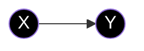
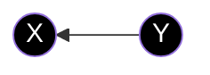
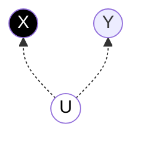
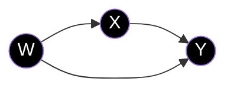
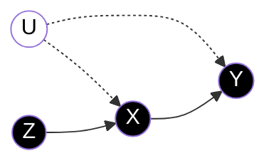
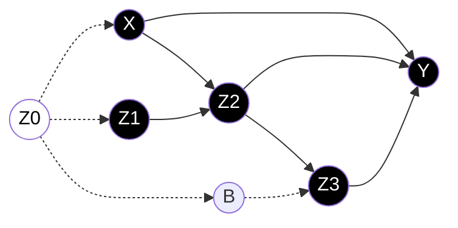

&nbsp;&nbsp;Table of Contents

<!-- START doctoc -->
<!-- END doctoc -->

## 今回のスコープ

- 因果推論における２つのフレームワーク，Potential outcomeとDirected acyclic graphsの紹介
- 経済学における因果推論の文脈でPotential outcomeが好まれる理由についての考察

## 論文要約パート

- 以下でのDAGの議論はThe Book of Why(TBOW)ベース

### Reverse causal questions vs Forward causal questions

|種類|説明|例|
|---|---|---|
|Reverse causal questions|なぜ観測されたoutcomeは発生 したのか？|近年なぜ東京の 地価は上昇しているのか？|
|Forward causal questions|とある特定の介入を実施したら 何が起こるか？||

### The Graphical Approach to Causality

TBOWでは，「Forward causal questions」に対して回答するプロセスをメインで取り扱っている．
そして回答するにあたって２つのインプットが基本的には必要との立場を撮っている：

1. モデル内のすべての観測変数の同時確率分布に関する知識
2. 現象を説明する因果モデル

TBOW, 特にJudea Pearlのcausal questionに対するアプローチは，上記(1), (2)についてまず定式化，つまりHow the world worksのモデルを作る．その後，identification problemを定式化し，esimation and inferenceのステップに入ることである．ポイントとしては，TBOW, 特にJudea Pearl流アプローチでは，因果モデルの特定化(specification)や統計的分析はidentification問題と明確に分けて取り扱われている．

一方，Econometricsの文脈における統計的問題や手法はリサーチクエッションの性質特有のものになりがちである．
そのため，Econometricsにおける文献や論文の多くはestimation method(推定手法)について取り扱ったものが多い．例として以下，

- weak instruments
- Propensity Scoreにおけるunconfoundedness
- regression discontinuity designs
- synthetic control methods

|用語|説明|
|---|---|
|Identidfication strategy|パラメータ識別のためのリサーチデザイン  “What is your identification strategy?” = “What research design (and assumptions) are you using?”|
|Estimation|finite sample下での，分析対象となるパラメーターの推定プロセス|
|Inference|推定した確率分布に基づき，分析対象についてなんらかの統計的結論を導くプロセス|

#### The Ladder of Causality

TBOWではcausal problemsを複雑さに応じて３つのレイヤーに分けて分類してます．

- association
- intervention
- counterfactuals

この３つのレイヤーを合わせてThe Ladder of Causalityと呼びます．

<ins>Association</ins>

- $P(y\vert x)$がリサーチクエッション
- このレイヤーの問題では，分析者は受動的にデータを観察し（＝観察データを用い），その観測に基づいてpredictionを実施する
- what does X tell us about Y?
- 出口調査結果から2024年の衆議院選挙の結果はどのように予測できるか？

 

<ins>Intervention</ins>

- $P(y\vert do(x), z)$がリサーチクエッション
- 特定のIntervention(or manipulation)を実施したら，世界はどのように変わるのか？と考えるレイヤー
- いわゆる what if question and RCT
- 今アスピリン１錠を摂取したら，頭痛はどのようになるのか？
- Angrist and Krueger (1999)で紹介されている識別戦略はこの分類に該当する

 

<ins>Counterfactuals</ins>

- $P(y_x \vert x^\prime, y^\prime)$がリサーチクエッション
    - $x^\prime, y^\prime$を観察した条件のもとで, $X=x$のとき$Y=y$となる確率
- いわゆる what would happen question
- 仮にあのときアスピリン１錠を摂取しなかったら，頭痛はどのようになっていたか？

 

まとめると以下，

|Level|Question|Typical Activity|Question phrase|
|-----|-----|----------------|--------|
|Association|$P(y\vert x)$|Seeing|What would seeing X tell us about Y?|
|Intervention|$P(y\vert do(x), z)$|Doing|What if I do X?|
|Counterfactuals|$P(y_x \vert x^\prime, y^\prime)$|Retrospection|Was it X that caused Y? What would happen to Y if X was set as a different level?|

Counterfactualsレイヤーについて答えることができるならば，Intervention及びAssociationレイヤーのクエッションに答えることがでるので，CounterfactualsレイヤーはThe Ladder of Causalityのトップに位置するとよく言われる．

#### Directed Acyclic Graphs

<ins>DAGの構成要素</ins>

DAGの構成要素は

- nodes
- acyclic directed edges

---|---
Directed|矢印がfrom cause to effectの向きで表現されている Causal effects cannot be bidirectional
Acyclic|directed edgesがloopしていない状態

また，nodeの分類について，$Z\to X\to Y$が与えられた時，

- $Y$のparentsは$X$
- $Y$のAncestorsは$X, Z$
- $X$のchildrenは$Y$

と呼ぶ．

確率変数間の独立性などの関係性は，POでは数式で定義するがDAGを利用することで視覚的に表現できることを以下見ていく．

まず，$X$ causes $Y$，を表したDAGをまず考える

$Y$ causes $X$，というreverse causalityの場合は

unobserved variable, $U$, によって発生する$X, Y$間のspurious correlationを表現する場合は

$X, Y$に加えてobserved confounder, $W$を考える場合は

このobserved confounderの例では$X, Y$の同時分布を推定するだけでは，$X$から$Y$への因果効果を識別することができない = the effect is confounded by the effect of $W$ on $X$ and $Y$．今回は, $W$が観察可能なので，$W$をコントロール(by controlling or adjusting for $W$という)した上で$X, Y$の同時分布を推定することで，$X$から$Y$への因果効果を識別することができる．

#### 操作変数法とDAG

Unobserved variable, $U$, がconfounderとして存在しているため同時分布の推定からでは$X$から$Y$への因果効果が推定できない以下のような状況を考える．

これはいわゆるIVの設定．UがconfounderでZがexclusion restrictionを満たすべきという仮定をDAGは分かりやすく示しており，excluexpository tool(解説ツール)としてDAGが有用である一例を示している．

<ins>Exclusion restriction</ins>

$Z$が操作変数であるための条件として

- Relevance: $\text{Cov}(X, Z)\neq 0$
- Exclusion: $\text{Cov}(Z, U) = 0$

後者は, $Z$は$X$を通じしてしか$Y$へ影響を与えない，という制約を意味しており，この制約のことをExclusion restrictionと呼ぶ．

#### 複雑なモデルにおける識別可能性の判別

- $Y$: 穀物収穫量
- $X$: 土壌改良treatment
- $Z_0$: 今シーズン期初時点でのミミズの数, unobserved
- $Z_1$: treatment実施直前時点でのミミズの数
- $Z_2$: treatment実施直後時点でのミミズの数
- $Z_3$: 今シーズン最後時点でのミミズの数
- $B$: 今シーズン期初時点の鳥（捕食者）の数, unobserved

という変数が与えられたとき，$(X, Y, Z_1, Z_2, Z_3)$の同時分布から, $X$から$Y$の効果を識別できるか？という
問題について考える．まずDAGで関係性について整理したのが以下，

DAGで表現することで，複雑なモデルについても識別可能性について議論することができるというのがDAGの利点．変数が多いとDAGを表現することが事実上できないという批判もあるが，現実の分析では100以上の変数を用いて構造推定を実施するケースなどめったになく，実務分析において「変数が多いと使用しづらい」という批判はあまり考えすぎなくて良い．

<ins>DAGの妥当性についての観点</ins>

DAGの妥当性を考えるにあたって以下のポイントが重要

- 完全なDGPの記述は不可能であるが，興味ある分布集合の近似モデルとしてDAGを用いる
- node間のedgeの不存在(=因果効果の不存在)の妥当性
- nodeの存在，不存在についての妥当性
- DAGにおいて独立/条件付き独立であると仮定された変数間の関係性が，データから同時分布を推定したときに正しいと判断できるか？

References
----------
- [The Book of Why (Pearl and Mackenzie 2018)](https://bayes.cs.ucla.edu/WHY/)