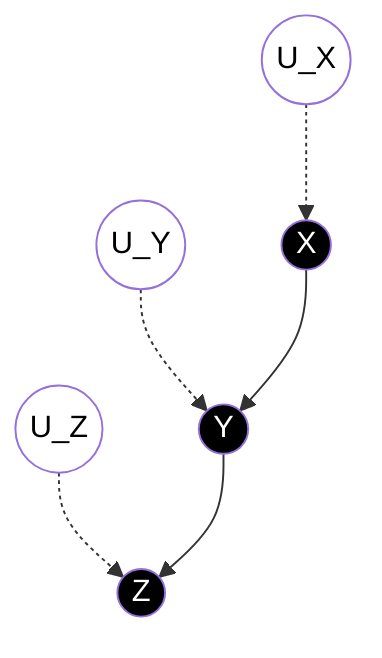
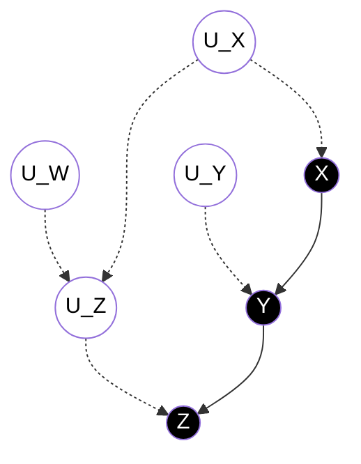
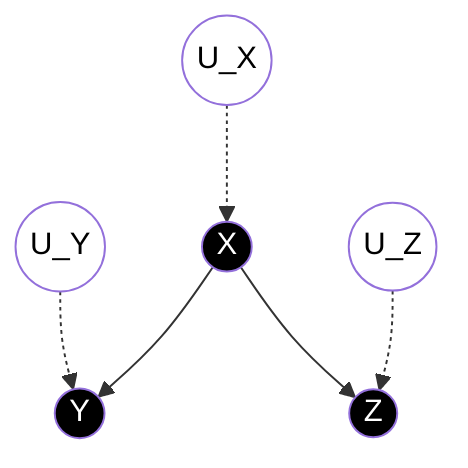
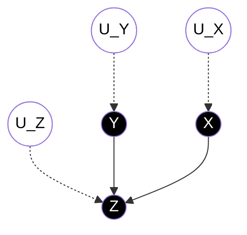

&nbsp;&nbsp;Table of Contents

<!-- START doctoc -->
<!-- END doctoc -->

## SCMの構成要素

構造的因果モデル(Structual Causal Model, SCM)は

- $U$: 外生変数変数の集合
- $V$: 内生変数集合
- $F$: モデルの他の変数の値によって$V$に属する確率変数の値を決定する関数の集合

によって構成されています．ここでの外生変数，内生変数の定義は

|変数の種類|説明|
|---|---|
|外生変数| モデルの外部に存在する変数 モデルにて外生変数の発生ルールについては説明しない 先祖は存在しない|
|内生変数| 少なくとも１つ以上の外生変数の子孫になっている変数|

## 独立性と推移性

SCMをDAGで表現することで変数間の独立性を視覚的に判断することできますが，同じSCMを持っているグラフが与えられたとしても必ずしも独立性/従属性についての判断が同じになるわけではないことを紹介します．

Case 1

$$
V=\{X, Y, Z\}, U=\{U_X, U_Y, U_Z\}, F=\{f_X, f_Y, f_Z\}
$$

について以下の関係性が成り立つ

$$
\begin{align*}
f_X: & X = U_X\\
f_Y: & Y = \frac{x}{3} + U_Y\\
f_Z: & Z = \frac{y}{16} + U_Z\\
\end{align*}
$$

 

Case 2

$$
V=\{X, Y, Z\}, U=\{U_X, U_Y, U_Z\}, F=\{f_X, f_Y, f_Z\}
$$

について以下の関係性が成り立つ

$$
\begin{align*}
U_X &= \{0, 1\}\\
U_Y &= \{0, 1\}\\
U_Z &= \{0, 1\}\\
f_X: X &= U_X\\
f_Y: Y &= \begin{cases}
                0 & \text{if } X=1 \land U_Y = 0\\
                0 & \text{if } X=0 \land U_Y = 1\\ 
                1 & \text{ otherwise} 
            \end{cases}\\
f_Z: Z &= \begin{cases}
                0 & \text{if } Y=0 \land U_Z = 0\\
                0 & \text{if } Y=1 \land U_Z = 1\\ 
                1 & \text{ otherwise} 
            \end{cases}\\
\end{align*}
$$

 

Case 3

$$
V=\{X, Y, Z\}, U=\{U_X, U_Y, U_Z\}, F=\{f_X, f_Y, f_Z\}
$$

について以下の関係性が成り立つ

$$
\begin{align*}
f_X: & X = U_X\\
f_Y: & Y = 84 - x + U_Y\\
f_Z: & Z = \frac{y}{100} + U_Z\\
\end{align*}
$$

 

Case 4

$$
V=\{X, Y, Z\}, U=\{U_X, U_Y, U_Z\}, F=\{f_X, f_Y, f_Z\}
$$

について以下の関係性が成り立つ

$$
\begin{align*}
U_X &= \{1, 2\}\\
U_Y &= \{1, 2\}\\
U_Z &= \{1, 2\}\\
f_X: X &= U_X\\
f_Y: Y &= \begin{cases}
                1 & \text{if } X=1 \land U_Y = 1\\
                2 & \text{if } X=2 \land U_Y = 1\\ 
                3 & \text{if } U_Y=2 
            \end{cases}\\
f_Z: Z &= \begin{cases}
                0 & \text{if } Y=3 \lor U_Z = 1\\
                1 & \text{if } Y \neq 3 \land U_Z = 2
            \end{cases}\\
\end{align*}
$$

Case 1 ~ 4すべてDGPは異なっているが，以下のように同じDAGで表現することができる

上記のDAGから以下の独立性/従属性の判断ができると一見思われる

1. $Z$と$Y$は従属である
    - $P(Z=z\vert Y=y)\neq P(Z=z)$となる$z,y$が存在する

2. $Y$と$Z$は従属である
    - $P(Y=y\vert X=x)\neq P(Y=y)$となるy,x$が存在する

3. $Z$と$X$は**おそらく**従属である
    - $P(Z=z\vert X=x)\neq P(Z=z)$となるz,x$が存在する

4. $Z$と$X$は$Y$の基で条件付き独立である
    - すべての$x,y,z$について, $P(Z=z\vert Y=y, X=x)=P(Z=z\vert Y=y)$

基本的には，どの２つの変数もその間にedgeが存在すれば従属の関係になるはずである．そして，$X$ causes $Y$かつ$Y$ causes $Z$を表した上のグラフでは，$Z$の値を決定する関数の一部に$Y$があり，$Y$の値を決定する関数の一部に$X$があるので，$Z$の値は$X$に依存すると考えるのも自然となります．

しかし，Case 4について見てみると結論としては，**「$Z$と$X$は独立である」**という関係性になっています．

$f_Z$に注目すると$Y=3$ or otherwiseで分類できるので, $Y^*$という新しい確率変数を以下のように定義します

$$
Y^* = \begin{cases}
A & \text{if } Y = 1 \text{ or } 2\\
B & \text{if } Y = 3\\
\end{cases}
$$

すると，$Y^*$と$U_Z$に着目した$Z$のDGPは以下のテーブルで表現することができます

||$Y^*=A$|$Y^*=B$|
|---|---|---|
|$U_Z=1$|$Z=0$|$Z=0$|
|$U_Z=2$|$Z=1$|$Z=0$|

つぎに$X$と$U_Y$に着目した$Y^*$のDGPは以下のテーブルを記述します

||$X=1$|$X=2$|
|---|---|---|
|$U_Y=1$|$Y^*=A$|$Y^*=A$|
|$U_Y=2$|$Y^*=B$|$Y^*=B$|

これをふまえると

<table>
<tr><th>X=1のcase</th><th>X=2のcase</th></tr>
<tr><td>

||$U_Y=1$|$U_Y=2$|
|---|---|---|
|$U_Z=1$|$Z=0$|$Z=0$|
|$U_Z=2$|$Z=1$|$Z=0$|

</td><td>

||$U_Y=1$|$U_Y=2$|
|---|---|---|
|$U_Z=1$|$Z=0$|$Z=0$|
|$U_Z=2$|$Z=1$|$Z=0$|

</td></tr> </table>

このように$X$がどのような値をとろうと, $Z$の確率関数は変化がない，つまり

$$
P(Z=z\vert X=x) = P(Z=z)
$$

のように独立の関係性になっています．$X$と$Z$の間にPATHが存在しているのにも関わらず独立性が成立するケースを**非推移的**といいます．

## 変数間のパスの種類

２つの変数間に存在しうる道において，

- 連鎖経路(chain)
- 分岐経路(fork)
- 合流点(collider)を含む経路

を３種類が存在する．

### 連鎖経路における条件付き独立性

このモデルでは2つの変数$X, Z$の間には変数$Y$しかなく$X\to Y \to Z$という同じ方向を向いた1つのpathしかありません．このような状況の時，以下のTerminologyを用います．

- 2つの変数$X, Z$の間のedgeがすべて同じ方向を向いているpathのことをdirected pathという
- 2つの変数$X, Z$のpathが1つのdirected pathのみで構成されている時，連鎖経路(chain)と呼ぶ

chainが与えられた時，以下のような条件付き独立性の規則が成り立ちます．

<ins>Theorem: 連鎖経路における条件付き独立性</ins>

2つの変数$X, Z$の間にdirected pathがただ１つあり，変数$Y$がその道を遮断する場合，$X$と$Z$は$Y$の下で条件付き独立である．

- ただし，backdoorが存在していないときのみに限る
- 例として，$U_X\to U_Z$というpathが存在する場合，ここでの条件付き独立は成立しない = $Y$だけでは$X$の情報をblockしきれていない

連鎖経路の条件付き独立性が成立しないケースを以下考えてみます．

Case 5

$$
V=\{X, Y, Z\}, U=\{U_X, U_Y, U_Z, U_W\}, F=\{f_X, f_Y, f_Z, f_{uz}\}
$$

について以下の関係性が成り立つとする

$$
\begin{align*}
U_X &= \{0, 1\}\\
U_Y &= \{0, 1\}\\
U_W &= \{0, 1\}\\
f_{uz}: U_Z &= U_X + U_W\\
f_X: X &= U_X\\
f_Y: Y &= X + U_Y\\
f_Z: Z &= Y + U_Z\\
\end{align*}
$$

つまり以下のDAGが成立する

このとき，$Y=0$で条件づけた時の$Z$についてのDGPをテーブルにして表すと

||$X=0$|$X=1$|
|---|---|---|
|$U_W=0$|$Z=0$|$Z=1$|
|$U_W=1$|$Z=1$|$Z=2$|

となり，$Y$で条件づけたにもかかわらず$X$の値に応じて$Z$が変化してしまっています．
このことから，外生変数$U$の独立性が成立していないとき(今回の例ではbackdoorが開いている)はchainの中間変数で条件付けても独立性が成立しないことがわかります．

### 分岐経路における条件付き独立性

Case 6

$$
V=\{X, Y, Z\}, U=\{U_X, U_Y, U_Z\}, F=\{f_X, f_Y, f_Z\}
$$

について以下の関係性が成り立つとする

$$
\begin{align*}
U_X &= \{0, 1\}\\
U_Y &= \{0, 1\}\\
U_Z &= \{0, 1\}\\
f_X: X &= U_X\\
f_Y: Y &= X + U_Y\\
f_Z: Z &= X + U_Z
\end{align*}
$$

つまり以下のDAGが成立する

変数$Y, Z$に着目するとPATHはchainにはなってはいないが共通の原因$X$から$Y \leftarrow X\to Z$という構成になっている．このような構成を分岐経路(fork)と呼ぶ．このとき以下の条件付き独立の定理が成立する．

<ins>Theorem: 分岐経路における条件付き独立</ins>

変数$X$が$Y, Z$の共通の原因で, $Y$と$Z$の間のPATHがただ一つ存在する場合，$X$の下で$(Y, Z)$は条件付き独立である．

- ただし，外生変数間の独立性が整理るする場合のみ成り立つ

### 合流点

<ins>Def: 合流点(Collider)</ins>

あるノードが他の２つのノードからエッジを受け取っている場合のことを合流点と呼ぶ

２つの原因, $X, Y$が共通の結果$Z$を引き起こす上のモデルにおいて，$Z$は$X, Y$の合流点と呼ぶ．

従属/独立の判断

上記のDAGから以下の独立性/従属性の判断ができます

1. $X$と$Z$は**おそらく**従属である
2. $Y$と$Z$は**おそらく**従属である
3. $X$と$Y$は独立である
4. $X$と$Y$は$Z$の下で**おそらく**条件付き従属である
    - $P(X=x\vert Y=y, Z=z)\neq P(X=x\vert Z=z)$となる$x, y, z$が存在する

#### なぜ「XとZはおそらく従属」であるのか？

結論から言うと, 

$$
P(Z=z\vert X=x) = P(Z=z)
$$

となるケースが存在するからです．上記のDAGについて以下の設定を追加して考えてみます．

$$
V=\{X, Y, Z\}, U=\{U_X, U_Y, U_Z\}, F=\{f_X, f_Y, f_Z\}
$$

について以下の関係性が成り立つとする

$$
\begin{align*}
U_X &= \{0, 1\}, \text{ (0, 1)の値を取るかは同様に確からしいとする}\\
U_Y &= \{0, 1\}, \text{ (0, 1)の値を取るかは同様に確からしいとする}\\
U_Z &= \{0, 1\}, \text{ (0, 1)の値を取るかは同様に確からしいとする}\\
f_X&: X = U_X\\
f_Y&: Y = U_Y\\
f_Z&: Z = I(X=Y) + U_Z
\end{align*}
$$

なお, $I(X=Y)$は$X=Y$ならば1, それ以外ならば0というIndicator functionを意味するとします

 

このとき以下が成立します

$$
\begin{align*}
P(Z=0) = \displaystyle \frac{1}{4}, \qquad
P(Z=1) = \displaystyle \frac{1}{2}, \qquad
P(Z=2) = \displaystyle \frac{1}{4}
\end{align*}
$$

一方, $X$について条件付けてもこの関係は変わらないので，$X, Z$が独立になるケースがありことが分かります．

#### Monty Hall Probelmと合流点
